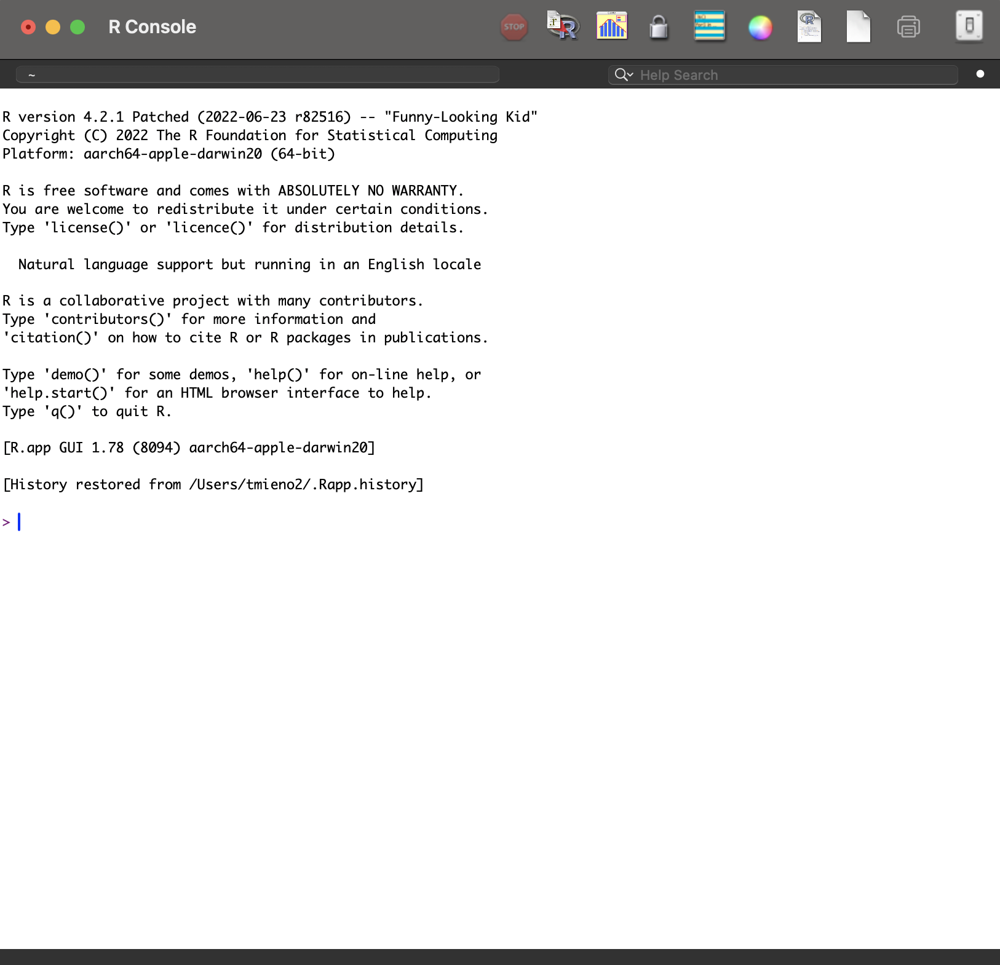

## Learning Objectives

<details class="transcript">
<summary>Transcript</summary>

Let's start with where this course is going, so the individual pieces have somewhere to sit. There are two broad aims. The first is simply to get you comfortable with programming as an activity, which for many of you is new and which turns out to be less hard than it first feels. The second, and the real goal, is that by the end you can use R to carry out research on your own: manipulate data, visualize it, report your results, and handle spatial data. Those four sub-goals map onto the chapters ahead, so when you find yourself wondering why we are spending a week on something, it is serving one of them.

</details>

+ Become familiar with programming
+ Become capable of using R to conduct research independently
  + Manipulate data
  + Visualize data
  + Report results
  + Manage spatial data

## Table of contents

<details class="transcript">
<summary>Transcript</summary>

Here is the shape of today in particular. Four parts. We start with R and RStudio themselves, what they are and how to get them installed and get oriented. Then object types, which is the conceptual core of the day and the part that makes the rest of the language make sense. Then functions and packages, which is how you actually get anything done. And we finish by going back over the four object types in more depth. If you get lost at any point, these headings are clickable, so you can jump back to wherever things stopped making sense.

</details>

1. [Introduction to R and RStudio](#sec-intro)
2. [Various object types](#sec-objects)
3. [Functions and packages](#sec-functions-packages)
4. [A bit more on vector, matrix, list, and data.frame](#sec-objects-basics)

# Introduction to R and RStudio {#sec-intro}

<html><div style='float:left'></div><hr color='#EB811B' size=2px width=1280px></html>

## R 

<details class="transcript">
<summary>Transcript</summary>

So what is R? It is a statistical programming language, genuinely popular in both academia and industry, and that second part matters for you because it means the skill travels outside the university. It began as software for doing statistics, designed by statisticians, and that origin still shows in how it thinks about data. It is open source and free, which is not a small thing. And it has grown enormously through its users: state-of-the-art statistical methods often arrive as R packages written by the very people who invented the method, and it has spread well beyond statistics into mapping and large-scale data work.

</details>
+ A very popular statistical programming language, used in both academia and industry
+ Started out as software for doing statistics, designed by a group of statisticians
+ Open-source and free
+ Has evolved rapidly through the contributions of its users, and continues to:

  + State-of-the-art statistical methods (machine learning algorithms, for example) written by the people who developed the methods
  + Geographic information systems (GIS)
  + Handling and analysis of large datasets

## RStudio

<details class="transcript">
<summary>Transcript</summary>

Here is something worth being blunt about: R's own interface is poor. If you install R and open it directly you get a fairly bare window, and it does not make a good first impression. RStudio is a separate program that sits on top of R and gives you a proper working environment, and it is by far the most popular way people actually use the language. So you will install two things, and you will then spend essentially all of your time in the second one. The screenshot shows what you will be looking at for the rest of the semester.

</details>

+ R's own graphical user interface is very poor
+ RStudio is by far the most popular graphical user interface for R



## Install R and RStudio 

<details class="transcript">
<summary>Transcript</summary>

Two installations, and the order matters: R first, then RStudio. The reason is that RStudio goes looking for an existing R installation when it starts up, so doing it the other way round can leave you with a program that cannot find its engine. Both links are on the slide, both are free, and both are ordinary installers for your operating system. If you have not done this yet, please do it now rather than later, because everything from this point on assumes you can open RStudio and see a console.

</details>

+ Install [R](https://www.r-project.org/)
+ Install [RStudio](https://www.rstudio.com/)

## Introduction to RStudio

<details class="transcript">
<summary>Transcript</summary>

Let's get oriented in the window, because I will be referring to these panes constantly. There are four. Upper left is your R script, where you write code you intend to keep. Lower left is the console, where code actually runs and where you try things out. Upper right is the environment, which lists the objects you have created, and you will find yourself glancing at it often. Lower right holds files, plots, packages, and help. Two small things worth doing early: set the appearance to something you find comfortable to look at, and rearrange the pane layout if the default does not suit how you work.

</details>

**Four panes** 

+ R script (upper left)
+ Console (lower left)
+ Environment (upper right)
+ Files, plots, packages, and help (lower right)

**Small tips** 

+ Appearance
+ Pane Layout 

# Getting started with R and RStudio 

<html><div style='float:left'></div><hr color='#EB811B' size=2px width=1280px></html>

## Objectives

<details class="transcript">
<summary>Transcript</summary>

This section is where you start actually typing, so four things to come away with. You will do some basic arithmetic, which is a low-risk way of confirming that everything is installed and working. You will learn to define objects, which is the single most important habit in the language. You will meet the different object types, which is the conceptual part of the day. And you will get used to driving RStudio while you do it, because the tool and the language really are learned together rather than one after the other.

</details>

Learn how to 

+ do basic mathematical operations 
+ define objects in R 
+ learn different object types
+ use RStudio at the same time 

## Basic element types (atomic mode)

<details class="transcript">
<summary>Transcript</summary>

Before we get to objects, the raw materials they are made of. There are five basic types. Integer is whole numbers. Numeric, also called double, is numbers with a decimal part, and this is the one you will meet most often. Complex has an imaginary part and you will almost certainly never need it in this course. Logical is just TRUE or FALSE, and it becomes enormously important once you start filtering data. And character is text, written inside quotation marks. Note the remark on that last one: you cannot do arithmetic on characters. That sounds obvious right now and it will still catch you out later.

</details>

+ **integer**: whole numbers, e.g. `1`, `3`
+ **numeric (double)**: numbers with a decimal part, e.g. `1`, `1.3`
+ **complex**: numbers with an imaginary part, e.g. `1+2i` (rarely needed in this course)
+ **logical (boolean)**: `TRUE` or `FALSE`
+ **character**: text, e.g. `"Nebraska"` (arithmetic is not allowed)

## Basic arithmetic: R as a calculator

<details class="transcript">
<summary>Transcript</summary>

Let's start by using R as nothing more than a calculator, because it is a comfortable way in. Addition, subtraction, multiplication with the asterisk, exponentiation with the caret, division with the slash. Then two you may not have met: double percent gives the remainder after division, and percent-slash gives the whole-number quotient. Those two come in useful more often than you would guess. Try the code in the box. And take note of the tip, because you will use it thousands of times: you run selected code with command and enter on a Mac, control and enter on Windows.

</details>
 
```{webr-r}
#--- addition ---#
2 + 3.3

#--- subtraction ---#
6 - 2.7

#--- multiplications ---#
6 * 2

#--- exponentiation ---#
2^2.4

#--- division ---#
6 / 2

#--- remainder ---#
6 %% 4

#--- quotient ---#
6 %/% 4
```

<br>

:::{.callout-note title="RStudio Tip"}
You can run the selected codes by hitting

+ Mac: `command` + `enter`
+ Windows: `Control` + `enter`
:::

## Comments

<details class="transcript">
<summary>Transcript</summary>

Anything after a hash on a line is ignored by R, and that is how you write comments. Use them, and use them more than you think you need to, because the person most likely to read your code and wonder what on earth you were thinking is you, three months from now. A comment can take up a whole line or sit at the end of a line of code. The callout explains a style you will see throughout these notes: a hash, some dashes, the text, some dashes, a hash. The dashes mean nothing at all to R; they simply make section headings easy to pick out when you are scrolling through a long script.

</details>

Anything after a `#` on a line is ignored by R. Use comments to explain what
your code is doing, to yourself and to anyone else who reads it.

```{webr-r}
#--- this whole line is a comment ---#
2 + 3

5 * 4  # a comment can also follow code on the same line
```

:::{.callout-note title="The style used in these notes"}
You will see `#--- like this ---#` throughout the course. The dashes carry no
special meaning; they simply make section headings easy to pick out in a long
script.
:::

## Logical values and operators

<details class="transcript">
<summary>Transcript</summary>

Now comparisons, which produce logical values. Double equals asks whether two things are equal, and note carefully that it is two equals signs rather than one, because a single equals sign means something quite different in R. Greater than and less than do what you would expect. Run these and look at what comes back: not a number, but TRUE or FALSE. This looks like a small thing at the moment, but comparisons are the foundation of filtering data, which is most of what we do in Chapter 3, so it is worth being comfortable with them now.

</details>

```{webr-r}
5 == 5

5 == 4

5 > 4

5 < 4
```


## Character

<details class="transcript">
<summary>Transcript</summary>

Text in R is called a character string, and you make one by enclosing it in quotation marks, double or single. Notice in the second example that the space before the word rocks sits inside the quotes, so it is part of the string; quotation marks preserve exactly what is between them. Then look at the third box, which fails on purpose: adding two character strings is an error, because addition means nothing for text. If you want to join strings together you need different tools, and we come to those when we do the stringr package later in the course.

</details>

Anything enclosed in double (or single) quotation marks is treated as a character string.

```{webr-r}
#--- character ---#
"R"

#--- character ---#
" rocks"
```

<br>

You cannot do arithmetic on character strings

```{webr-r}
"R" + "rocks"
```

<br>

We will learn string manipulations later using the `stringr` package.


## Missing values: `NA`

<details class="transcript">
<summary>Transcript</summary>

Real data has holes in it, and R has a specific value for that: NA. Be clear about what it is not. It is not zero, and it is not the two-letter text NA in quotes; it is a distinct thing meaning this value is unknown. You test for it with is.na, which checks every element and returns TRUE wherever the value is missing. Now the important behaviour: most calculations involving NA return NA, and that is correct rather than annoying, because the honest answer to what is the mean of these numbers, one of which I do not know, is that you cannot say. You can ask for the mean of what remains with na.rm equals TRUE. But read the callout, because it matters: do not reach for that out of habit. It drops observations silently, which is how you end up reporting a result computed on a different sample than the one you think you have.

</details>

R uses `NA` to mean "this value is missing". It is not zero, and it is not the
text `"NA"`.

```{webr-r}
x <- c(4, 3, NA, 9)

x

#--- is each element missing? ---#
is.na(x)
```

<br>

Most calculations involving a missing value return `NA`, because the answer
genuinely is unknown:

```{webr-r}
mean(x)
```

<br>

Ask for the mean of what remains with `na.rm = TRUE`:

```{webr-r}
mean(x, na.rm = TRUE)
```

:::{.callout-important}
Do not reach for `na.rm = TRUE` out of habit. It silently drops observations, so
first make sure you understand why they are missing.
:::

## Assigning contents to an object 

::: {.panel-tabset}

### How

<details class="transcript">
<summary>Transcript</summary>

This is the most important thing you will learn today. You assign something to a name so that you can use it again, and there are two operators that do it: the arrow, made from a less-than sign and a hyphen, and the equals sign. At the top level, for creating objects, they behave essentially the same, and the arrow is the conventional choice, which is what this course uses. Pick one and be consistent. The callout gives you the one place they genuinely differ: inside a function call, an equals sign means this is the value for this argument. When you write seq with by equals two, you are setting an argument, not creating an object called by.

</details>

+ You can assign a value (a number, a character string, a logical, and so on) to an object in R and reuse it later, using either `<-` or `=`.

```{r eval = F}
object_name <- contents
object_name = contents
```

<br>

+ For assignment at the top level, it makes little difference which you use, though `<-` is the conventional choice and the one used throughout this course. Whichever you pick, be consistent.

:::{.callout-note title="One place they differ"}
Inside a function call, `=` means "this is the value for this argument", not assignment. `seq(0, 10, by = 2)` sets the `by` argument; it does not create an object called `by`.
:::

### Example

<details class="transcript">
<summary>Transcript</summary>

Here it is in practice: a gets the value one, b gets two. Run those two lines and then look at the environment pane in the upper right, because this is the moment that pane starts being useful. Your objects are now listed there along with their values. That pane is your window into what R currently knows about. And take the keyboard shortcut in the callout seriously: option and hyphen on a Mac, alt and hyphen on Windows, types the assignment arrow for you. You will type that arrow so often that learning the shortcut pays for itself inside a week.

</details>

```{webr-r}
a <- 1
b <- 2
```

<br>

Notice that these objects are now in the list of objects on the **environment** tab of RStudio.

:::{.callout-note}
You can insert the assignment operator (`<-`) by hitting

+ Mac: `Option` + `-`
+ Windows `Alt` + `-` 
:::


### Object evaluation 

<details class="transcript">
<summary>Transcript</summary>

Once an object exists you can see what is inside it by typing its name and running it. That is all that evaluation means. I use the word constantly, so I want to define it once here: when I ask you to evaluate an object, I am asking you to print it so you can look at the contents. It is the simplest and most frequent thing you will do while working, and it is how you check that what you think happened has actually happened.

</details>

Once objects are created, you can evaluate them on the console to see what is inside:

```{webr-r}
a
```

<br>

:::{.callout-note}
I often ask you to **evaluate** an R object. That simply means printing it so you can see what it holds.
:::

### More examples

<details class="transcript">
<summary>Transcript</summary>

Two more assignments, to show this works for any type. The first stores a character string in b, and notice that b was previously holding the number two, so we have just replaced it. The second stores the result of a comparison in d, and this one is worth pausing on: the right-hand side is one equals two, which evaluates to FALSE, and it is that FALSE which gets stored, not the comparison itself. R evaluates the right-hand side first and then assigns the result. That order matters, and it is easy to skate past.

</details>

```{webr-r}
#--- character ---#
b <- "R rocks"

b

#--- logical ---#
d <- 1 == 2

d
```

### Notes

<details class="transcript">
<summary>Transcript</summary>

Three things to remember about assignment, and the last two are deliberately shown as errors so that you meet them here rather than in the middle of an assignment. First, assigning to a name that already exists silently overwrites what was there. No warning; it is simply gone. Second, a name cannot begin with a digit, so 1a is not legal. Third, you cannot use a reserved word, meaning a word the language itself needs, such as if. Run those last two and read the errors carefully, because recognizing an error message you have seen before is a genuine and underrated skill.

</details>

Several things to remember about assignment: 

+ Assigning to a name that already exists overwrites whatever was stored there before 

```{webr-r}
a <- 3
a <- 1
a
```

<br>

+ Object names cannot start with a digit. Try the following:

```{webr-r}
1a <- 2  
```

<br>

+ You cannot use a reserved word as the name of an object (complete list found [here](https://stat.ethz.ch/R-manual/R-devel/library/base/html/Reserved.html))

```{webr-r}
#--- try this ---#
if <- 3  
```
:::
<!--end of panel-->


# Various object types {#sec-objects}

<html><div style='float:left'></div><hr color='#EB811B' size=2px width=1280px></html>

## Objects

::: {.panel-tabset}

### Basics

<details class="transcript">
<summary>Transcript</summary>

R is an object-oriented language, and the line on the slide captures the practical consequence: everything is an object and everything has a name. That is not merely philosophy. It means the way you work is by creating named things and then handing them to functions. The list underneath is the set of types we care about: vector, matrix, data.frame, list, and function. Notice that a function is itself an object, which sounds strange now and becomes genuinely useful in Chapter 5. The next several tabs take the first four one at a time.

</details>

+ R is an object-oriented programming language, which broadly means: 

"Everything is an object and everything has a name."


+ R has many different object types (classes)

  - vector
  - matrix
  - data.frame
  - list
  - function

### Vector

<details class="transcript">
<summary>Transcript</summary>

A vector is the simplest container: a sequence of elements that must all be the same type. You build one with c, which stands for combine. The first example makes a vector of numbers, the second one of characters. Now the interesting part, in the second half of the tab. What happens if you mix types? Look at the output: the numbers have turned into characters, with quotation marks around them. A vector can hold only one type, so rather than complain, R quietly promotes everything to the most general type present. That silence is the danger. When a column of numbers arrives in your analysis as text, this is usually why.

</details>

:::{.callout-note title="Definition"}
A `vector` is a class of object whose elements are all of the **same** type. Use `c()` to create one.
:::

**Example** 

```{webr-r}
#--- create a vector of numbers ---#
a <- c(4, 3, 5, 9, 1)

a

#--- create a vector of characters ---#
b <- c("python", "is", "better", "than", "R")
b
```

<br>

**What if the types are mixed?**

What happens if we put elements of different types into one vector?  

```{webr-r}
#--- mix numbers and a character ---#
a_vector <- c(4, 3, "5", 9, 1)

#--- see its content ---#
a_vector
```

<br>

Every element is converted to a character. A vector can hold only one type, so R quietly promotes everything to the most general type present.

### List

<details class="transcript">
<summary>Transcript</summary>

A list is the flexible counterpart to a vector. Where a vector insists that every element be the same type, a list does not care at all: each element can be anything, including other lists, or data frames, or functions. Compare the output here against the vector example on the previous tab. When we mixed types in a vector, the numbers were converted into text. Here they are not; the number four stays a number and the character five stays a character. Nothing is coerced, because nothing needs to be. Lists become important later, when a function needs to hand you back several different things at once.

</details>

:::{.callout-note title="Definition"}
A `list` is a class of object whose elements may be of **different** types.
:::

**Example** 

+ A `list` is very flexible. It can hold essentially any kind of R object as its elements. 

```{webr-r}
#--- create a list holding mixed types ---#
a_list <- list(4, 3, "5", 9, 1)

#--- see its content ---#
a_list
```

<br>

+ We will see more complex examples later.

### Matrix

<details class="transcript">
<summary>Transcript</summary>

A matrix is a vector arranged in two dimensions, rows and columns, and as with a vector every element has to be the same type. You build one with the matrix function, giving it the values and telling it how many rows you want, and it works out the columns for itself. Look carefully at the first example and notice the order the values are filled in: down the first column, then down the second. That column-first filling surprises almost everyone the first time. The second example makes a matrix of characters, to show the same-type rule applies to text exactly as it does to numbers.

</details>

:::{.callout-note title="Definition"}
A `matrix` is a class of object whose elements are all of the **same** type, arranged in two dimensions (rows and columns).
:::

**Examples**

```{webr-r}
#--- create a matrix of numbers ---#
M_num <- matrix(c(2, 4, 3, 1, 5, 7), nrow = 3)

M_num
```

<br>

```{webr-r}
#--- create a matrix of characters ---#
M_char <- matrix(c("a", "b", "c", "d", "e", "f"), nrow = 3)

M_char
```


### `data.frame`

<details class="transcript">
<summary>Transcript</summary>

Now the one you will use constantly. A data.frame looks like a matrix, but it is better thought of as a list of columns, and the crucial difference from a matrix is that different columns may be different types. Look at the example: nitrogen and yield are numbers, state is text, and they sit together quite happily. That is exactly what real data looks like, which is why this is the workhorse object of the entire course. The last bullet mentions tibble and data.table, which are variations on the same idea with some conveniences added, and we meet them later on.

</details>

`data.frame` is like a matrix (or a list of columns)

<br>

```{webr-r}
#--- create a data.frame ---#
yield_data <- data.frame(
  nitrogen = c(200, 180, 300),
  yield = c(240, 220, 230),
  state = c("Kansas", "Nebraska", "Iowa")
)

yield_data
```

<br>

Several other object types behave like a `data.frame`:

+ tibble 
+ data.table

We will talk about some of them later.

### Recognizing the class

<details class="transcript">
<summary>Transcript</summary>

This tab is about a habit rather than a fact, and the tabs inside it cover why it matters, how to check, and how to inspect an object visually. The short version is this: knowing what class an object is is not an academic exercise. The same function behaves differently depending on the class it is handed, and some functions simply refuse to work on some classes at all. A large share of the errors you will hit this semester come from giving a function an object it was never designed for. So when something behaves strangely, checking the class is a very good first move.

</details>

::: {.panel-tabset}

####  Why?

It is critical to recognize the class of the objects:

+ the same function does different things depending on the class of the object to which the function is applied  
+ some functions work on some object classes, but not on others 

Many of the errors you will meet in R come from applying a function to an object it was never meant to handle.

#### How

Use the `class()`, `typeof()`, and `str()` functions to find out what you are dealing with:

```{webr-r}
#--- check the class ---#
class(yield_data)

#--- check the "internal" type ---#
typeof(yield_data)

#--- look into the structure of an object ---#
str(yield_data)
```

#### Visual inspection

You can also use the `View()` function to inspect an object visually:

```{r eval = F}
View(yield_data)
```

:::
<!--end of panel-->

:::
<!--end of panel-->


# Functions and packages {#sec-functions-packages}

<html><div style='float:left'></div><hr color='#EB811B' size=2px width=1280px></html>

## Function 

::: {.panel-tabset}
### What is a function?

<details class="transcript">
<summary>Transcript</summary>

A function takes objects, does something with them, and gives you an object back. That is the whole concept, and it is worth stating that plainly because the word function carries mathematical baggage that can get in the way. The example is min: you hand it a vector of values and it hands you back the smallest one. Input, operation, output. Everything you do in R from this point onwards amounts to finding the right function and giving it the right things to work on.

</details>

A function takes R objects (a vector, a data.frame, and so on), does something with them, and returns an R object. 

<br>

**Example:** 

`min()` takes a vector of values as an argument and returns the minimum of all the values in the vector

```{webr-r}
min(c(1, 2))
```


### Why functions?

<details class="transcript">
<summary>Transcript</summary>

Why do we care so much about functions? Because they are the reason R is worth using at all. There are functions built into R, but far more importantly there are hundreds of thousands written by other people and shared freely, covering essentially any statistical method you might want to apply. This course is, honestly, largely a tour of the functions that make research work easier, and most of them arrive through user-written packages, which is the subject of the next slide.

</details>

+ Functions, both those built into R and those written by other users, are what make R compelling as statistical and programming software
     
+ Indeed, this course is largely about learning the functions that make your work easier

+ We will learn lots of functions that are made available through user-written packages

### Some other useful functions

<details class="transcript">
<summary>Transcript</summary>

Four functions you will use constantly, so they are worth meeting properly. seq builds a sequence, and notice it can be told either how big each step should be, using by, or how many values you want in total, using length. rep repeats a value a given number of times. sum adds up everything in a vector. And length tells you how many elements a vector has, which sounds trivial and turns out to be one of the things you reach for most often. Run all four and look at the results before you move on, because the exercise on the next tab uses them.

</details>

+ create a sequence of values 

```{webr-r}
v1 <- seq(0, 100, by = 5)
v2 <- seq(0, 100, length = 21)
```

<br>

+ repeat values 

```{webr-r}
v3 <- rep(10, 5)
```

<br>

+ sum values 

```{webr-r}
v1_sum <- sum(v1)
```

<br>

+ find the length of a vector

```{webr-r}
v1_len <- length(v1)
```

### Exercises

<details class="transcript">
<summary>Transcript</summary>

Now you use them. Three exercises, and I want you to actually type these rather than read them. First, build a vector starting at one and increasing by two up to ninety-nine, which is a direct application of seq. Second, compute the sample mean of that vector; the formula is on the slide. Third, compute the sample variance. Read the callout carefully on that last one, because it is a trap: the formula shown divides by n, whereas R's built-in var function divides by n minus one, so the two will not agree. Compute it directly from the formula rather than reaching for var, or you will get a number that is close and wrong.

</details>

1. Generate a vector (call it $x$) that starts at 1 and increases by 2 up to 99

```{webr-r}


```

<br>

2. Calculate the sample mean of $x$ 

$\frac{1}{n}\sum_{i=1}^n x_i$

```{webr-r}


```

<br>

3. Calculate the sample variance of $x$

$\frac{1}{n}\sum_{i=1}^n (x_i-\bar{x})^2$, where $\bar{x}$ is the sample mean

:::{.callout-note title="Note on the formula"}
This formula divides by $n$. R's built-in `var()` divides by $n-1$, so the two will not agree. Compute this one directly rather than reaching for `var()`.
:::

```{webr-r}


```

:::
<!--end of panel-->

## Package

::: {.panel-tabset}

### What are packages?

<details class="transcript">
<summary>Transcript</summary>

Here is the analogy I would like you to carry with you. Your R environment is a workspace, and a package is a drawer of specialized tools for one particular kind of job. The list on the slide is a preview of the semester: dplyr and data.table for wrangling data, ggplot2 for visualization, and sf, raster, and stars for spatial data. You do not need to know what any of them do yet. The point is that when you need to do a new kind of work in R, the answer is almost always that somebody has already built the drawer for you.

</details>

A package is a drawer in your workspace (the R environment) holding specialized tools (functions) for a particular set of tasks.

<br>

**Example packages:**

+ dplyr (data wrangling)
+ data.table (data wrangling)
+ ggplot2 (data visualization)
+ sf (spatial vector data handling)
+ raster (spatial raster data handling)
+ stars (spatiotemporal data handling)

### How to use them?

<details class="transcript">
<summary>Transcript</summary>

Two steps, and keeping them separate in your head prevents a lot of confusion. First you install the package, using install.packages with the name in quotes, which downloads it onto your computer. Then, to actually use it, you load it with library, which brings that drawer into your current workspace. Now read the callout, because this is a genuine stumbling block: you install once per computer, but you load in every new session. And crucially that includes every time you render a Quarto document, because rendering starts a fresh session. That single fact is the source of a great many could not find function errors.

</details>

+ Before you can use the tools (functions) in a drawer (package), you have to obtain the drawer (install the package). Install one like this:

```{r echo=TRUE, eval=FALSE}
install.packages("package name")
```

<br>

+ For example,

```{r eval = F}
install.packages("ggplot2")
```

<br>

+ You then bring the drawer (package) into your workspace (the R environment) with the `library()` function:

```{r eval = F}
library(ggplot2)
```

<br>

+ You can now use the tools (functions) that drawer contains.

:::{.callout-note title="Install once, load every time"}
You install a package only once on a given computer. You have to load it with `library()` in every new R session, and that includes every time you render a Quarto document.
:::

:::
<!--end of panel-->

## Getting help

::: {.panel-tabset}

### From inside R

<details class="transcript">
<summary>Transcript</summary>

You are going to need help constantly, and there is no shame in that; it is how everybody works. The fastest route is a question mark in front of a function name, which opens its help page in the Help pane. Help pages have a reputation for being dense, and some of them earn it, but they all share the same structure and two sections repay reading immediately. Usage tells you the arguments and their defaults. Examples, right at the bottom, gives you code you can run. We spend a whole slide on reading these properly in a moment.

</details>

Put a `?` in front of any function name to open its help page in the
**Help** pane:

```{r}
#| eval: false
?seq
?mean
```

Every help page has the same sections. The two worth reading first are
**Usage**, which lists the arguments and their defaults, and **Examples** at
the very bottom, which you can copy and run.

### When you do not know the name

<details class="transcript">
<summary>Transcript</summary>

That works when you know the function's name. When you do not, there are three options. Two question marks searches the help system for a phrase rather than a name. Searching the web works genuinely well, because R is popular enough that somebody has almost certainly asked your question already; phrase it as r how to and then what you want. And the practical tip in the third bullet is worth taking: include the package name in your search, because dplyr filter multiple conditions gets you a useful answer where filter multiple conditions does not.

</details>

+ `??regression` searches the help system for a phrase rather than a function name
+ Searching the web for "r how to ..." works well, because R is popular enough that someone has almost certainly asked already
+ Include the package name in your search, for example "dplyr filter multiple conditions"

### Reading an error message

<details class="transcript">
<summary>Transcript</summary>

When something goes wrong, R prints an error, and the single most useful habit you can build this semester is reading it before you do anything else. It usually names the function that failed and says what it objected to. Run the example here, which asks for the mean of a character string, and look at what comes back. Then read the callout and take it seriously: pasting an error message into a search engine is not cheating and it is not a sign that you are struggling. It is what practising researchers do every day of the week.

</details>

When something goes wrong, R prints an error. Read it before doing anything
else: it usually names the function that failed and what it objected to.

```{webr-r}
mean("a")
```

:::{.callout-note}
Copying the error message into a search engine is a perfectly respectable way
to solve a problem, and it is what practising researchers do daily.
:::

:::
<!--end of panel-->

## Anatomy of a help page

::: {.panel-tabset}

### Orientation

<details class="transcript">
<summary>Transcript</summary>

We are going to spend a whole slide on how to read a help page, because it is a skill that pays off for the rest of your career and almost nobody is ever taught it. The important structural fact is on this tab: every help page, for every function, has the same sections in the same order. So once you can read one, you can read all of them. Three sections do the real work, Usage and Arguments and Examples, and we take them one at a time using seq, which you have already met.

</details>

Running `?seq` opens the page shown in the next tabs. Every help page---no matter the function---is laid out with the **same sections in the same order**, so once you can read one, you can read them all.

```{r}
#| eval: false
?seq
```

<br>

The three sections you will actually use are **Usage**, **Arguments**, and **Examples**. We take them one at a time, using `seq()` as the example.

### Description

<details class="transcript">
<summary>Transcript</summary>

Right at the top is the Description, which is a sentence or two saying what the function does. For seq it is simply: generate regular sequences. That is usually all you need in order to decide whether you are in the right place. Treat this section as a filter. If the description does not match what you want, close the page and keep looking rather than reading on. If it does match, go straight to Usage.

</details>

At the very top, the **Description** states in a sentence or two what the function does.

<br>

> Generate regular sequences.

<br>

That is usually enough to decide whether this is the function you want. If it is not, move on; if it is, read **Usage** next.

### Usage

<details class="transcript">
<summary>Transcript</summary>

Usage is the most useful section on the page and the one worth learning to read properly. It shows how the function is called, with every argument and its default value. Read it like this. Each name-equals-value pair is an argument together with the value you get if you do not supply it, so if you say nothing about from, it is one. Arguments are matched by position when you do not name them and by name when you do, which is why seq of zero comma ten means from zero to ten. And the three dots mean the function accepts further arguments, which you can happily ignore at first. The callout explains why a function listing five arguments works fine when you supply two: you only ever need to override the defaults you want to change.

</details>

**Usage** is the single most useful section. It shows how the function is called and, crucially, its **arguments and their default values**.

```r
seq(from = 1, to = 1, by = ((to - from)/(length.out - 1)),
    length.out = NULL, along.with = NULL, ...)
```

Read it like this:

+ Each `name = value` is an argument together with its **default**. If you do not supply `from`, it is `1`; if you do not supply `length.out`, it is `NULL`.
+ Arguments are matched **by position** when you do not name them, or **by name** when you do. So `seq(0, 10)` means `from = 0, to = 10`.
+ `...` means the function accepts further arguments (here, passed on to methods). You can ignore it at first.

:::{.callout-note title="Defaults are your friend"}
You only need to supply the arguments whose defaults you want to change. That is why `seq(0, 10)` works even though the function lists five arguments.
:::

### Arguments

<details class="transcript">
<summary>Transcript</summary>

Arguments goes through each one in turn and says what it means and what sort of value it expects. For seq: from is where the sequence starts, to is where it ends, by is the step size, and length.out is how many values you want. Now notice the observation underneath, because that is the real lesson of this tab. There is more than one way to describe the same sequence: you can say how big the steps are, or you can say how many values you want. You would never have guessed that from the function's name. Reading Arguments is how you discover options you did not know existed.

</details>

**Arguments** explains, one by one, what each argument means and what kind of value it expects.

+ `from`: the starting value of the sequence
+ `to`: the end value of the sequence
+ `by`: the increment between consecutive values
+ `length.out`: the desired number of values

<br>

Notice there is more than one way to describe the same sequence: you can say **how big each step is** (`by`) *or* **how many values you want** (`length.out`). Reading **Arguments** is how you discover options like this.

### Examples

<details class="transcript">
<summary>Transcript</summary>

Scroll to the very bottom of any help page and you reach Examples, which is runnable code written by the person who made the function. Copying one of those and running it is very often the fastest way to understand what a function does. The two examples here show the two routes we just discussed: stepping by two, and asking for eleven evenly spaced values. The callout gives you a habit worth forming, and it is the opposite of what people naturally do. When you meet a new function, go to Examples first, run one, and then look back up at Usage to see which arguments it used.

</details>

Scroll to the very bottom and you reach **Examples**---runnable code the author provided. Copying an example and running it is often the fastest way to understand a function.

```{webr-r}
seq(1, 9, by = 2)          # step of 2
seq(0, 1, length.out = 11) # 11 evenly spaced values
```

:::{.callout-note title="A habit worth forming"}
When you meet a new function, jump straight to **Examples**, run one, then look back up at **Usage** to see which arguments it used.
:::

### Your turn

<details class="transcript">
<summary>Transcript</summary>

Now practise that on a function whose documentation you have not seen. Open the help page for rep and answer the three questions by reading rather than guessing. What does times do, what does each do, and then predict the output of the two lines before you run them. That prediction step is the entire point of the exercise. If your prediction is right, you have read the page correctly. If it is wrong, you have found exactly the gap between what you assumed and what the documentation actually said, and that is worth more than getting it right first time.

</details>

Open the help page for `rep()` and use **Usage** and **Arguments** to answer these---read, do not guess.

```{r}
#| eval: false
?rep
```

1. What does the `times` argument do?
2. What does the `each` argument do?
3. Predict the output of each line below, then run it to check.

```{webr-r}
rep(c(1, 2), times = 3)
rep(c(1, 2), each = 3)
```

:::
<!--end of panel-->

## Working with R (or any computer programs)

<details class="transcript">
<summary>Transcript</summary>

I want to close this section with a way of thinking about what you are doing when you program. You are the architect: you hold the picture of the finished thing, but you cannot lay the bricks yourself. R is your builder, and it will build any piece perfectly, provided you give it the right tools and the right instructions. But it is a peculiar builder. Give it the wrong tool, or an instruction that does not quite parse, and it stops and reports an error. It will never guess what you meant, and it will never quietly work around a problem for you. Your job is supplying correct instructions and fixing them when they turn out to be wrong, and that fixing is what debugging means. It is not a sign of failure. It is the job.

</details>

+ You are the architect. You hold the blueprint for the finished product, but you cannot build the individual pieces yourself.

+ You work with a single builder (R), who can build any piece perfectly <span style="color:red"> if given the right tools and the right instructions </span>.

+ This builder is peculiar. Given the wrong tools, or an instruction that does not make sense, they stop and report an error. They will never guess at what you meant or work around the problem on their own.

+ Your job is to supply the right tools and instructions, and to correct them when you discover you have made a mistake. That correcting is called **debugging**.

# A bit more on vector, matrix, list, and data.frame {#sec-objects-basics}

<html><div style='float:left'></div><hr color='#EB811B' size=2px width=1280px></html>

## Vector

::: {.panel-tabset}

### Prep

<details class="transcript">
<summary>Transcript</summary>

We are going back over the four object types in a bit more depth, starting with vectors, and this first tab simply sets up two of them to play with. a holds the numbers one through five, and b is assigned a, which makes b a copy of those same five numbers. Run these before you move on, because every example in the following tabs uses them. There is nothing conceptually new here; these are just the ingredients.

</details>

Let us define two vectors to work with.

```{webr-r}
a <- c(1, 2, 3, 4, 5)

b <- a
```

### Arithmetic operations

<details class="transcript">
<summary>Transcript</summary>

Now add, subtract, multiply, and divide the two vectors, and look carefully at what comes back each time. Every result is itself a vector of five numbers. That is the point, and it is what the callout is telling you: arithmetic on vectors happens element by element. The first element of a is combined with the first element of b, the second with the second, and so on down the line. This is called vectorization, and it is one of the things that makes R pleasant to use, because in many other languages you would have to write a loop to achieve the same thing.

</details>


```{webr-r}
#--- addition ---#
a + b

#--- subtraction ---#
a - b

#--- multiplication ---#
a * b

#--- division ---#
a / b
```

::: {.fragment}
:::{.callout-note}
Vector arithmetic operations happen **element by element**!
:::
:::
<!--end of the fragment-->

### Access elements

<details class="transcript">
<summary>Transcript</summary>

To get at part of a vector you use square brackets with a position inside them. a bracket two gives you the second element. And you are not limited to one at a time: put a vector of positions inside the brackets and you get several elements back, so a bracket c of one comma two gives you the first and second. Notice the pattern here, because it generalizes: whatever goes inside the brackets describes which elements you want. That idea carries straight over to matrices and data frames, where the brackets simply gain more positions.

</details>

To access element(s) of a vector, you use `[]` like below:

```{webr-r}
#--- second element of vector a ---#
a[2]

#--- third element of vector a ---#
b[3]
```

<br>

You can access multiple elements of a vector 

```{webr-r}
#--- first and second elements of vector a ---#
a[c(1, 2)]

#--- first and fifth elements of vector b ---#
b[c(1, 5)]
```

:::
<!--end of panel-->

## Matrix

::: {.panel-tabset}

### Prep

<details class="transcript">
<summary>Transcript</summary>

Two ways to build a matrix, shown side by side. The first fills a three-by-two matrix entirely with the value two, and its arguments are the value, the number of rows, and the number of columns. The second takes an actual vector of six values and asks for three rows, leaving R to work out that there must therefore be two columns. Run both and look at how B is laid out, because it fills column by column rather than row by row. Keep A and B in your environment, since the next three tabs both use them.

</details>

```{webr-r}
#--- define matrix ---#
# A <- matrix(a value, # of rows, # of cols)
A <- matrix(2, 3, 2)
A

# B <- matrix(vector,# rows)
B <- matrix(c(2, 4, 3, 1, 5, 7), nrow = 3)
B
```

### Arithmetic operations

<details class="transcript">
<summary>Transcript</summary>

Adding and multiplying matrices with the ordinary plus and asterisk works element by element, exactly as it did for vectors. Look at A times B and check a couple of the entries by hand: the value in the first row and first column of the result is the product of the corresponding entries in A and B. This is worth being explicit about, because if you have done any linear algebra, the asterisk is almost certainly not doing what you expect it to do. The proper matrix product is on the next tab.

</details>

```{webr-r}
#--- matrix addition by element ---#
A + B

#--- matrix multiplication by element ---#
A * B
```

### Other operations

<details class="transcript">
<summary>Transcript</summary>

Two genuine matrix operations here. t transposes, turning rows into columns. And the percent-asterisk-percent operator is real matrix multiplication, the linear algebra kind, as opposed to the element-by-element multiplication on the previous tab. Look carefully at the example: we transpose B first so that the dimensions line up, because matrix multiplication requires the number of columns in the first to match the number of rows in the second. If you meet a non-conformable arguments error later in the course, this is the rule you have broken.

</details>

```{webr-r}
#--- transpose ---#
t(B)

#--- matrix multiplication ---#
A %*% t(B)
```

### Access elements

<details class="transcript">
<summary>Transcript</summary>

Accessing a matrix uses the same square brackets as a vector, but now there are two positions inside, separated by a comma: rows first, then columns. So A bracket one comma two is the first row, second column. As with vectors you can ask for several at once by putting a vector into either position. And the third example is the one to remember: leaving a position empty means give me all of them, so A bracket one comma nothing hands you the entire first row. That empty-means-everything convention comes up constantly once we get to data frames.

</details>

To access elements of a matrix you use `[]`, just as for a vector, but now there are two positions inside the brackets: 

```{r eval = F}
matrix[indices for rows, indices for columns]  
```

<br>

**Examples** 

```{webr-r}
#--- 1st row, 2nd column ---#
A[1, 2]

#--- 1st and 3rd row, 2nd column ---#
A[c(1, 3), 2]

#--- all the values in the first row ---#
A[1, ]
```

:::
<!--end of panel-->


## List

::: {.panel-tabset}

### Building a list

<details class="transcript">
<summary>Transcript</summary>

Back to lists, now with something more realistic in one. This list holds three completely different things: a matrix, a character vector, and the data frame we built earlier. That is the flexibility we talked about, actually being used. The other new thing here is that each element has been given a name, using name equals value inside the list call. Look at how the printed output labels them. Those names are what make the dollar-sign access on the third tab possible, and in practice you should almost always name your list elements.

</details>

As mentioned earlier, a single `list` can hold objects of any type.

```{webr-r}
a_list <- list(
  a = matrix(2, 3, 2),
  b = c("R", "rocks"),
  c = yield_data
)

a_list
```

Note that each element has a name.

### Access elements using [[]]

<details class="transcript">
<summary>Transcript</summary>

Lists have their own bracket rules, and this is a classic source of confusion, so let us be precise about it. Double square brackets give you a single element, the thing itself. Single square brackets give you back a sub-list, even when you asked for only one thing. So double brackets two hands you the actual second element, while single brackets with a vector of positions hands you a smaller list containing those elements. The rule of thumb: double brackets to reach in and take something out, single brackets to take a slice of the list that is still a list.

</details>

To access elements of a **list**, use `[[]]` for a single element and `[]` for more than one.

**Example: single element**

```{webr-r}
#--- 2nd element ---#
a_list[[2]]
```

<br>

**Example: multiple elements** 

```{webr-r}
#--- 1st and 3rd elements ---#
a_list[c(1, 3)]
```

### Access elements using $

<details class="transcript">
<summary>Transcript</summary>

The third way in, and in practice the one you will use most, is the dollar sign, which works whenever an element has a name. names shows you what those names are, and then dollar b gets you the element called b. Compare this against the previous tab: dollar b and double brackets two give you the same thing here, but the dollar sign version says what you actually mean rather than relying on position, so it keeps working even if the order changes. This is the syntax you will be using on data frame columns constantly from Chapter 3 onwards.

</details>

You can also use the `$` operator to access a single element of a list, as long as that element has a name.

```{webr-r}
#--- check the name of the elements ---#
names(a_list)

#--- an element called b (2nd element) ---#
a_list$b
```

:::
<!--end of panel-->

## data.frame

::: {.panel-tabset}

### Basics

<details class="transcript">
<summary>Transcript</summary>

Now the object you will spend the rest of the course inside. Three things to hold onto. It is the most common type we use, by a wide margin. Technically it is a special kind of list whose elements are vectors that all happen to have the same length, and that equal length is what gives it its rectangular, matrix-like shape. And because of that dual nature it inherits properties of both a list and a matrix, which is exactly why the next tab shows two different ways of getting at its contents. Run mtcars to see a real one.

</details>

`data.frame` (and its relatives) 

+ is the most common object type we use. 
+ is a special kind of `list` whose elements are vectors of equal length, which gives it a `matrix`-like shape
+ shares properties of both the matrix and the list

```{webr-r}
mtcars
```

### Access parts of a `data.frame`

<details class="transcript">
<summary>Transcript</summary>

And here is that dual nature in action. The list-like way uses the dollar sign with a column name, so mtcars dollar gear hands you that entire column as a vector. The matrix-like way uses square brackets with a row position and a column position. Both are correct, and which one you reach for depends on whether you are thinking of the object as a collection of named columns or as a rectangle of values. The line in red is a promise: we are going to spend a great deal of time doing exactly this kind of work with the tidyverse, and it will be considerably more pleasant than square brackets.

</details>

Accessing parts of a `data.frame` works like accessing elements of a matrix or a list.

**Examples**

```{webr-r}
#--- list-like: access the gear column by name ---#
mtcars$gear

#--- matrix-like: 1st row, 2nd column (cyl) ---#
mtcars[1, 2]
```

<br>

<span style="color:red"> We will spend lots of time on how to do data wrangling on `data.frame`s using the `tidyverse` package! </span> 

:::
<!--end of panel-->

## Next class: Quarto

<html><div style='float:left'></div><hr color='#EB811B' size=2px width=1280px></html>


