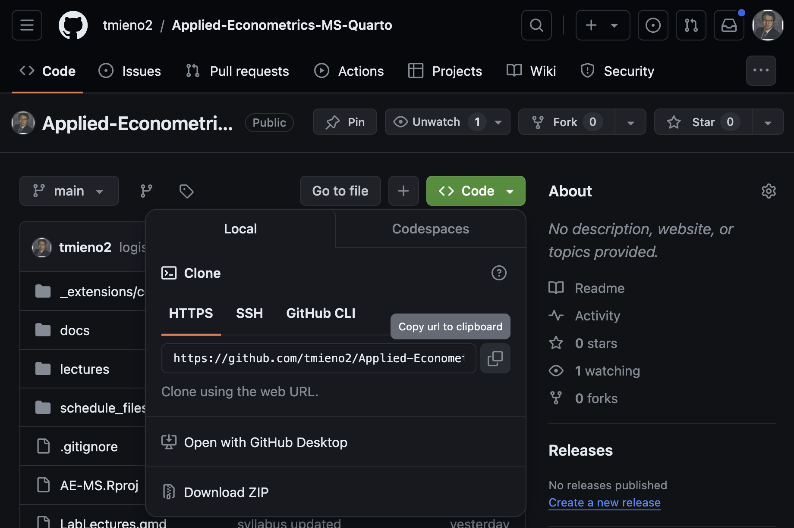
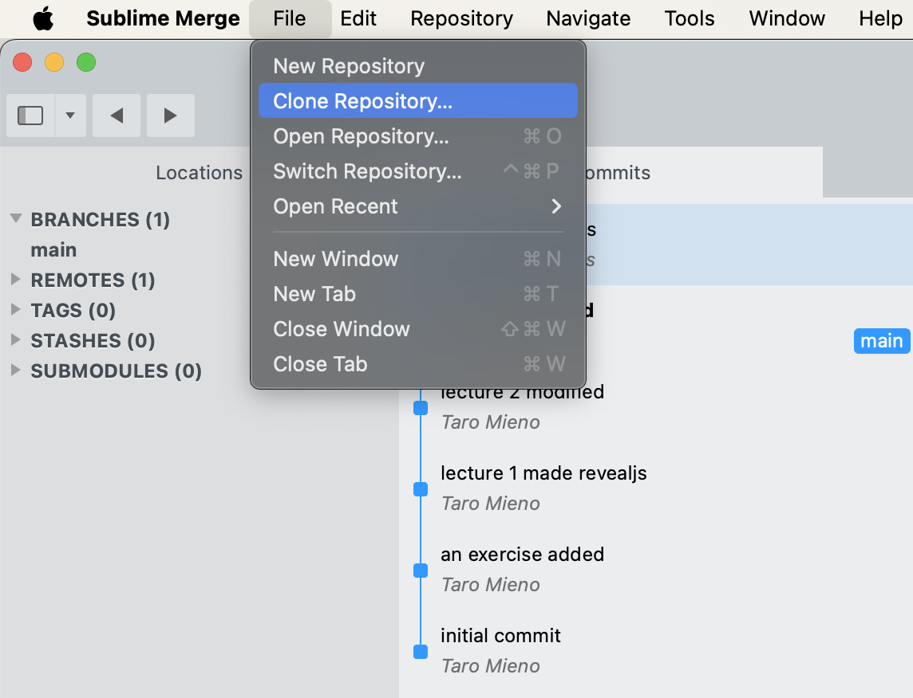
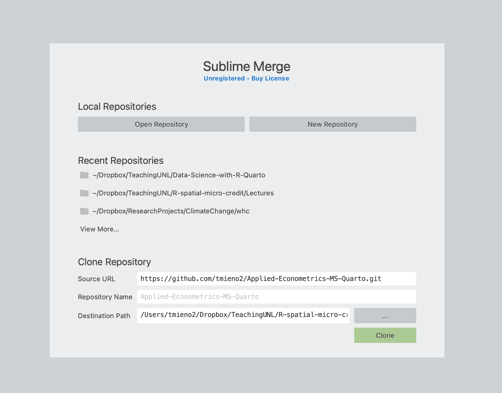

<!--
================================================================================
REVISED VERSION of 02-0-Github-sublime-merge.qmd

NOTE: this block must stay BELOW the YAML header. An HTML comment placed above
the header stops the header from being recognized as front matter, and the YAML
gets printed as a visible slide.

Change log at a glance:
  A. Corrections .......... repository renamed on Github, dead webr filter,
                            inert echo/fig-dpi options, "the a button" typo.
  B. New material ......... you do not need to learn git, Sublime Merge is free
                            to evaluate, a step that checks the clone worked,
                            what the repository is actually for.
  C. Improvements ......... Objective callout moved to the top, alt text on all
                            four screenshots.

ACTION REQUIRED (A2): the repository's copy of templates/sample_qmd.qmd is the
OLD version with no chunk labels. Lecture 02-1 now refers to labelled chunks
(summary-cars, inline-demo, echo-eval-both, ...) that exist only in the rewritten
copy at supplementary-material/templates/sample_qmd.qmd. Push the rewritten file
to https://github.com/tmieno2/quarto-examples before teaching 02-1, otherwise
students following the Directions in 02-1 will be looking at a file that does not
contain what those Directions name.
================================================================================
-->

## Github

Transcript

Let's start with what Github actually is, because the name gets used pretty loosely. Think of it as an online service for storing code, primarily programs, though small datasets are fine too. The unit of storage is a repository, which you can picture as a folder that happens to live online. Repositories are either public, meaning anybody can look at them, or private, meaning only the owner can even see that they exist. And here is the part that matters for us: any public repository can be cloned, which is just a longer word for copied, onto your own computer. One reassurance, in the callout: Github runs on a tool called git, and git is well worth learning one day, but this course never asks you to use it. We copy things down, and that is the whole of it.

:::{.callout-note title="Objective"}
Learn how to clone Github repositories.
:::
<!-- CHANGED (C1): the Objective callout was at the bottom of this slide. Every
     other deck in Chapter 2 opens with it. -->

+ Github is an online service to store primarily computer programs (small datasets are okay to store).
+ Github **repository** is like a folder on your computer (but it is online)
  + public: anybody can access it
  + private: only the owner can access it (you cannot even see it on Github)
+ There are numerous public repositories that serve as excellent examples to learn coding
+ You can **clone** (just another way of saying **copy**) any public Github repositories to your local computer

:::{.callout-important title="You do not need to learn git"}
Github is built on a tool called **git**, which tracks the history of a project. Git is well worth learning, but this course never asks you to use it. We use Github in one direction only: copying existing repositories onto your computer.
:::
<!-- ADDED (B1): students who have heard of git assume a version-control unit is
     coming. Nothing in this course ever teaches committing, so saying so up
     front prevents the anxiety. -->

## Sublime Merge

Transcript

To do the cloning we are going to use a program called Sublime Merge. I want to be clear that it is not the only option; there are plenty of git clients and you are welcome to use whatever you already know. I picked this one because it is light and the cloning workflow is about three clicks. Install it from the link in the first callout. The second callout is the one I really want you to read: Sublime Merge is paid software with an unlimited free evaluation, so every so often a window will pop up asking you to buy a license. Just dismiss it. Nothing we do in this course stops working, and you have not run out of a trial.

+ In cloning Github repositories, we will use Sublime Merge.

+ Sublime Merge is certainly not the only option. But, I found it very easy and light-weight to use especially for just cloning Github repositories.

:::{.callout-note title="Install Sublime Merge"}
Click [here](https://www.sublimemerge.com/) and install it.
:::

:::{.callout-note title="About the license"}
Sublime Merge is paid software with an unlimited free evaluation. You will occasionally see a window asking you to buy a license. Dismiss it. Everything we do in this course works during the evaluation.
:::
<!-- ADDED (B2): the purchase dialog reliably makes students think they have
     installed the wrong thing or run out of a trial. -->

## Clone a repository to your computer

::: {.panel-tabset}

### Copy the url of the repository

Transcript

The first half of cloning happens on the Github website, not on your machine. You go to the repository you want, and you look for the green Code button, which is on the main page of every repository. Click it and a small panel drops down with the repository's address in it. Next to that address is a little icon showing two overlapping sheets of paper, and that is the copy button. Click it and the URL is on your clipboard. That is genuinely all this step is: go and get the address. The screenshot below shows exactly what you are looking for, because the button is smaller than you would expect.

1. Visit the Github repository you want to clone (copy)
2. Click on the green **Code** button
3. Click the copy button, the icon showing two overlapping sheets of paper, which copies the url of the repository

{width=80% fig-alt="The Github Code button expanded, with the copy-url icon next to the repository address"}
<!-- CHANGED (A4): "Click on the a button with two sheets of papers".
     CHANGED (C2): added fig-alt here and on the three screenshots below. -->

### Clone the repository

Transcript

Now the second half, over in Sublime Merge, and it is three short steps in the tabs below. Step one, open the File menu and choose Clone Repository. Step two, you get a dialog with three boxes: the source URL, which should already be filled in from your clipboard, the repository name, and the destination path, which is where the folder will actually land on your machine. Step three is the one I added deliberately, because people skip it. Sublime Merge opens the repository when it finishes, which tells you the copy worked but not where it went. Click through the tabs and I will show you each screen.

::: {.panel-tabset}

#### Step 1

Go to Sublime Merge and follow `file -> Clone Repository`

{width=80% fig-alt="The Sublime Merge File menu with Clone Repository selected"}

#### Step 2

You should now see something like below.

{width=60% fig-alt="The Sublime Merge clone dialog, showing the Source URL, Repository Name, and Destination Path boxes"}

+ Note that the source url you copied is already printed on the `Source URL` box (if not, just paste the url yourself).
+ On `Repository Name`, the name of the repository for which you copied the url is printed automatically. If you would like a different name, type the name you want.
+ On `Destination Path`, click on the gray box with `...` to select the folder on your machine in which the repository is going to be cloned.
+ Finally, hit the `Clone` button

#### Step 3: check that it worked

Sublime Merge opens the cloned repository once it finishes, which tells you the copy succeeded but not where it went.

+ Go to the `Destination Path` you chose in Step 2, using Finder on a Mac or File Explorer on Windows
+ You should see a new folder there, named whatever appeared in the `Repository Name` box
+ Open it, and confirm that the files you saw on the Github page are inside

:::{.callout-tip title="If you cannot find the folder"}
In Sublime Merge, follow `file -> Open Containing Folder` while the repository is open. That takes you straight to it.
:::

:::
<!--end of panel-->

### Do it yourself

Transcript

Now you do it yourself. We are going to clone a repository I put together holding the templates and sample files this course uses, and the link is on the slide. Here is the important instruction, and it is bold for a reason: do not delete this folder after you clone it. The rest of Chapter 2 works out of it. The sample qmd that lecture 02-1 walks through chunk by chunk lives in there, the example style file you will look at in 02-2 is in there, and the datasets for the later exercises are in there too. So clone it, and write down where you put it, because the very next lecture asks you to open a file from it.

+ Let's clone a repository that has many templates and sample qmd files used in this course.

+ The repository is found [here](https://github.com/tmieno2/quarto-examples).
<!-- CHANGED (A1): the url used to be tmieno2/quarto-revealjs-example. The
     repository has been renamed to quarto-examples. The old address still works
     through a Github redirect, but the folder you end up with is called
     quarto-examples, which no longer matched the slide. -->

+ **Do not delete it after you clone it.** The rest of Chapter 2 works out of this folder:

  + `templates/sample_qmd.qmd` is the file lecture 02-1 walks through, chunk by chunk
  + `templates/custom.scss` is an example style file to look at when you write your own in 02-2
  + `data/` holds the datasets used in the later exercises
<!-- ADDED (B3): the original said only "We will actually use this template
     later", which is too vague to stop anyone from deleting the folder. -->

:::{.callout-note title="After cloning"}
Note down where you put this folder. Lecture 02-1 asks you to open `templates/sample_qmd.qmd` from it.
:::

:::
<!--end of panel-->
