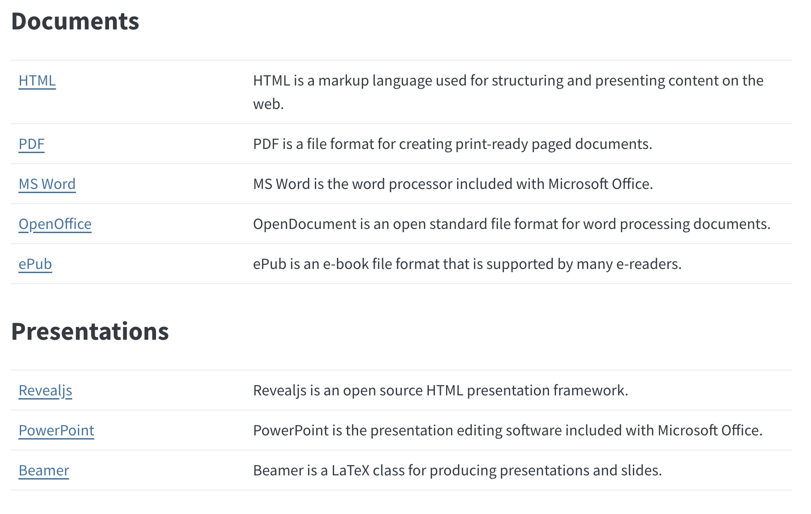

<!-- CHANGED (A11): removed the "filters: - webr" entry. Nothing in this file
     uses a webr chunk, so the filter was loaded for no reason. -->

<!--
================================================================================
REVISED VERSION of 02-1-Quarto-introduction.qmd

Every change from the original is marked with an HTML comment starting with
"CHANGED:", "ADDED:", or "REMOVED:". None of them appear in the rendered
slides. Delete them once you have accepted the changes.

NOTE: this block must stay BELOW the YAML header. An HTML comment placed above
the header stops the header from being recognized as front matter, and the YAML
gets printed as a visible slide.

Change log at a glance:
  A. Corrections .......... broken image, non-existent render(), cache==TRUE,
                            knir:: typo, wrong here::here() path, dotted figure
                            options, old {r eval = F} chunk headers, wrong
                            include: false description, word vs docx, typos,
                            unused webr filter.
  B. New material ......... embed-resources, here::here() for file paths,
                            chunk labels, what to do when a render fails, the
                            fresh-session recipe, a YAML header walkthrough,
                            code-fold, freeze.
  C. Improvements ......... self-sufficient Markdown table, inline code syntax
                            shown on the slide, chunk-label references instead
                            of fragile line numbers, caching trimmed,
                            consistent callout title quoting.

SAMPLE FILE: sample_qmd.qmd (supplementary-material/templates/) has been
rewritten so that every point in this lecture has a labelled worked example, and
every Direction callout below names the section or chunk label to look at.
================================================================================
-->

```{r}
#| label: setup
#| include: false
library(ggplot2)
library(dplyr)
library(here)

source(here::here("lectures/_lecture-theme.R"))
```
<!-- CHANGED (B3): gave this chunk a label, since the lecture now teaches
     labels and the slides should model what they teach. -->

## Quarto: Introduction

::: {.panel-tabset}
### What is Quarto, and why use it?

<details class="transcript">
<summary>Transcript</summary>

Let's start with what Quarto is for. The core idea is that you write one document containing both your R code and the results that code produces, and Quarto assembles them into a finished report. These lecture notes are themselves written in Quarto, so you are looking at the output right now. The situation it is built for is the one you will actually be in: you have done an analysis and you need to show somebody, an advisor or a coauthor, both what you found and the code behind it. And this goes far beyond simple html documents; the gallery linked on the slide is worth a browse to see how far it stretches.

</details>

+ It lets you produce a single document containing both your R code and the results that code produces. These lecture notes are themselves written in **Quarto**.

+ It is useful when you need to report an analysis, together with the R code behind it, to your advisor or anyone else who reads R.

+ The power of Quarto goes well beyond just creating a simple html document. The full power of Quarto is on display [here](https://quarto.org/docs/gallery/).


:::{.callout-note title="Quarto Installation"}
Visit [here](https://quarto.org/docs/get-started/).
:::

###  Using WORD?

<details class="transcript">
<summary>Transcript</summary>

It is worth being explicit about the alternative, because most of you have lived it. You run your analysis in R, then you copy a piece of code into Word, then you copy the output, then a figure, and you do that thirty times. It is tedious, and worse, it is fragile: the moment you change one number in your analysis you have to find and redo every place it appeared. And the formatting almost never survives the paste. Quarto removes that entire loop. You write the code once, in the document, and the results appear where you put the code.

</details>

+ Doing so is tedious, because you have to copy and paste every piece of R code and every result into WORD **manually**.

+ Copied code and results are also badly formatted more often than not.

+ Quarto removes the need for that repeated copying and pasting, and lets you communicate what you did (the code) and what you found (the results) without fighting the formatting.

### Make a report with Quarto

<details class="transcript">
<summary>Transcript</summary>

So how does this actually work? It is two steps, and that is worth holding onto because it explains everything that follows. Step one, you create a qmd file, which is a plain text file mixing ordinary writing with R code, and you use a special syntax to mark which parts are code so the computer can tell them apart. Step two, you tell the computer to process that file, either by clicking the Render button in RStudio or by calling quarto_render from the quarto package. At that point the computer runs your code, collects the results, and combines text, code, and results into one document.

</details>

Generating a report using Quarto is a two-step process:

+ Create a Quarto file (file with .qmd as an extension) with regular texts and R codes mixed inside it.
<!-- CHANGED (A10): "an Quarto file" -> "a Quarto file". Same fix applied to
     every other "an qmd" in this document. -->

  - You use a special syntax to let the computer know which parts of the file are simple texts and which parts are R codes.

+ Tell the computer to process the qmd file (click a button in RStudio, or call the `quarto::quarto_render()` function)
<!-- CHANGED (A2): was "the render() function". There is no such function
     available by default; a student who typed it got
     "could not find function render". -->

  - The computer runs the R code and collects the results
  - It then combines the text, the code, and the results into a single document

:::
<!--end of panel-->

## Quarto: the Basics

::: {.panel-tabset}


### R code chunks

<details class="transcript">
<summary>Transcript</summary>

Everything in a qmd file is one of two things: an R code chunk, or ordinary text. That is the whole model. What separates them is the special syntax in the callout, three backticks with r in curly braces, which fences off a piece of code and tells R to run it. Anything not inside that fence is treated as writing and passes through untouched. The Direction callout points you at sample_qmd.qmd, from the repository you cloned in the last lecture. Open it now and keep it open, because the rest of this lecture keeps pointing back at specific parts of it.

</details>

A qmd file consists of two types of input:

+ R code chunks
+ Regular text

:::{.callout-important title="Special Syntax"}

You mark a piece of R code as code by enclosing it in a special syntax.

````{verbatim}
```{r}
codes
```
````
:::

:::{.callout-note title="Direction"}
Take a look at **sample_qmd.qmd**, which is in the `templates` folder of the [quarto-examples](https://github.com/tmieno2/quarto-examples) repository you cloned in lecture 02-0. Open it in RStudio and keep it open, because the rest of this lecture points at specific parts of it.

If you have not cloned that repository yet, go back to lecture 02-0 and do it now.
<!-- CHANGED (C3): this used to link to a Dropbox share and say "save it in the
     folder you are working in". Two problems: students ended up with the file in
     an unpredictable place, and the class depended on a share link staying
     alive. They already clone the repository in 02-0, so the file is already on
     their machine in a known location.
     ACTION REQUIRED: the copy currently in that repository is the OLD version
     with no chunk labels. Push supplementary-material/templates/sample_qmd.qmd
     to the repository before teaching this lecture, or none of the Direction
     callouts below will find what they name. -->

+ The R code `summary(cars)` and `plot(pressure)` are each enclosed in the special syntax

+ So, in this qmd file, R knows to treat them as code rather than as regular text.

+ Anything not enclosed in the special syntax is treated as regular text.
:::

### Render

<details class="transcript">
<summary>Transcript</summary>

The word for turning a qmd into a finished document is rendering, and you will hear me use it constantly from here on. The easy way is the Render button at the top of the code pane in RStudio. There is also a programmatic route, in the callout, using quarto_render from the quarto package, which matters when you want to render as part of a script rather than by hand. One warning from experience: there is no plain function called render available by default, so if you type that you will get a could not find function error.

</details>

The process of compiling a qmd file to produce a document is called **rendering**.

+ The easiest way to render is to hit the **Render** button located at the top of the code pane (upper left pane by default)

:::{.callout-note}
Alternatively, you can render from R with the `quarto` package:

```{r}
#| eval: false
quarto::quarto_render("sample_qmd.qmd")
```
:::
<!-- CHANGED (A2): render() -> quarto::quarto_render(). -->
<!-- CHANGED (A7): the chunk header was ```{r eval = F}, which is the old
     R Markdown style. This document teaches "#| eval: false", so the examples
     now use it too. Same fix applied everywhere below. -->

### qmd v.s. output

<details class="transcript">
<summary>Transcript</summary>

Let's put the input and the output side by side, because seeing the correspondence is what makes this click. On the qmd side there are three kinds of thing. At the very top, fenced by three dashes, is the YAML header, which controls the document as a whole. Then ordinary sentences, which are not fenced. Then a code chunk, which is. Now look at the html side. The YAML header itself prints nothing; it only shapes the document. The sentences come through as text. And the chunk contributes both its code and its results. Three inputs, three different fates.

</details>

Inspect the qmd file and its output document:

::: {.columns}

::: {.column width="50%"}
**qmd side**

1. The block fenced by `---` at the very top: the **YAML header**, where you control the document as a whole (covered on the next tab)
<!-- CHANGED (B6): was "more on this later", but "later" never arrived inside
     this lecture. There is now a YAML header tab immediately after this one. -->
2. The sentences under **"R code chunks and regular text"**: ordinary text, not enclosed in the special syntax
3. The `summary-cars` chunk just below them: R code, enclosed in the special syntax
:::
<!--end of the 1st column-->
::: {.column width="50%"}
**html side**

1. The YAML header: nothing, it only shapes the document
2. The sentences: printed as regular text
3. The `summary-cars` chunk: both the code and its results printed
:::
<!--end of the 2nd column-->
:::
<!--end of the columns-->

<!-- ADDED (B6): entire tab below. The original said "more on this later" and
     then showed toc / number-sections in a code block with no explanation of
     what any of them do, even though 02-2 and 02-4 assume you can read a YAML
     header. -->
### The YAML header

<details class="transcript">
<summary>Transcript</summary>

Let's take the YAML header apart properly, because 02-2 and 02-4 both assume you can read one. Title, author, and date print at the top of the document, and date colon today fills in the render date automatically. The format key decides what kind of document you get. Underneath it are options belonging to that format: a table of contents, how deep it goes, whether sections get numbered, and embed-resources, which we come back to when we talk about submitting. Now read the callout, because it is the thing that actually breaks: YAML expresses nesting through indentation, and getting the indentation wrong is the single most common reason a header stops working.

</details>

The block at the very top, fenced by three dashes on either side, is the **YAML header**. It controls everything about the document as a whole.

````{verbatim}
---
title: "Reporting using Quarto"
author: "Taro Mieno"
date: today
format:
  html:
    toc: true
    toc-depth: 2
    number-sections: true
    embed-resources: true
---
````

+ `title`, `author`, `date`: printed at the top of the document (`date: today` fills in the render date automatically)
+ `format: html`: what kind of document to produce
+ `toc: true`: add a table of contents
+ `toc-depth: 2`: put headers down to the second level (`##`) in the table of contents
+ `number-sections: true`: number the section headers automatically
+ `embed-resources: true`: produce a single self-contained html file (see the **Submitting your html** tab)

:::{.callout-important title="Indentation matters"}
YAML uses indentation to express nesting. `toc` is indented under `html`, which is indented under `format`, because a table of contents is an option of the html format. Getting the indentation wrong is the single most common reason a YAML header stops working.
:::

### Inline code

<details class="transcript">
<summary>Transcript</summary>

This is a small feature that changes how you write. You can drop an R expression directly into a sentence, using a backtick followed by r and then the code, and what appears in the output is the value. So instead of typing the cars dataset has fifty rows, you write an expression that counts the rows, and the number appears. The reason this matters is in the callout. When your data changes, and it always does, that number updates itself the next time you render. You never again go hunting through your prose for hard-coded numbers that are now wrong.

</details>

You can refer to an R object defined earlier in the document and print its value inside a sentence, using this syntax:

````{verbatim}
The `cars` dataset has `r nrow(cars)` rows.
````

which renders as:

> The `cars` dataset has `r nrow(cars)` rows.

<!-- CHANGED (C1): the original tab was nothing but a one-line pointer to
     "lines 41-51 of the qmd file". A student reviewing the slides on their own
     got no syntax at all. The syntax and its result are now on the slide. -->

:::{.callout-note title="Why this is useful"}
If your dataset changes, the number in the sentence updates by itself the next time you render. You never have to hunt down hard-coded numbers in your text.
:::

:::{.callout-note title="Direction"}
See the section **"Inline code"** and the `inline-demo` chunk. Look at how the sentence below that chunk is written in the source.
:::
<!-- CHANGED (C2): was "See lines 41-51 of the qmd file". Line numbers go stale
     the first time sample_qmd.qmd is edited. Named sections and chunk labels
     do not. -->

### Markdown basics

<details class="transcript">
<summary>Transcript</summary>

The writing itself is done in Markdown, and this table is the practical subset you need. Hashes make headers, and more hashes make smaller ones. Plus signs make bullets, numbers make numbered lists. Single asterisks give italic, double give bold, backticks give code style inside a sentence. Single dollars put maths in a line, double dollars put it on its own centered line. Square brackets followed by parentheses make a link, and the same with an exclamation mark in front inserts a figure. Keep this table; it is the one slide you will come back to during an assignment. The Direction asks you to compare each row against the sample file.

</details>

<!-- CHANGED (C1): the original tab was a bare list of eight words
     (header, make a list, font, ...) plus a pointer to the sample file. The
     table below makes the slide usable on its own, which matters when students
     consult it during an assignment. -->

| What you type | What you get |
|:---|:---|
| `# Big header` | a first-level header |
| `## Smaller header` | a second-level header |
| `+ item` | a bullet list item |
| `1. item` | a numbered list item |
| `*text*` | *italic* |
| `**text**` | **bold** |
| `` `text` `` | code style, in a sentence |
| `$y = a x + b$` | math inside a sentence |
| `$$y = a x + b$$` | math on its own centered line |
| `[UNL](https://www.unl.edu)` | a web link |
| `` | insert a figure |
| `[@smith2020]` | a citation (covered in 02-4) |

:::{.callout-note title="Direction"}
Compare the section called **"Markdown basics"** in the qmd file with the corresponding output in the rendered html file. Every row of the table above appears there.
:::


### Caveat: a fresh R session

<details class="transcript">
<summary>Transcript</summary>

Now the single most important thing in this lecture, because it is what students get stuck on more than anything else. When you render, R starts a completely fresh session that has no connection to the one you have been working in. It cannot see objects you made in the console, and it cannot see packages you loaded by hand. So everything the document needs has to be created inside the document itself, in order, top to bottom: every library call, every dataset, every object. The callout gives you the habit that prevents this: restart R, then run all chunks. If that works, your render will work.

</details>

+ When you render a qmd file, R starts a session that is completely <span style = "color: blue;"> independent </span> of whatever R session you have open in RStudio.

+ This means the document cannot see objects you created by hand in the console, and cannot see packages you loaded by hand either.

<!-- ADDED (B5): everything below this line in this tab. The original stated the
     fact but never said what to do about it, and "it works when I run the
     chunks but fails when I render" is the single most common thing students
     get stuck on. -->

:::{.callout-important title="What this means in practice"}
Everything the document needs must be created **inside the document itself**, in order, from top to bottom:

+ every `library()` call
+ every dataset you read in
+ every object you use later
:::

:::{.callout-note title="The habit that prevents this problem"}
Before you render, do this:

1. **Session > Restart R** (or `Ctrl/Cmd + Shift + F10`)
2. **Run > Run All Chunks**

If that works in a fresh session, the render will work. If it fails, you have found the missing `library()` or missing object before Quarto has to tell you about it.
:::
:::
<!--end of panel-->

<!-- ADDED (B3): entire slide below. The original asked students to write
     "dependson: cache_1" and referred to "the cache_1 chunk" repeatedly without
     ever teaching that chunks can be named. Labels are also required for the
     cross-references taught in 02-4 and they make error messages readable. -->
## Chunk labels

::: {.panel-tabset}

### What?

<details class="transcript">
<summary>Transcript</summary>

You can give a chunk a name, using the label option on its own line inside the chunk. That is all there is to the syntax. It looks like a cosmetic detail and it is not, which is what the next tab is about. Notice the shape of it: the label goes on a comment line starting with a hash and a pipe, immediately after the chunk opens. That hash-pipe pattern is how every chunk option is written, so you are learning the general syntax here as well as this particular option.

</details>

You can give a code chunk a name using the `label` option:

````{verbatim}
```{r}
#| label: read-corn-price

corn_price <- read.csv("corn_price.csv")
```
````

### Why bother?

<details class="transcript">
<summary>Transcript</summary>

Three reasons to bother labelling your chunks, and they compound. First, and most immediately useful, error messages become readable: when a render fails, Quarto tells you which chunk broke by name, and being told that read-corn-price failed is a great deal more helpful than being told chunk seven failed. Second, cross-references require labels; in 02-4 you will refer to figures and tables by number, and that only works if the chunk is named. Third, the caching options later in this very lecture point at chunks by label. Label everything, from today.

</details>

+ **Error messages become readable.** When a render fails, Quarto tells you which chunk failed, by name. Without labels, you get an unhelpful "chunk 7".

+ **Cross-references require them.** To refer to a figure or table by number in your text (Chapter 02-4), the chunk must be labeled `fig-something` or `tbl-something`.

+ **Caching options refer to them.** The `dependson` option, later in this lecture, points at another chunk by its label.

### Rules

<details class="transcript">
<summary>Transcript</summary>

Three rules, and they are short. Labels have to be unique within a document, which makes sense since the whole point is identifying one chunk. No spaces. And stick to letters, digits, and hyphens; write read-corn-price with hyphens rather than spaces or underscores. That hyphen habit is worth building now, because in 02-4 you will find that underscores silently break cross-referencing. The Direction points out that every chunk in the sample file is labelled, so you have several dozen examples to look at.

</details>

+ Each label must be **unique** within the document
+ **No spaces**
+ Stick to letters, digits, and hyphens (`read-corn-price`, not `read corn price`)

:::{.callout-note title="Direction"}
Every chunk in `sample_qmd.qmd` is labelled. See the section **"Chunk labels"** and its `labelled-example` chunk.
:::

:::
<!--end of panel-->

## Chunk options

::: {.panel-tabset}

### What?

<details class="transcript">
<summary>Transcript</summary>

Chunk options are settings that live inside a code chunk and control how that particular chunk behaves. The list on the slide is the set you will actually meet: echo, eval, message, warning, output, include, cache, and the figure options. Do not try to memorize what each one does from this list; we take them a few at a time over the next several tabs, each with a worked example in the sample file. The link goes to the complete reference, which is where you should look when you want something we have not covered.

</details>

Chunk options are settings placed inside an R code chunk that control how that chunk behaves.

Here are some example options:

+ `echo`
+ `eval`
+ `message`
+ `warning`
+ `output`
+ `include`
+ `cache`
+ `fig-cap`, `fig-height`, etc
<!-- CHANGED (A6): was "fig.cap, fig-height", which mixed the old dotted names
     and the Quarto hyphenated names inside a single bullet. Quarto uses
     hyphens throughout, and 02-4 already uses the hyphenated form. -->

See all the options [here](https://quarto.org/docs/computations/execution-options.html#output-options).

### Example: `echo`

<details class="transcript">
<summary>Transcript</summary>

Before the syntax, let's look at the effect, because that makes the syntax worth learning. Open the sample file at the section on code chunks and regular text and compare it against the rendered output. The first chunk, summary-cars, shows you both the code and its result. The second, plot-pressure, shows only the figure; the code that drew it is nowhere in the output. Same kind of chunk, completely different appearance. The only difference between them is one chunk option, echo set to false, on the second one.

</details>

Look at the section **"R code chunks and regular text"** in the sample file, and compare it with the rendered output:

+ The `summary-cars` chunk: both the code and its result appear
+ The `plot-pressure` chunk: only the figure appears, not the code that drew it

The difference is the chunk option `echo: false` on the second one.

### How

<details class="transcript">
<summary>Transcript</summary>

Here is the syntax for setting an option, and it is the hash-pipe pattern you already saw with labels. Immediately inside the chunk, on its own line, you write hash, pipe, the option name, a colon, and the value. So hash-pipe echo colon false hides the code. Now read the Caveat, because this one is genuinely maddening when it happens: there must be no blank line between the start of the chunk and its options. Put a blank line in there and the option is silently ignored. Nothing warns you; the chunk just behaves as though you never set it.

</details>

To set a chunk option, use the following syntax:

````{verbatim}
```{r}
#| option-name: choice

R codes come here
```
````

<br>

**Example**

````{verbatim}
```{r}
#| echo: false

R codes come here
```
````

<br>

:::{.callout-important title="Caveat"}
<!-- CHANGED (A10): "titel=Caveat" was a typo, so this callout rendered without
     its title. Also quoted for consistency with every other callout title in
     this file (C6). -->
There must be no blank line between the start of an R code chunk and its options. In the example below, the `echo` option is ignored:

````{verbatim}
```{r}

#| echo: false

R codes come here
```
````
:::


### Various options

<details class="transcript">
<summary>Transcript</summary>

The next few tabs go through the options one small group at a time, and each group has matching chunks in the sample file so you can see the difference rather than take my word for it. Echo and eval control whether the code is shown and whether it is run. Message and warning control whether R's chatter reaches the reader. Output controls the results. Include is a convenient combination of several at once. And the figure options control size, alignment, and captions. Work through the tabs in order; they build on each other.

</details>

::: {.panel-tabset}

#### `echo` and `eval`

<br>

+ `echo` (<span style="color:red"> true </span> or false): whether the code itself appears in the output document

+ `eval` (<span style="color:red"> true </span> or false): whether the code is run at all

<br>

:::{.callout-note title="Direction"}
See the section **"`echo` and `eval`"**. It has four chunks, `echo-eval-both`, `echo-eval-no-echo`, `echo-eval-no-eval`, and `echo-eval-neither`, showing every combination.
:::
<!-- CHANGED (C2): was "lines 75-103". Replaced with a chunk label reference
     here and in every other Direction callout below. -->

#### `message` and `warning`

<br>

+ `message` (true or <span style="color:red"> false </span>): whether messages produced while running the code appear in the output document

+ `warning` (true or <span style="color:red"> false </span>): whether warnings produced while running the code appear in the output document
<!-- CHANGED (A10): "weather" -> "whether", twice. -->

<br>

:::{.callout-note title="Direction"}
See the section **"`message` and `warning`"**. The chunks `message-warning-both`, `message-warning-no-message`, and `message-warning-neither` each emit the same message and warning, and differ only in which are suppressed.
:::

#### `output`

<br>

`output` (<span style="color:red"> true </span>, false, asis)

+ `true`: prints all results, including warnings and messages
<!-- CHANGED (A10): "pint" -> "print". -->
+ `false`: hides all results, including warnings and messages
+ `asis`: inserts the result into the document exactly as it is, with no formatting applied

<br>

:::{.callout-note title="Direction"}
See the section **"`output`"**. The `output-demo` chunk prints nothing, and the `output-demo-check` chunk right after it proves the code still ran.
:::

#### `include`

<br>

`include: false` runs the code but shows nothing at all. It is equivalent to setting `eval: true`, `echo: false`, `output: false`, `warning: false`, and `message: false` all at once.

<!-- CHANGED (A8): the original said it was equivalent to "eval: true,
     echo: false, results: false". Two problems: (i) the option in Quarto is
     called "output", not "results" (the previous tab just taught "output"), and
     (ii) include: false also suppresses warnings and messages, which the old
     list left out. -->

:::{.callout-note title="Common use"}
This is what you put on a setup chunk that loads your packages: the packages get loaded, but the reader is not shown a wall of `library()` calls and startup messages.
:::

:::{.callout-note title="Direction"}
See the section **"`include`"**. The `include-demo` chunk shows nothing at all, and `include-demo-check` proves it still ran.
:::

#### figure-related

<br>

**Chunk options for figures**

+ `fig-align`: 'default', 'center', 'left', 'right'
+ `fig-width`: in inches
+ `fig-height`: in inches
+ `fig-cap`: figure caption

<!-- CHANGED (A6): all four were written with dots (fig.align, fig.width,
     fig.height, fig.cap), which is the old knitr spelling. Quarto uses hyphens,
     and 02-4 uses hyphens. The dotted names still happen to work with the R
     engine, which is exactly why the inconsistency confuses students. -->

<br>

:::{.callout-note title="Direction"}
See the `fig-options` chunk in the sample file, which sets all four at once. Change `fig-align` to `left`, or change `fig-width`, and render again. The full list of figure options is [here](https://quarto.org/docs/reference/cells/cells-figures.html).
:::
<!-- CHANGED (A6): the link pointed at the knitr options page, which documents
     the dotted names. Now points at the Quarto reference. -->


:::
<!--end of panel-->

### Specify chunk options globally

<details class="transcript">
<summary>Transcript</summary>

Everything so far has been per chunk, which is fine until you want the same setting everywhere. If your instructor wants results without code, you do not want to type echo false into forty separate chunks. These tabs show the global route: an execute block in the YAML header that applies to the whole document. There is also a tab on code-fold, which I would argue is usually the better answer for an assignment, because it hides the code behind a button rather than deleting it, so I can still check your work. And a short note at the end on the precedence rule.

</details>

::: {.panel-tabset}

#### What and why?

Sometimes it is useful to set chunk options that apply globally, to the entire document.

For example,

+ You are writing a term paper and the instructor may want to see only results, but not R codes.
+ You do not want any code to appear in the output document, but `echo: true` is the default.
+ Typing `echo: false` in every single chunk is a waste of time.

#### How

You can set chunk options globally in the YAML header with the `execute` option like below:

````{verbatim}
---
title: "Reporting using Quarto"
author: "Taro Mieno"
format:
  html:
    toc: true
    toc-depth: 2
    number-sections: true
    number-depth: 2
execute:
  echo: false
  warning: false
  message: false
---
````
<!-- CHANGED: added warning and message to the example, since hiding those
     globally is far more common in practice than hiding code. -->

:::{.callout-note title="Direction"}
+ Insert the following in the YAML header of `sample_qmd.qmd` file so that it looks like above

````{verbatim}
execute:
  echo: false
````

+ Render the qmd file again and then compare the **echo-eval** section of the qmd file and its corresponding output.
:::

<!-- ADDED (B7): entire tab below. code-fold solves the exact motivating example
     used two tabs ago ("the instructor wants to see only results"), but better,
     because the code is still there if the reader wants it. You already use it
     in Chapter 5. -->
#### A better option than hiding: `code-fold`

Instead of removing the code from the document entirely, you can collapse it behind a "Code" button that the reader can click open:

````{verbatim}
format:
  html:
    code-fold: true
````

+ The document reads cleanly, without walls of code
+ The reader who wants to check your work can still see every line
+ Use `code-fold: show` to have it start expanded instead

:::{.callout-note title="For this course"}
This is usually a better choice than `echo: false` for an assignment: I can read your results without the code in the way, and still check your code when I need to.
:::

:::{.callout-note title="Direction"}
See the `code-fold-demo` chunk in the sample file, and click the **Code** button above its figure in the rendered html.
:::

#### Note

:::{.callout-important}
A local option always overrides the global one.
:::

:::
<!--end of panel-->

:::
<!--end of panel-->

<!-- ADDED (B4): entire slide below. Nothing in the original told students what
     to do when a render stops with an error, which is the situation they will
     actually be in at 11pm the night an assignment is due. -->
## When a render fails

::: {.panel-tabset}

### Read the message

<details class="transcript">
<summary>Transcript</summary>

This slide exists because at some point, probably late the night before something is due, a render is going to fail. So let's make that a normal, survivable event. When rendering stops, Quarto prints an error in the Console or the Background Jobs pane, and two pieces of that message matter. First, which chunk failed, reported by its label, which is the concrete payoff for labelling everything. Second, the error itself, which is an ordinary R error of the kind you already know how to read: object not found, cannot open file, and so on. Read those two things before you change anything.

</details>

When rendering stops, Quarto prints the error in the Console or Background Jobs pane. Two things in that message matter:

+ **which chunk failed** (by label, which is why you label your chunks)
+ **the error itself**, which is an ordinary R error like `object 'corn_data' not found` or `cannot open file 'corn_price.csv'`

### Find the cause

<details class="transcript">
<summary>Transcript</summary>

Now the procedure. Go to the chunk it named, run that chunk by hand in the console, and read the error there where it is easier to see. Then ask which of three things it is. Could not find function means a library call is missing inside the document. Object not found means the object exists only in your console session, not in the document, which is the fresh-session problem again. And cannot open file is a path problem, which the Directory slides deal with. Nearly every render failure is one of those three, and the reminder at the bottom catches most of them before they happen.

</details>

1. Go to the chunk it named
2. Run that chunk by hand in the console and read the error there
3. Ask which of these it is:

+ `could not find function ...` : a `library()` call is missing **inside the document**
+ `object '...' not found` : the object only exists in your console session, not in the document
+ `cannot open file ...` : a file path problem (see the **Directory** slides)

:::{.callout-note title="Reminder"}
Restart R and run all chunks from the top. Most render failures show up immediately when you do.
:::

### `error: true`

<details class="transcript">
<summary>Transcript</summary>

One more tool for when things break. By default a single failing chunk stops the entire render, which is usually what you want but occasionally is not. Setting error true on a chunk tells Quarto to print the error into the document and carry on building. Two uses. First, when you are deliberately demonstrating an error, which is exactly what the sample file does with log of a. Second, and more practically, when several chunks are broken and you want to see all the failures in one render instead of fixing them one at a time.

</details>

By default, one failing chunk stops the whole render. Sometimes you want the document to build anyway and show the error where it happened:

````{verbatim}
```{r}
#| error: true

log("a")
```
````

+ The error message is printed in the document instead of stopping the render
+ Useful when you are deliberately demonstrating an error, and useful for isolating which of several chunks is broken

:::{.callout-note title="Direction"}
See the `error-demo` chunk in the sample file. It calls `log("a")`, which fails, yet the document still builds and shows you the error.
:::

:::

## Caching

::: {.panel-tabset}

### What?

<details class="transcript">
<summary>Transcript</summary>

Here is a problem you will have as soon as your analysis gets slow. While writing a report you hit Render many times, checking whether things look right, and every single time, every chunk runs again from scratch, even the ones that have not changed. Caching fixes that: set cache true on a chunk and R stores its results, then reuses them instead of re-running the code. The longer a chunk takes, the more this matters. Note the syntax carefully, cache colon true in lower case, in the hash-pipe style, not the older double-equals TRUE form you may see in older material.

</details>

+ You are going to hit the "Render" button many times while writing a report, to check whether the output looks right.

+ Every time you render, all the R code chunks are evaluated again, even though R has already evaluated them before.

+ Caching stores the results of a chunk so that R can call up the saved results instead of re-running the code. The longer the code takes to run, the more time this saves.

+ Turn it on with the chunk option `cache: true`.
<!-- CHANGED (A3): the original said "cache==TRUE", which is wrong twice: a
     double equal sign instead of a colon, and upper-case TRUE instead of the
     YAML "true". -->

### Let's try

<details class="transcript">
<summary>Transcript</summary>

Let's watch it happen rather than take it on trust. The Direction asks you to switch the cache_1 chunk from eval false to eval true and render. You will see two new folders appear next to your document, one ending in cache and one ending in files, which is where the stored results live. Then render a second time without changing anything, and notice how much faster it is. That difference is the cached chunk being skipped. Once you have seen the folders appear you will also recognize them when you need to delete them, which is coming up in two tabs.

</details>

:::{.callout-note title="Direction"}
+ Change `eval: false` to `eval: true` in the **cache_1** chunk
+ Render and confirm that **sample_qmd_cache** and **sample_qmd_files** folders are created
+ Render again and observe that the rendering process is much faster now
:::

### The one trap

<details class="transcript">
<summary>Transcript</summary>

Now the trap, and it is the reason caching has a bad reputation. If you change the code inside a cached chunk, R notices and re-runs it. That part is reliable. But if the code stays exactly the same while the data it uses has changed, R does not notice, because all it compares is the text of the code, not the contents of your objects. So it hands you the old result, silently, and it looks correct. The Direction walks you through producing exactly that failure on purpose, which is the fastest way to learn to distrust a stale cache.

</details>

+ If you change the **code** inside a cached chunk, R notices and re-runs it. That part is automatic and reliable.

+ If the code stays the same but the **data it uses** has changed, R does **not** notice. R only compares the text of the code, not the contents of your objects. You get the old, stale result.

<!-- CHANGED (C4): the original spent four tabs on caching (What / Let's try /
     Changes in codes / Changes in contents / dependson) before students had
     written a single document of their own. The "code changed" and "content
     changed" tabs are merged here into the one trap that matters, and
     dependson is moved to an "If you hit this" tab below. -->

:::{.callout-note title="Direction"}
+ Change `eval: false` to `eval: true` in the **cache_2** chunk and render
+ Now change `y <- 1 + x + v` to `y <- 1 + 2 * x + v` in **cache_1** and render again
+ **cache_1** re-runs, because its code changed, and `MC_results` is now a different number
+ But notice that **cache_2** still prints the **old** number. Its own code did not change, so R reused the cached result
:::

### If you hit this: `dependson`

<details class="transcript">
<summary>Transcript</summary>

There is a proper fix for what you just saw. The dependson option lets you declare that one cached chunk depends on another, so when the first one re-runs the second is forced to re-run as well. Add dependson pointing at cache_1 to the cache_2 chunk and the stale-number problem goes away. But read the second callout, because it is the honest advice: when you are in any doubt, just delete the cache folder and render again. Caching is an optimization, and correctness comes first. Nobody ever lost marks for a render that took an extra minute.

</details>

You can tell R that one cached chunk depends on another, so that a change in the first forces the second to re-run:

:::{.callout-note title="Direction"}
Add `dependson: cache_1` to the `cache_2` chunk as an option and render again.
:::

:::{.callout-important title="The simplest fix"}
When in doubt, delete the `_cache` folder and render again. Caching is an optimization; correctness comes first.
:::

<!-- ADDED (B8): entire tab below. Students building the Quarto website in 02-3
     run straight into this, and cache does not solve it. -->
### Related: `freeze`

<details class="transcript">
<summary>Transcript</summary>

One related idea, which you will want in the very next lecture. Cache speeds up repeated renders of a single document. Freeze solves the neighbouring problem: when you have a whole website or project made of many documents, you do not want to rebuild all of them every time you edit one. Putting freeze auto in _quarto.yml means only the documents whose source has actually changed get re-rendered. If you build the website in 02-3 and find yourself waiting through a full rebuild for a one-line edit, this is the setting you want.

</details>

`cache` speeds up repeated renders of **one document**. When you have a whole Quarto **website** or project of many documents (Chapter 02-3), you want something else: `freeze` stops a document from being re-rendered at all unless its source has changed.

````{verbatim}
execute:
  freeze: auto
````

Put this in `_quarto.yml` and only the documents you have actually edited get re-rendered when you rebuild the site.

:::
<!--end of panel-->

## Directory: where R looks for your files

<!-- CHANGED (B2): this whole section is rewritten. The original offered three
     options, of which the recommended-for-beginners one conflicts with the
     project structure taught later, the second breaks the moment the folder
     moves or someone else opens it, and the third
     (knitr::opts_knit$set(root.dir = ...)) contained a typo ("knir::"), is an
     R Markdown workaround rather than the Quarto way, and does not behave
     reliably under Quarto. The here package, which this very lecture already
     loads, is now the recommended answer. -->

::: {.panel-tabset}
### The default

<details class="transcript">
<summary>Transcript</summary>

Now file paths, which is where cannot open file errors come from. The default rule is simple: R looks for the file in the same folder as the qmd file, not wherever your console happens to be pointed. The slide shows this concretely with the actual folder this file lives in, and the full path R would therefore try. If the file is not at that exact location, the read fails, and everything downstream that needed the data fails with it. The next four tabs are three ways to handle this, in increasing order of how much I recommend them.

</details>

Suppose you want to read a dataset like this:

```{r}
#| eval: false
read.csv("corn_price.csv")
```

<br>

:::{.callout-important}
By default, R looks for **corn_price.csv** in the same folder in which the qmd file is located.
:::

<br>

+ In my case, `sample_qmd.qmd` is located in <span style = "color: blue;"> `r here::here("lectures", "Chapter-2-Quarto")` </span>.
<!-- CHANGED (A5): was here::here("Chapter-2-Quarto"), which printed a path that
     does not exist. here::here() builds the string whether or not the folder is
     real, so the slide was confidently displaying a fake location. The actual
     folder is lectures/Chapter-2-Quarto. -->

+ This means that R tries to find <span style = "color: blue;"> `r here::here("lectures", "Chapter-2-Quarto", "corn_price.csv")`</span>.

+ If the file is not there, R cannot import it and returns an error. Everything downstream that depends on the dataset fails too.

### Option 1: same folder

<details class="transcript">
<summary>Transcript</summary>

Option one is to put your data in the same folder as your qmd and refer to it by name alone. It is the simplest thing that works and it is genuinely fine for a single short assignment, so do not feel bad about using it this week. But read the callout, because it has a shelf life. As soon as a project has more than a handful of files you will want data in one folder, code in another, and output in a third, and at that point this approach stops working. Later in the course we set projects up that way, and then option three is what you use.

</details>

Put the datasets you intend to use in the same folder as your qmd file, and refer to them by name alone:

```{r}
#| eval: false
read.csv("corn_price.csv")
```

+ Simplest thing that works, and fine for a single short assignment.

:::{.callout-note title="But not for long"}
Once a project has more than a handful of files, you will want data in its own folder, code in another, and output in a third. Later in this course we set projects up that way, and then Option 3 below is what you use.
:::
<!-- ADDED (C5): forward pointer. The original presented "put everything in one
     folder" as the recommendation for beginners with no hint that it is
     temporary, so students carried it into projects where it does not scale. -->

### Option 2: full path (avoid)

<details class="transcript">
<summary>Transcript</summary>

Option two is to write out the entire path from the root of your hard drive, and I am showing it to you mainly so you recognize it and avoid it. Look at the example: it has my username in it. That is the problem in miniature. It breaks the moment you rename any folder above it, it breaks on anybody else's computer including mine when I am grading, and it breaks on your own second machine. If you find yourself typing a path that starts with Users or C colon, stop.

</details>

You can spell out the entire path to the file:

```{r}
#| eval: false
read.csv("/Users/tmieno2/Dropbox/Data-Science-with-R/Chapter-2-Quarto/corn_price.csv")
```

:::{.callout-important title="Why to avoid this"}
+ It breaks the moment you move or rename any folder above it
+ It breaks on anyone else's computer, including mine when I grade it
+ It breaks on your own second computer
:::

### Option 3: `here` (recommended)

<details class="transcript">
<summary>Transcript</summary>

Option three is the one I recommend, and it is the here package. Rather than starting from your hard drive or from the qmd's own folder, here builds paths from the project root, which is the folder holding your Rproj file or your _quarto.yml. You write here, then the folder and file names as separate pieces, and it assembles the right path. It works no matter which subfolder the document sits in, it works on any computer because nothing above the project root is written down, and it works whether you render or run chunks by hand. If you are unsure what it decided the root was, run here on its own in the console.

</details>

The `here` package builds paths starting from your **project root**: the folder containing your `.Rproj` file or `_quarto.yml`.

```{r}
#| eval: false
library(here)

read.csv(here("data", "corn_price.csv"))
```

+ Works no matter which subfolder the qmd file itself sits in
+ Works on any computer, because nothing above the project root is written down
+ Works whether you render the document or run the chunks by hand

:::{.callout-note title="Check what it resolved to"}
Run `here::here()` on its own in the console to see which folder it decided is the project root.
:::

:::{.callout-note title="Direction"}
See the section **"Reading a data file"** in the sample file. The `read-relative` chunk uses a plain file name and `read-here` uses `here()`. Both are set to `eval: false`, so they are shown but not run.
:::

### Project-wide alternative

<details class="transcript">
<summary>Transcript</summary>

One alternative worth knowing if you are working on a whole project rather than a single document. Setting execute-dir project in _quarto.yml makes every document run as though it were sitting at the project root, so a plain relative path like data slash corn_price works from anywhere in the project. It solves the same problem here solves, which is exactly why the note warns you to pick one and not both. Mixing them means you can no longer tell at a glance which folder any given path is starting from, and that confusion is worse than either approach on its own.

</details>

If you would rather have every document in a project run as if it were sitting at the project root, set this once in `_quarto.yml`:

````{verbatim}
execute-dir: project
````

Then `read.csv("data/corn_price.csv")` works from any document in the project. This is a project-wide setting, so use it instead of `here`, not alongside it, to avoid confusion about which folder paths start from.

:::
<!--end of panel-->

<!-- ADDED (B1): entire slide below. This is the biggest practical gap in the
     original. Students are told to submit assignments in html, and the
     assignment templates already set embed-resources: true, but nothing ever
     explained what it does. A student who emails only the .html file without it
     submits a document with no figures. -->
## Submitting your html

::: {.panel-tabset}

### What rendering actually produces

<details class="transcript">
<summary>Transcript</summary>

This slide is about handing work in, so it matters for your grade. When you render my_report.qmd you get two things, not one: the html file, and a folder called my_report_files holding every figure, stylesheet, and script the document needs. The callout is the part to remember. The html file on its own is not the whole document. If you email me just the html, or upload just the html, the figures will be missing when I open it, and you will have submitted a report with holes in it without ever knowing.

</details>

Render `my_report.qmd` and you get **two** things in the folder:

+ `my_report.html` : the document
+ `my_report_files/` : a folder holding every figure, style sheet, and script the document needs

:::{.callout-important title="They travel together"}
The html file by itself is **not** the whole document. Email only `my_report.html`, or upload only that file, and your figures will be missing when I open it.
:::

### The fix: `embed-resources`

<details class="transcript">
<summary>Transcript</summary>

The fix is one line in the YAML header: embed-resources set to true, indented under html. That tells Quarto to pack everything, figures and styles and scripts, inside the single html file. It gets bigger, but it becomes one genuinely self-contained document you can email, upload, or open anywhere, and you no longer need the files folder at all. Read the callout: this is required for everything you submit in this course. Set it once at the top of every assignment and then submit the single html file.

</details>

Add one line to the YAML header:

````{verbatim}
format:
  html:
    embed-resources: true
````

+ Everything gets packed **inside** the single html file
+ The file gets bigger, but it is now one self-contained document you can email, upload, or open anywhere
+ You no longer need the `_files` folder at all

:::{.callout-important title="Required for this course"}
Use `embed-resources: true` for every assignment you submit. Then submit the single `.html` file.
:::

### Check it worked

<details class="transcript">
<summary>Transcript</summary>

And here is how to be certain before you submit, which takes about thirty seconds. Render the document. Then move only the html file, by itself, to your Desktop, away from its folder. Open it there and look. If the figures are still present, the file is genuinely self-contained and safe to hand in. If they have vanished, embed-resources is either missing or in the wrong place in your YAML, most likely indented incorrectly. Do this check the first few times until you trust your own header.

</details>

1. Render the document
2. Move **only** the `.html` file to your Desktop
3. Open it there

If the figures still show up, you are safe to submit. If they do not, `embed-resources: true` is missing or misplaced in the YAML.
:::

:::{.callout-note title="Direction"}
`sample_qmd.qmd` deliberately does **not** set `embed-resources`. Add it under `html:` in the YAML header, render, and compare: the html file gets much larger, and the document no longer depends on the `sample_qmd_files` folder.

:::
<!--end of panel-->

## Output types

::: {.panel-tabset}

### Various formats

<details class="transcript">
<summary>Transcript</summary>

A qmd is not tied to one kind of output. The same source can become html, PDF through several different engines, Word, and a good deal else; the link on the slide has the full list and the screenshot shows the range. But read the callout, because it sets the policy for this course. We use html, and html is what you submit. There is a specific reason beyond convenience: html has no concept of a page, so you never have to fight to make a table or a figure fit inside a fixed rectangle, which is a real and recurring cost with PDF and Word.

</details>

A qmd file can be rendered to many different formats, using different engines. See [here](https://quarto.org/docs/output-formats/all-formats.html) for the full list of document types.


<!-- CHANGED (A1): was "". The .png extension was missing,
     so the image was broken in the rendered slides. Alt text added as well. -->

:::{.callout-important}
+ In this course, we only use the html option. Submit your assignment in html.
+ html has no concept of a **page**, so you never have to worry about fitting text, tables, and figures into a fixed amount of space.
:::


### How

<details class="transcript">
<summary>Transcript</summary>

Producing a different format is two steps. Step one, add the format under the format key in the YAML header, and the example shows three at once: html with its options, docx taking the defaults, and typst with page size, margins, and columns specified underneath it. Notice the pattern, that a format either takes default or has its own indented block of options. Step two, back in RStudio, there is a small downward triangle next to the Render button, and that is where you choose which of your declared formats to build.

</details>

**Step 1**

To produce a given output type, add the appropriate option under `format` in the YAML header, as below.

````{verbatim}
---
title: "Reporting using Quarto"
author: "Taro Mieno"
format:
  html:
    toc: true
    toc-depth: 2
    number-sections: true
    number-depth: 2
    embed-resources: true
  docx: default
  typst:
    papersize: a5
    margin:
      x: 1cm
      y: 1cm
    columns: 2
---
````
<!-- CHANGED: added the enclosing --- fences, which the original example was
     missing, and added embed-resources to keep the running example consistent
     with the submission slide. -->

Here,

+ A WORD document (the `docx` option) is produced with the default settings.
<!-- CHANGED (A9): the text said "with `word` option" while the YAML said
     "docx". There is no "word" format key. -->
+ A PDF (the `typst` option) is produced using the settings listed under `typst:`.

:::{.callout-note title="Direction"}
Add the docx option and typst options in the YAML above to your qmd file.
:::

<br>

**Step 2**

You should see a downward triangle to the right of the **Render** button. Use it to choose which format to render.

### Note

<details class="transcript">
<summary>Transcript</summary>

One caution to close the slide with. The YAML options and chunk options that are available are not the same across formats and engines. An option that works beautifully for html may be meaningless for Word, or spelled differently for PDF. So when something you copied from elsewhere quietly does nothing, the first thing to check is whether that option exists for the format you are actually producing. The link goes to the per-format reference, which is where to look rather than guessing.

</details>

The YAML and chunk options available differ by output format and engine. See [here](https://quarto.org/docs/reference/formats/html.html) for the options specific to a particular format.
:::
<!--end of panel-->

## Resources

<details class="transcript">
<summary>Transcript</summary>

That is the tour of Quarto's basics. Where to go next: the official Quarto website is genuinely the best resource, and I have split the links by what you will actually be looking for. The guide is for syntax, both general and specific to a document type. The reference section is for YAML options for a particular format. And the cell options page is the complete list of chunk options, which is the one you will want open while doing the assignment. Everything in this lecture is in there, along with a great deal more.

</details>

The best resource for learning Quarto is its official website:

+ [General and specific (to document type) syntax](https://quarto.org/docs/guide/)
+ [YAML options specific to document type](https://quarto.org/docs/reference/)
+ [All chunk (cell) options](https://quarto.org/docs/reference/cells/cells-knitr.html)
<!-- ADDED: a direct link to the cell options reference, since the lecture
     sends students looking for chunk options in several places. -->
