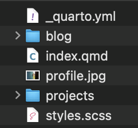
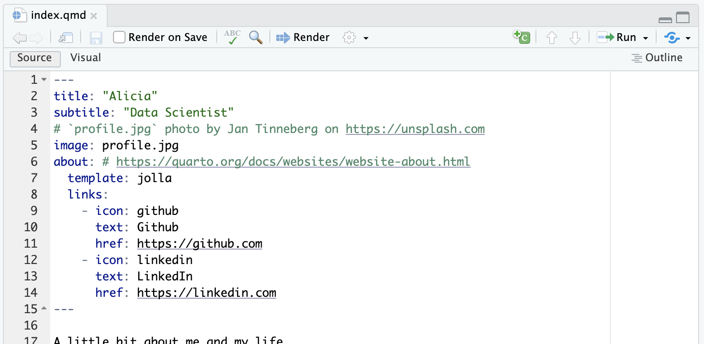
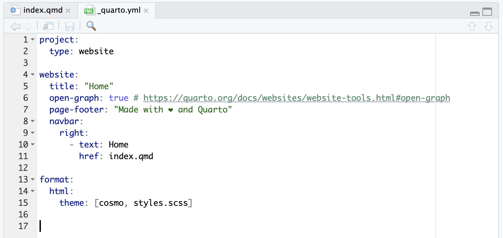

```{r}
#| include: false
library(ggplot2)
library(dplyr)

source(here::here("lectures/_lecture-theme.R"))
```

## Get Started

::: {.panel-tabset}

### Start with a template

<details class="transcript">
<summary>Transcript</summary>

Rather than building a website from an empty folder, we start from a template somebody else has already got working and then bend it to our needs. The command is on the slide. You open a terminal, use cd to navigate to wherever you want the website folder to live, and run quarto use template with the template's address. In this address, EmilHvitfeldt slash website-template names the GitHub owner and repository, so Quarto knows exactly which template to copy. It will ask you a series of questions. One of them is the name of the folder it creates, so answer that one deliberately; say yes to the rest. When it finishes you will have a folder of files that looks like the screenshot, and that is already a working website. Look at what the template has supplied. The underscore Quarto dot y-m-l file holds settings for the whole website, index dot q-m-d is the home page, profile dot j-peg is an image used by that page, and styles dot s-c-s-s holds custom styling. The blog and projects folders organize additional site content. You do not need to understand every file yet. The point is that the template gives you configuration, content, an image, and styling that already work together. In the next tab, you will build those materials into the website.

</details>

We are going to start with a Quarto website template and then modify it to our likings.

+ Open a terminal app or go to the terminal tab of the console pane.
+ Navigate to the folder in which you want to create a folder with all the website materials using `cd`.
+ Run the following code and you will see a series of questions. One of them ask you the name of the folder created. Say yes to all the other questions.

```console
quarto use template EmilHvitfeldt/website-template
```

<br>

Once the code is run, you should see files like below:

{fig-align="center"}

### Build a website

<details class="transcript">
<summary>Transcript</summary>

Now let's actually see it. In RStudio, look at the upper-right pane, find the Build tab, and click Render Website. A full website render processes all valid render targets, subject to Quarto's exclusions and project settings, and when it finishes the website opens in your configured RStudio preview location or browser. One thing to be clear about: this website is not online. It is sitting on your own machine and only you can see it. Publishing it is a separate step we are not doing today. For now the loop that matters is edit a file, click Render Website, look at the preview.

</details>

+ Click on the `Build` tab of the right upper pane and click on the **Render Website** button. A full website render processes all valid render targets, subject to Quarto's exclusions and project settings.

+ The website opens in your configured RStudio preview location or browser. It is not online yet.

### index.qmd

<details class="transcript">
<summary>Transcript</summary>

Every website needs a home page, and in a Quarto project that comes from the index.qmd file sitting directly under the project folder. It becomes index.html, which is what a browser loads when somebody visits your site without asking for any particular page. Look at the screenshot in the What tab and you will see the YAML header is where you set the title, the subtitle, and so on. The image field names profile dot j-peg, so the home page knows which picture to display. The about field selects an about-page design, and the nested template field chooses the Jolla layout. Under links, each leading dash begins a separate link. Its icon field chooses the symbol, text supplies the label your visitor reads, and href supplies the destination. That repeated structure creates the GitHub and LinkedIn links you see in the code. The green text beginning with a hash is a comment for the person editing the file, so Quarto ignores it. The closing three hyphens end the YAML header, and the writing below them becomes the visible body of the home page. Then in the Try yourself tab, do exactly that: change the title and subtitle, render the website again, and confirm the change shows up. That edit, render, look loop is the whole workflow.

</details>

::: {.panel-tabset}

#### What?

The **index.qmd** file directly under the project folder will turn into the index.html, which is the home of the website.

As you can see below, you configure things like title, subtitle, etc.



#### Try yourself

Change the title and subtitle, build a website, and then confirm how the website changed. 

:::
<!--end of panel-->

### _quarto.yml

<details class="transcript">
<summary>Transcript</summary>

The other file that matters is _quarto.yml, and this one is configuration for the project as a whole rather than the content of any single page. Two things in there you will want early. Under the website option you define the navigation, which is the menu running across the top of every page. And under the format option you set the appearance of the whole site, the theme and so on. Now look through the screenshot from top to bottom. Project, with type set to website, tells Quarto to treat this folder as a connected website rather than as a collection of unrelated documents. Inside website, title supplies the site's name, open-graph true asks Quarto to include information used when a page is shared, and page-footer supplies the text repeated at the bottom of the pages. Navbar contains the menu. Right puts this list of links on the right side of the bar, while text gives a link its visible label and href gives its destination. Here, Home points to index dot q-m-d. Under format, html says the pages should be HTML, and the theme list combines the built-in Cosmo theme with styles dot s-c-s-s, where you can add the site's own visual changes. The green text after a hash is only a comment pointing you to documentation; it is not another option. The indentation shows which settings belong inside project, website, navbar, and format, so it is doing real work in YAML. The rule of thumb is simple: if a setting should apply to the entire site rather than to one page, it belongs in _quarto.yml. With that site-wide structure in place, the next slide shows how little you need to add an individual page.

</details>

In the `_quarto.yml` file, you can specify things like website navigation under the `website:` option, change the aesthetics of the website (under the `format:` option).



:::
<!--end of panel-->


## Create a page

::: {.panel-tabset}

### Introduction

<details class="transcript">
<summary>Transcript</summary>

Adding a page to your site is just adding a qmd file. That file can have its own YAML header for a page title and other settings that belong only to that page, followed by the prose, code, figures, and other content you want the page to show. There is no registration step and no list to update; the callout says it plainly, when you hit Render Website every qmd in the project gets processed and becomes part of the site. You do not need a navigation list to make the file render, although you would add a link under navbar in underscore Quarto dot y-m-l if you want visitors to reach it from the site's menu. That separation lets the qmd file define the page while the project file defines how the whole site is organized. That is convenient, but it has an edge worth knowing. If you have a qmd you are not ready to publish, add draft true to its YAML header and it will stay off the website. Read the wording carefully though: draft keeps the file off the site, but the file is still processed, so if it contains errors it will still break your build. Draft is therefore a publication setting, not a promise to skip checking or running the file.

</details>

You can create a page on your website with a qmd file (and yml).

:::{.callout-note title="Important"}
When you build a website (by hitting the **Render website** button on RStudio), all the qmd files will be processed to be part of the website.
:::

<br>


You can add `draft: true` in the YAML header to prevent the qmd file from appearing on the website.

This will still process the qmd file, and will cause a build error if the qmd file has errors.

### 

:::
<!--end of panel-->
