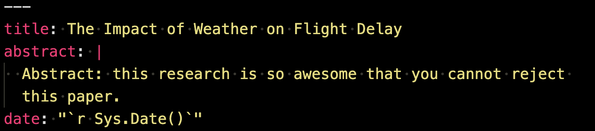
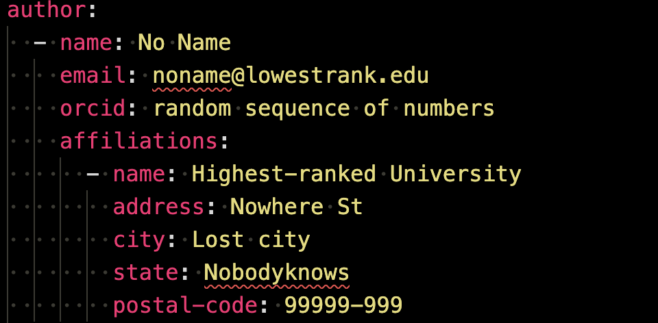
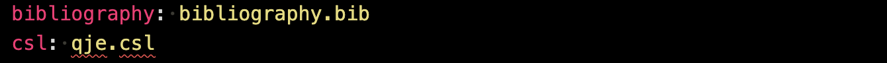
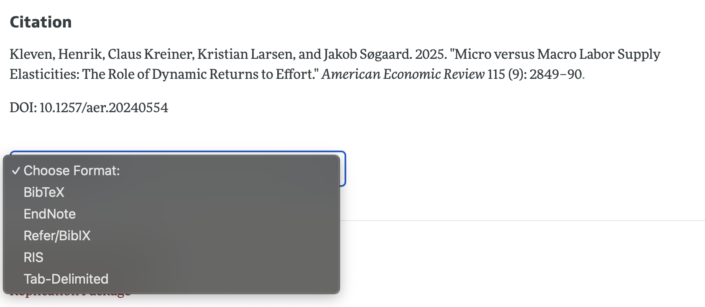
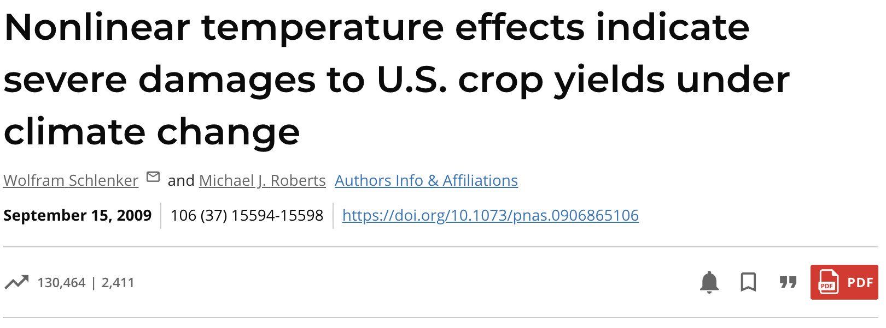
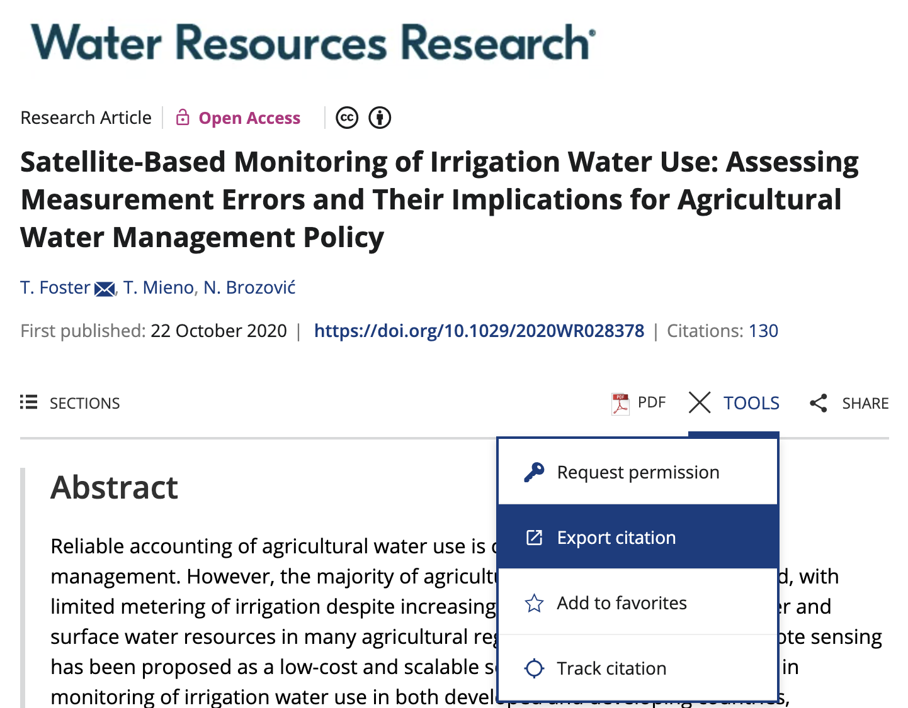
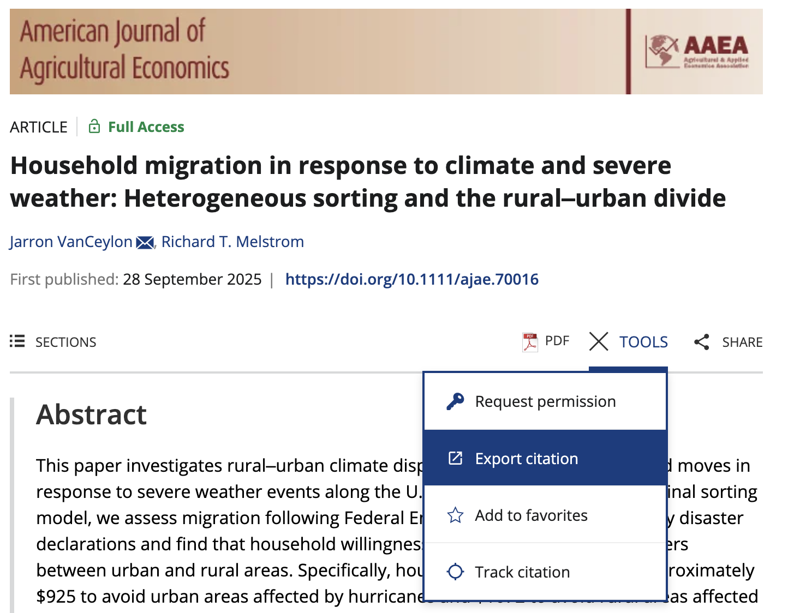
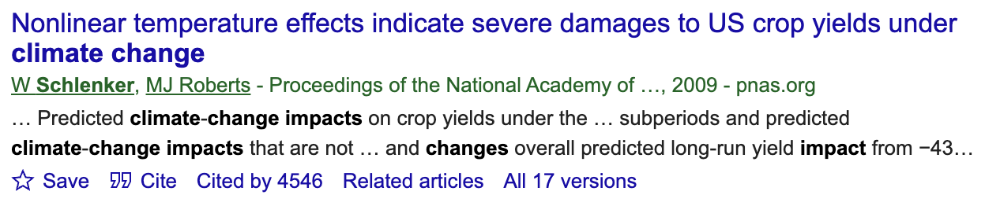
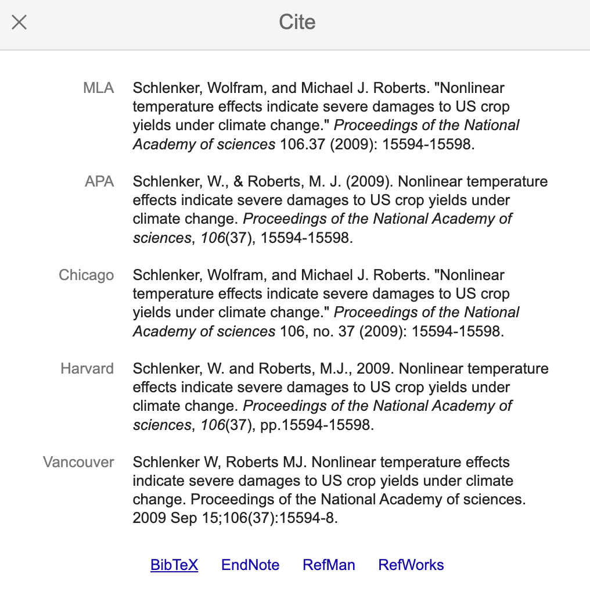
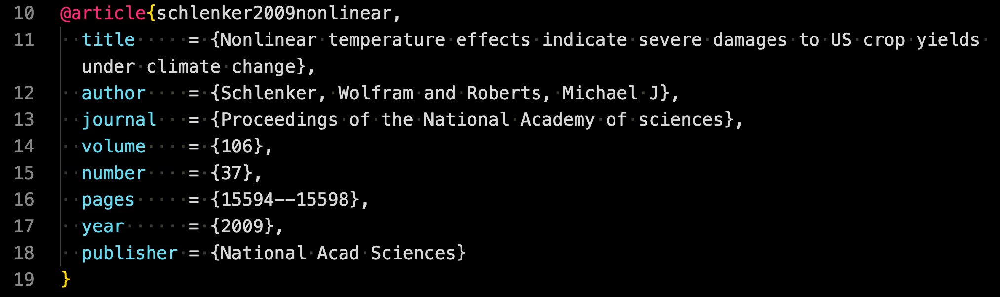

```{r}
#| include: false
library(ggplot2)
library(dplyr)

source(here::here("lectures/_lecture-theme.R"))
```

## Output format

<details class="transcript">
<summary>Transcript</summary>

Before you write anything, you have to decide what the document is going to become, because that choice constrains everything after it. A qmd can produce four things, and the table lays out the trade-offs. PDF through LaTeX is the traditional academic route: enormously flexible and professional-looking, but slow to compile and you need some LaTeX. PDF through Typst is a newer and much faster alternative, but the ecosystem around it is still young. HTML is fast and flexible, but it is simply not what journals want. And Word is fast and universally understood by editors, though it struggles with complicated mathematics. Look at the last column especially, because for actual journal submission it comes down to LaTeX PDF or Word. The status column makes the practical distinction explicit: Typst and HTML are not accepted submission formats here, Word is accepted, and the LaTeX route is accepted with the expectation that a journal may ask for the LaTeX source files as well as the finished PDF.

</details>

There are four output options available from a Quarto (.qmd) file, each with distinct pros and cons.

```{r}
#| echo: false
library(flextable)
library(dplyr)

(
  data.frame(
    Format = c("PDF (LaTeX)", "PDF (Typst)", "HTML", "Word"),
    Pros = c(
      "Extremely flexible; professional output",
      "Fast; modern alternative",
      "Fast; highly flexible for web sharing",
      "Fast; widely used; simple for editors"
    ),
    Cons = c(
      "Slow compilation; requires LaTeX skills",
      "Still developing; limited ecosystem",
      "Not designed for journals",
      "Limited support for complex math"
    ),
    Status = c(
      "Accepted (but journals require LaTeX source files",
      "Not accepted",
      "Not accepted",
      "Accepted"
    )
  ) %>%
    flextable() %>%
    autofit() %>%
    theme_vanilla() %>%
    set_header_labels(
      Format = "Format",
      Pros = "Pros",
      Cons = "Cons",
      Status = "Journal Submission Status"
    )
)
```

## Title page

::: {.panel-tabset}

### Title, date, and abstract 

<details class="transcript">
<summary>Transcript</summary>

The front matter of a paper, the title and date and abstract, all comes out of the YAML header, exactly as it has for every other format we have seen. The screenshot shows the shape of it. The one trick worth stealing is in the callout: instead of typing today's date and then forgetting to update it, you can put an inline R expression in the date field that calls Sys.Date. Now the date is whatever day you rendered the document. That sounds like a trivial convenience until you have sent out three versions of a working paper all confidently dated the day you first started writing. Look closely at the YAML shape in the screenshot. The title is a single value after title colon, while the vertical bar after abstract colon tells YAML that the indented lines below belong to one multi-line abstract. The date expression is quoted so YAML treats the whole inline R expression as the value of the date field. With those document-level fields in place, the next tab adds the more deeply nested author information.

</details>

You can set title, date, and abstract like below in the YAML header:




:::{.callout-note}
````{verbatim}
date: "`r Sys.Date()`"
````

Finds the current date and prints it.
:::


### Author information

<details class="transcript">
<summary>Transcript</summary>

Author information is more structured than you might expect, and that is deliberate. It goes under the author key, and rather than one string you give Quarto separate fields: name, affiliation, email, and so on. The reason for the structure is that different journals and different output formats want the author block laid out differently, and if you have handed Quarto the pieces separately it can assemble them however the template requires. Look at the screenshot for the shape of it. You type this once per paper and then never think about it again. The first hyphen under author colon starts one author record. Name, email, and ORCID are fields of that author, so they line up at the same indentation. Affiliations colon contains another nested record, with its own name, street address, city, state, and postal code. That nesting is what tells Quarto which contact details belong to the person and which address details belong to the institution. For another author or another affiliation, you add another item at the corresponding list level. With the paper's front matter described, we can move on to the figures and tables in its body.

</details>

You can place author information under `author:` like below:

{width="60%"}

:::
<!--end of panel-->

## Style

## Figures

::: {.panel-tabset}

### Place a figure

<details class="transcript">
<summary>Transcript</summary>

There are two ways a figure gets onto the page, and which one you use depends on where the figure came from. If you made the plot in R inside this same qmd, you simply refer to the object in a code chunk and it prints. That is the easy case. If the plot already exists as an image file on disk, you bring it in with knitr include graphics, handing it the path. And do read the callout, because it will save you a confusing hour: HTML output will not accept an image saved as a PDF. Save your images as PNG and every output format will take them. In the first code block, figure underscore sample is the name of an R object that must already have been created, and evaluating that name makes the plot appear. In the second, knitr double colon says to take include graphics from the knitr package, and the quoted text inside the parentheses is the path to the saved image. The point of include graphics is that Quarto can then place the external image as part of the document instead of asking R to recreate the plot. Once the figure is on the page, the next tab shows how to give it a stable caption and reference.

</details>

**A plot as an R object** 

Suppose you have created a plot using R which is called `figure_sample` within the same qmd file. Then, you can print the plot by simply referring to it within an R code chunk like below: 

````{verbatim}
```{r}
figure_sample 
```
````

<br>

**A plot saved as an image**

Suppose you have created a plot using R and saved it as an image file called `figure_sample.png`. Then, you can print the plot using `knitr::include_graphics(path_to_the_image)` within an R code chunk like below: 

````{verbatim}
```{r }
knitr::include_graphics("path_to_your_image.png")
```
````

<br>

:::{.callout-note title="Important"}
html output does not accept an image saved as a pdf file. I would suggest that you save images as png file, which are accepted for any output format. 
:::

### Cross-reference

<details class="transcript">
<summary>Transcript</summary>

Now the thing that makes writing a paper in Quarto genuinely better than writing it in Word: you never number a figure yourself. You give the chunk a label and a fig-cap, and then anywhere in your text you write at-fig-and-the-label, and Quarto fills in the right number. Move the figure, or add another one before it, and everything renumbers itself. In the code on screen, the hash-bar prefix marks label and fig-cap as chunk options rather than R statements. Hash-bar label colon fig-sample-label creates the identifier, hash-bar fig-cap colon Sample figure title supplies the printed caption, and the final figure underscore sample line evaluates the plot object that those options belong to. Two traps in the callouts, and both of them bite. First, the label has to begin with fig- or Quarto will not treat it as a figure and the reference silently fails. Second, avoid underscores for cross-format reliability, especially with LaTeX PDF, and prefer hyphens. And do not type the word Figure before the reference, because Quarto adds it for you.

</details>

In order to cross-reference a figure with captions, you can use the `label` and `fig-cap` options like below:


````{verbatim}
```{r}
#| label: fig-sample-label
#| fig-cap: "Sample figure title"
figure_sample 
```
````

+ `fig-cap: "Sample figure title"` adds `Sample figure title` as the caption of the figure 
+ `fig-sample-label` is the figure id used for cross-referencing

You can then type `@fig-sample-label` in the qmd file to cross-reference the figure.


:::{.callout-note}
+ Figure numbering in the output file is done automatically.
+ `@fig-sample` will append "Figure" automatically in the output. So, if you have `Figure @fig-sample` in your qmd file, then you will see "Figure Figure figure-number" in the output file.
:::

:::{.callout-important}
+ Do not forget to have `fig-` at the beginning of the chunk label as in `label: fig-sample-label` in the R code chunk option. Otherwise, the plot will not be recognized as a figure in the output file and cross-referencing will not work even though the figure will be displayed. 
+ Avoid `_` in chunk labels for cross-format reliability, especially with LaTeX/PDF, and prefer `-`.
:::

### Figure placement

### Change the size of the figure

:::
<!--end of panel-->

## Tables

::: {.panel-tabset}

### Place a table

<details class="transcript">
<summary>Transcript</summary>

Tables work exactly like figures, which is the point: once you have learned one you have learned both. A table you built in R inside this qmd gets printed by referring to the object in a chunk. A table you saved as an image comes in through knitr include graphics with its path. And the same warning applies as for figures, so save as PNG and you are safe in every output format. If this feels repetitive, good. The consistency is deliberate, and it means the cross-referencing rules a couple of tabs along will already look familiar to you. In the first block, table underscore sample is an existing R table object, and leaving its name as the chunk's final expression displays it. In the second, knitr double colon selects include graphics from knitr, and table-underscore-sample-dot-P-N-G is the path of the saved image to insert. Treating a table as an image preserves its visual design when a document format cannot reproduce the table directly. The next tab uses that fact to help you choose a table-making package.

</details>

**A table as an R object** 

Suppose you have created a table using R which is called `table_sample` within the same qmd file. Then, you can print the table by simply referring to it within an R code chunk like below: 

````{verbatim}
```{r}
table_sample 
```
````

<br>

**A table saved as an image**

Suppose you have created a table using R and saved it as an image file called `table_sample.png`. Then, you can print the table using `knitr::include_graphics("table_sample.png")` within an R code chunk like below: 

````{verbatim}
```{r }
knitr::include_graphics("table_sample.png")
```
````

<br>

:::{.callout-note title="Important"}
html output does not accept an image saved as a pdf file. I would suggest that you save images as png file, which are accepted for any output format. 
:::

### Which package to create tables?

<details class="transcript">
<summary>Transcript</summary>

There is a real decision to make about which table package to learn, and it is worth a minute of thought. The slide separates the powerful table-building packages, gt and flextable, from the ones built around LaTeX output, xtable, huxtable, and kableExtra. Both groups can produce LaTeX, but gt and flextable put their effort into HTML first, so their LaTeX output is the less complete of the two. But look at the third bullet, because it gives you a reliable fallback when direct LaTeX output does not suit your document: gt and flextable can both export a table as an image, and LaTeX is perfectly happy to accept images. So there is no real penalty for investing your time in the more capable package. The choice is therefore about the workflow you prefer, not whether the final PDF can contain the table. Direct LaTeX output keeps the table as typeset document content, while the image route preserves the package's appearance and uses the same insertion method from the previous tab. After choosing the package, the next tab returns to the familiar cross-reference pattern.

</details>

+ The most powerful table-creation packages (e.g., `gt`, `flextable`) do support LaTeX output, though it is less complete than their HTML output. They also provide the option to export tables as image files.

+ Packages built around LaTeX output include `xtable`, `huxtable`, and `kableExtra`.

+ Since LaTeX can also accept tables as images, there is no drawback to investing time in learning the more capable package.


### Cross-reference

<details class="transcript">
<summary>Transcript</summary>

Cross-referencing tables is the same mechanism as figures with one letter changed. Use tbl-cap rather than fig-cap for the caption, start the label with tbl- rather than fig-, and refer to it with at-tbl-and-the-name. In the chunk on screen, the hash-bar lines are options attached to the chunk: hash-bar label colon tbl-sample-label establishes the table identifier, hash-bar tbl-cap colon Sample table title provides its caption, and table underscore sample is the R object that is displayed as that table. The numbering is automatic, and the word Table gets added for you, so if you type Table before the reference you will see the word twice in your output. The underscore guidance carries over too: avoid underscores for cross-format reliability, especially with LaTeX PDF, and prefer hyphens. If you followed the figure version two tabs ago, you already know this one.

</details>

In order to cross-reference a table with captions, you can use the `label` and `tbl-cap` options like below:


````{verbatim}
```{r}
#| label: tbl-sample-label
#| tbl-cap: "Sample table title"
table_sample 
```
````

+ `tbl-cap: "Sample table title"` adds `Sample table title` as the caption of the table 
+ `tbl-sample-label` is the table id used for cross-referencing

You can then type `@tbl-sample-label` in the qmd file to cross-reference the table.


:::{.callout-note}
+ Table numbering in the output file is done automatically.
+ `@tbl-sample` will append "Table" automatically in the output. So, if you have `Table @tbl-sample` in your qmd file, then you will see "Table Table 1" in the output file.
:::

:::{.callout-important}
+ Do not forget to have `tbl-` at the beginning of `label: tbl-sample-label`. Otherwise, the table will not be recognized as a table in the output file and cross-referencing will not work even though the table will be displayed. 
+ Avoid `_` in chunk labels for cross-format reliability, especially with LaTeX/PDF, and prefer `-`.
:::

:::
<!--end of panel-->


## Mathematical expressions

::: {.panel-tabset}

### Single-line math

<details class="transcript">
<summary>Transcript</summary>

Mathematical notation is where the output format you chose on the first slide starts to matter, which is exactly why this tab splits in two. You can wrap your maths in an equals-tex block and write raw LaTeX, which passes straight through, so the equation itself displays in both PDF and HTML, though not in Word, and you can use any LaTeX maths tool you like. The catch is the cross-reference rather than the equation: backslash-ref only resolves in PDF. For maths you can cross-reference in every format, enclose the expression in double dollar signs and give it a hash-eq label instead. Both put the equation on its own line. The catch, in the second callout, is that the dollar-sign route does not support every LaTeX construct, so complicated expressions may not survive. On the first subtab, the opening fence is code-brace-equals-tex and the matching closing fence ends the raw TeX block. Inside it, begin align and end align surround the equation, so those two commands must remain paired. This course uses that route for the LaTeX PDF and HTML outputs shown on the tab. On the second subtab, the opening and closing double dollar signs mark display math; the simple equation can sit directly between them, or an align environment can sit inside them. Flip between the two subtabs and choose the syntax for the format you need, remembering that the first callout promises the full LaTeX toolset while the second deliberately warns about a smaller supported subset.

</details>

::: {.panel-tabset}

#### pdf (latex) and html 

To type mathematical equations, you can enclose the math expressions with a special syntax for printing tex expressions like below.

````markdown
```{=tex}
Math using Latex syntax
```
````

<br>

For example, 


````markdown
```{=tex}
\begin{align}
y = \alpha + \beta x + v
\end{align}
```
````

would print the following:

```{=tex}
\begin{align}
y = \alpha + \beta x + v
\end{align}
```

<br>

:::{.callout-note}
+ This syntax automatically move to a new line and then prints the math
+ Since the above syntax prints whatever inside the `=tex` environment in the tex file, which is then compiled to produce a pdf file, you can use *any* Latex math-writing tools.
:::

#### html and Word

To type a mathematical equation that spans only a single line, you can enclose the math expressions with `$$` like below:

````markdown
$$
y = \alpha + \beta x + v
$$
````

, which would print the following:

```{=tex}
\begin{align}
y = \alpha + \beta x + v
\end{align}
```

You can actually use some of the Latex environments (e.g., `equation`, `align`) like below:

````markdown
$$
\begin{align}
y = \alpha + \beta x + v
\end{align}
$$
````

:::{.callout-note}
+ This syntax automatically move to a new line and then prints the math
+ Not all of Latex math syntaxes work.  
:::


:::
<!--end of panel-->

### In-line math

<details class="transcript">
<summary>Transcript</summary>

That was mathematics on its own line. For a symbol sitting inside a sentence, where you want to write about the coefficient alpha without breaking the paragraph, you use a single dollar sign on each side instead of two. That is the whole difference: two dollars means display the expression on its own line, one dollar means keep it in the flow of the text. The example on the slide shows it rendered, so you can see the symbol sitting in the sentence exactly where it was typed.

</details>

For math expressions in line, write math expressions in Latex syntax enclosed by `$` (not `$$`) as in

````markdown
Here is the math $\alpha$.
````

<br>

This would print like this in the output:

Here is the math $\alpha$.

### More complex equations

<details class="transcript">
<summary>Transcript</summary>

Once you go past a single line you need a LaTeX environment, and the two tabs here cover the two you will actually use. The align environment stacks several equations and lines them up on a chosen character, usually the equals sign, and that is what the ampersands in the code are doing. The cases environment is for a function defined piecewise, which comes up constantly in the kind of models this course touches. Notice that each tab shows the code twice, side by side: the LaTeX version on the left and the dollar-sign version on the right, because which one you use still depends on your output format. In the alignment example, each double backslash ends one equation line, and putting the ampersand before each equals sign gives both lines the same alignment point. That is why the equations for y and v render as a readable system instead of two unrelated lines. In the cases example, the outer align environment positions the whole display and the inner cases environment creates the large left brace and one row per branch. The underscore syntax creates subscripts such as j comma i, the caret creates powers such as N squared, and the backslash epsilon, alpha, beta, gamma, and tau commands print the Greek symbols. The ampersand before each condition separates the formula from its condition, while the double backslash moves to the next case. Read the two conditions as N less than tau for the first branch and N greater than or equal to tau for the second. The small backslash-comma before each comma adds breathing room in the typeset expression; it changes spacing, not the model. Once you can typeset these equations, the next tab shows how to refer back to them without managing equation numbers yourself.

</details>

::: {.panel-tabset}

#### Multiple lines with alignment

Use the **align** environment like below:

::: {.columns}

::: {.column width="50%"}
**pdf (latex) and html**
````markdown
```{=tex}
\begin{align}
y & = \alpha + \beta x + v \\
v & = \rho Wv + \mu
\end{align}
```
````
:::
<!--end of the 1st column-->

::: {.column width="50%"}
**html and WORD**
````markdown
$$
\begin{align}
y & = \alpha + \beta x + v \\
v & = \rho Wv + \mu
\end{align}
$$
````
:::
<!--end of the 2nd column-->
:::
<!--end of the columns-->

<br>

It will print like below:

```{=tex}
\begin{align}
y & = \alpha + \beta x + v \\
v & = \rho Wv + \mu
\end{align}
```

#### Cases

Use the **cases** environment like below:

::: {.columns}

::: {.column width="50%"}
**pdf (latex) and html**
````markdown
```{=tex}
\begin{align}
y_{j,i} =
  \begin{cases}
  \alpha_{j,i} + \beta_{j,i} N + \gamma_{j,i} N^2 + \varepsilon_{j,i} \, ,& N < \tau_{j,i} \\
  \alpha_{j,i} + \beta_{j,i} \tau_{j,i} + \gamma_{j,i} \tau_{j,i}^2 + \varepsilon_{j,i} \, ,& N \ge \tau_{j,i}
  \end{cases}
\end{align}
```
````
:::
<!--end of the 1st column-->

::: {.column width="50%"}
**html and WORD**
````markdown
$$
\begin{align}
y_{j,i} =
  \begin{cases}
  \alpha_{j,i} + \beta_{j,i} N + \gamma_{j,i} N^2 + \varepsilon_{j,i} \, ,& N < \tau_{j,i} \\
  \alpha_{j,i} + \beta_{j,i} \tau_{j,i} + \gamma_{j,i} \tau_{j,i}^2 + \varepsilon_{j,i} \, ,& N \ge \tau_{j,i}
  \end{cases}
\end{align}
$$
````
:::
<!--end of the 2nd column-->
:::
<!--end of the columns-->


<br>

It will print like below:

```{=tex}
\begin{align}
y_{j,i} =
  \begin{cases}
  \alpha_{j,i} + \beta_{j,i} N + \gamma_{j,i} N^2 + \varepsilon_{j,i} \, ,& N < \tau_{j,i} \\
  \alpha_{j,i} + \beta_{j,i} \tau_{j,i} + \gamma_{j,i} \tau_{j,i}^2 + \varepsilon_{j,i} \, ,& N \ge \tau_{j,i}
  \end{cases}
\end{align}
```

:::
<!--end of panel-->

### Cross-reference

<details class="transcript">
<summary>Transcript</summary>

Equations get cross-referenced as well, and here the two output routes genuinely diverge, so read the tab that matches your format. On the LaTeX side you use the native label and ref commands, and the callout warns that this works for PDF only; the equation will still print in HTML but the reference will not resolve. On the HTML and Word side you tag the equation by putting hash-eq-model in braces after the closing double dollars and refer to it with an at sign, and the label has to start with eq-. Both tabs point you at specific line numbers in the sample article file, which is the fastest way to watch it work. In the LaTeX code, label with eq-model inside braces assigns the key at the equation itself, and ref with the same key inserts the corresponding number in your prose. Matching those two names is what connects the reference to the equation. In the HTML and Word code, it is the hash-prefixed brace label after the closing double dollar signs that gives Quarto its equation identifier, and at-eq-model is the reference that Quarto resolves. The inner LaTeX label is still visible in the example, but the Quarto brace label is the part doing the cross-reference work for this route. This is why the instruction asks you to inspect the sample file for the format you are producing rather than mixing the two systems.

</details>

::: {.panel-tabset}

#### Latex

You can take advantage of the original latex syntax like this:

````markdown
```{=tex}
\begin{align}
y & = \alpha + \beta x + v \label{eq-model}
\end{align}
```
````

Then refer to it with `\ref{eq-model}`. 

<br>

:::{.callout-note title="Note"}
+ This way of cross-referencing an equation works only for pdf, but not for html even though the equation would be printed for html.
:::

:::{.callout-note title="Instruction"}
See lines 101-111 of **sample_qmd_article.qmd** to confirm this works.
:::

#### html and WORD

Place `{#eq-model}` after the closing `$$` and reference it with `@eq-model` like below:

````markdown
$$
\begin{align}
y & = \alpha + \beta x + v \label{eq-model}
\end{align}
$$ {#eq-model}
````

Then you can refer to it by `@eq-model`.

<br>

:::{.callout-note title="Note"}
+ An equation label needs to start with `eq-`.
:::

:::{.callout-note title="Instruction"}
See lines 113-119 of **sample_qmd_article.qmd** to confirm this works.
:::

:::
<!--end of panel-->

:::
<!--end of panel-->

## Citation and References

::: {.panel-tabset}

### Set up with a bib file

<details class="transcript">
<summary>Transcript</summary>

References are the part of writing a paper that Quarto improves the most, and it starts with a single line in the YAML header pointing at a bibliography file. The three tabs walk through it. First, declaring the file: there are several bibliography formats, BibTeX and CSL-JSON and RIS among them, and we will use a .bib. Second, what is actually inside that file, which is a series of entries like the one shown, each with a key, a title, authors, and a year. Third, and most practically, how to get those entries without typing them yourself, which is the tab that will save you the most time.

On the Declare tab, read bibliography colon bibliography dot bib as the YAML field followed by the file Quarto should search when it encounters a citation key. Keep that bibliography file with the project and make the filename in YAML match it. The screenshot also shows a separate csl colon qje dot csl line. The bibliography file supplies the reference data, while the CSL file controls how that data will be formatted, and we will return to that distinction in the citation-style tab. The instruction points you to the sample article's YAML so you can see both lines in their real document context.

On the dot-bib-file tab, at-manual identifies this as a manual entry and the R immediately inside the opening brace is its citation key. The remaining fields store the record's title, author, organization, address, year, and URL. Braces hold each field value, commas separate the fields, and the final closing brace ends the entry. A bibliography file simply repeats that structure for every source. Looking at bibliography dot bib in the templates folder matters because it shows you how many separate entries live together in one plain-text file.

On How to get bib entries, the four journal screenshots show that publisher sites put the same operation in different places: one offers a format menu, while others place Export citation under a Tools menu. Choose BibTeX when it is offered, then put the exported entry into your dot-bib file. The journal website is recommended because it is the publisher's record for that article. Google Scholar is the fallback shown in the next subtab: search for the article, click Cite under the result, and then choose BibTeX from the citation window. Either route saves you from transcribing every field by hand, but you should still check the exported record for the citation key and metadata you intend to use. With the bibliography connected and populated, the next tab shows the citation forms you type in the article.

</details>

::: {.panel-tabset}

#### Declare 

Begin by preparing a file that contains all your references. In your document's YAML header, specify the bibliography file:

```{code}
bibliography: bibliography file name
```

There are multiple formats and systems available for bibliographies, such as 

+ BibLaTeX/BibTex (.bib)
+ CSL-JSON (.json)
+ RIS (.ris)

Here, we use a **.bib** file. If our bibliography file is titled `bibliography.bib`, the YAML header would look like:

```{r  echo = F, out.width = "100%"}

```

:::{.callout-note title="Instruction"}
Take a look at the bottom of the YAML header of **sample_qmd_article.qmd** in the templates folder.
:::

#### .bib file

Here is what an bib entry looks like:

````markdown
@manual{R,
  title        = {R: A Language and Environment for Statistical Computing},
  author       = {{R Core Team}},
  organization = {R Foundation for Statistical Computing},
  address      = {Vienna, Austria},
  year         = {2022},
  url          = {https://www.R-project.org/}
}
````

.bib file consists of many of these bib entries.

:::{.callout-note title="Instruction"}
Take a look at **bibliography.bib** in the templates folder.
:::

#### How to get bib entries

::: {.panel-tabset}

##### Journal website (recommended)

The website of the journal in which the article published typically has a tool to export its bib file.

::: {.columns}

::: {.column width="50%"}

**American Economic Review**



:::
<!--end of the 1st column-->
::: {.column width="50%"}

**Proceeding of National Academy of Science**



:::
<!--end of the 2nd column-->
:::
<!--end of the columns-->
::: {.columns}


::: {.column width="50%"}

**Water Resources Research**



:::
<!--end of the 1st column-->
::: {.column width="50%"}

**American Journal of Agricultural Economics**



:::
<!--end of the 2nd column-->
:::
<!--end of the columns-->

##### Google scholar

1. You can google an article for which you want a bib entry:

{width="60%"}

2. Click on `Cite` and then click `BibTex` in the pop-up window.

{width="50%"}


:::
<!--end of panel-->

:::
<!--end of panel-->

### How

<details class="transcript">
<summary>Transcript</summary>

Now the citing itself, and there are four forms worth knowing. A bare at-sign with the reference name gives you an author-in-text citation, which is what you want when the authors are the subject of your sentence. Wrapping the same thing in square brackets gives you a normal citation instead. Separate several with semicolons inside one set of brackets to cite them together. And a minus sign before the at-sign suppresses the author, for when you have already named the authors. The exact rendered output depends on the CSL style. The reference name is the first entry in the bib record. Everything you cite is collected into the reference list automatically; you never maintain that list yourself. More precisely, the reference name is the citation key immediately after the entry type and opening brace, before the first comma. In the screenshot, that is schlenker-two-thousand-nine-nonlinear. Your at-sign citation must match that key exactly so Quarto can look up the right record. The semicolon inside one pair of square brackets tells Quarto that several keys belong in one citation group, rather than in separate citation groups. Follow the instruction by comparing the sample article's Introduction with its References section. First create or provide bibliography dot JSON before switching the YAML bibliography line to it, or continue using the existing bibliography dot bib. If you use a valid CSL-JSON file, seeing the same citations and reference list survive that switch demonstrates that the citation syntax is separate from the storage format. Once the citations resolve, the next tab controls how they look.

</details>

To cite, use the following syntax:

+ `@reference_name` creates an author-in-text citation
+ `[@reference_name]` creates a normal citation
+ `[@reference_name_1; @reference_name_2]` groups multiple normal citations
+ `[-@reference_name]` suppresses the author
+ Exact output is determined by the CSL style.


`reference_name` is the very first entry of a **.bib** file as in 

```{r  echo = F, out.width = "70%"}

```

:::{.callout-note}
The reference of all the cited articles will be automatically placed in the Reference section.
:::


:::{.callout-note title="Instruction"}
+ See the Introduction and Reference sections in the sample qmd and PDF files to confirm this rule.
+ The sample uses `bibliography.bib`. Quarto also accepts a CSL-JSON file, but you have to create one first; there is no `bibliography.json` in the templates folder to switch to.
:::


### Citation and Reference Style

<details class="transcript">
<summary>Transcript</summary>

Different journals want different citation styles, and you should never reformat references by hand. Styles are described by CSL files, and there is a public repository holding essentially every journal's style. You download the csl file you need, point at it with one line in the YAML header, and every citation and the entire reference list reformats. The instruction at the bottom is worth actually doing: the sample article is currently set to the Quarterly Journal of Economics style, so download another journal's style from that repository, point the csl line at the file you downloaded, and render again. Watching a whole bibliography change from one line is the moment this stops feeling abstract.

</details>

You can change the citation and reference style using [Citation Style Language](https://citationstyles.org/). Citation style files have **.csl** extension.

1. Obtain the csl file you would like to use from the [Zotero citation style repository](https://www.zotero.org/styles).

2. Place the following in the YAML header:

```{r eval = F}
csl: csl file name
```

3. Then, citations and references styles will reflect the style specified by the csl file

Currently, the csl style is set to **qje.csl** (citation style language for The Quarterly Journal of Economics) as below

```{r  echo = F, out.width = "100%"}

```

:::{.callout-note title="Instruction"}
+ Download a different style from the [Zotero citation style repository](https://www.zotero.org/styles), for example the one for the Proceedings of the National Academy of Sciences, and save the `.csl` file next to your qmd
+ Change `csl: qje.csl` in the YAML header to the file you just downloaded
+ Render the **sample_qmd_article.qmd** file again to observe the changes in style
:::
 
### Reference position

<details class="transcript">
<summary>Transcript</summary>

One last detail, and it is a small one that looks like a bug when you first hit it. When you render to PDF, the references land at the end of the document automatically. But you usually want an actual heading above them, so you add a References heading at the very bottom of your qmd. The curly-brace minus after it explicitly marks that section as unnumbered. If you have turned on section numbering in your YAML, and academic documents often do, citeproc already keeps the bibliography heading unnumbered, but the marker makes your intent clear.

</details>

+ When knitting to PDF, the references will be positioned at the conclusion of the document, as documented (see [here](https://quarto.org/docs/authoring/footnotes-and-citations.html#bibliography-generation)). 

+ Append `# References {-}` to the tail end of your `.qmd` file. This creates a "References" section heading where all the citations will be listed. 

+ Including `{-}` adjacent to the section header explicitly marks the `References` section as unnumbered. This is particularly useful if you have activated section numbering in the YAML header with `number-sections: true`. 

+ Citeproc already makes the bibliography heading unnumbered without `{-}`, but the marker makes that intent explicit.

:::
<!--end of panel-->
