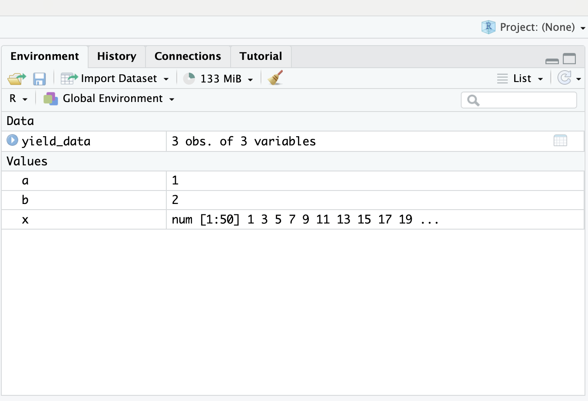
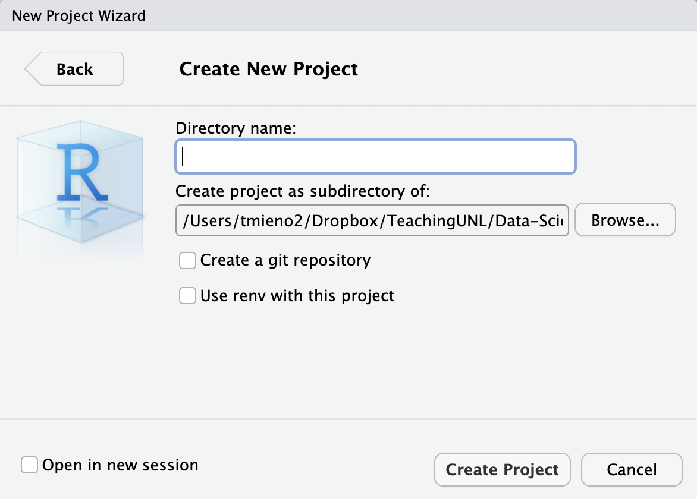
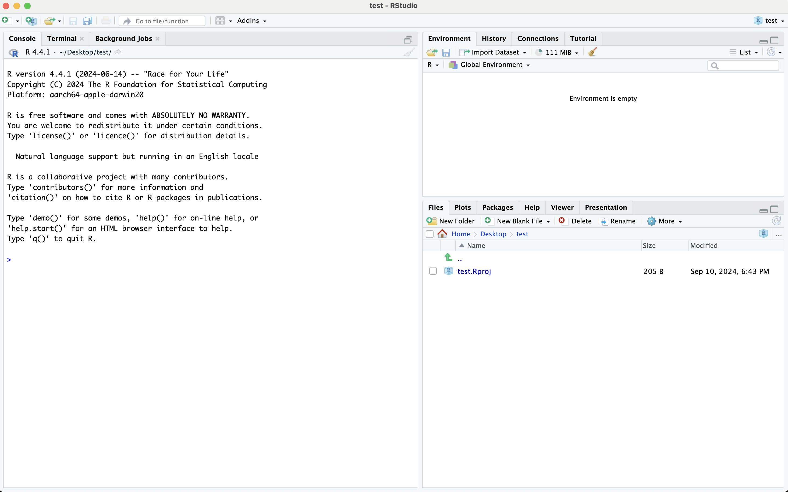
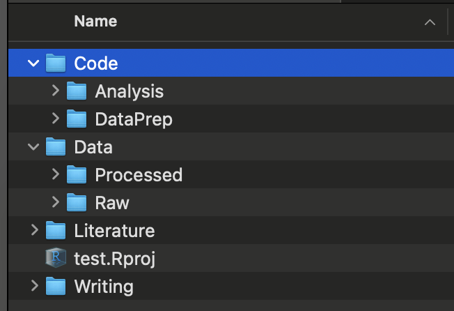
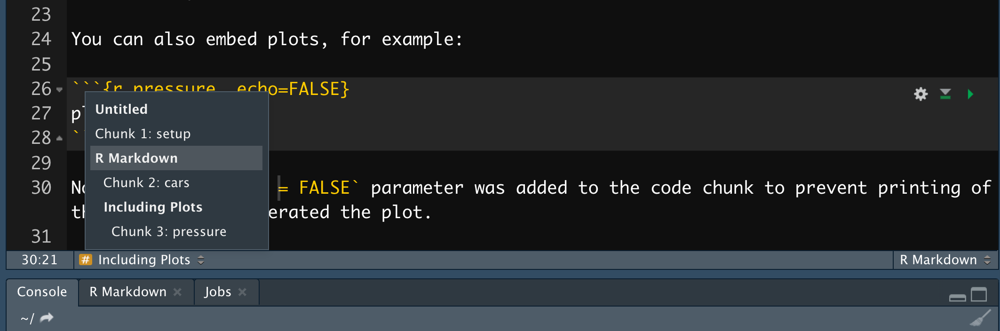
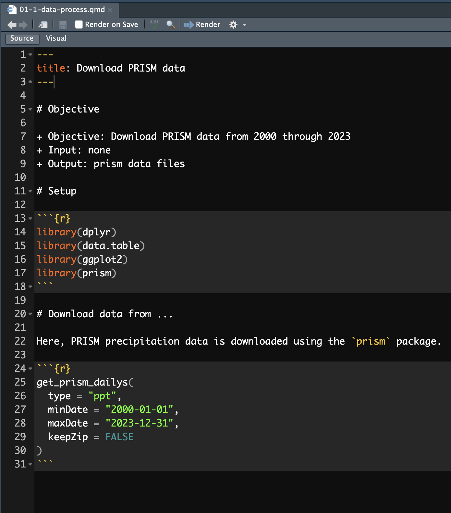

## Tips to make the most of the lecture notes

::: {.panel-tabset}

### Interactive navigation tools

<details class="transcript">
<summary>Transcript</summary>

Two navigation tricks before we start. The three stacked lines in the bottom left corner open a table of contents, so you can jump straight to a section. And pressing the letter o gives you a panel view of every slide at once. This deck works as a reference more than most of the others, because it is full of folder layouts and keyboard shortcuts you will want to come back to when you are actually setting up a project rather than sitting in class. So it is worth knowing how to find a specific slide quickly, because you will be doing exactly that in a few weeks.

</details>

+ Click on the three horizontally stacked lines at the bottom left corner of the slide, then you will see table of contents, and you can jump to the section you want

+ Hit letter "o" on your keyboard and you will have a panel view of all the slides

### Running and writing codes

<details class="transcript">
<summary>Transcript</summary>

The usual note about the code boxes. The faintly blue area is an editor, Run Code executes it, and you can run part of it by highlighting and pressing Command Enter, or Control Enter on Windows. The copy button in the top right corner puts the code on your clipboard for pasting into RStudio, and the reload button restores the original if you have edited yourself into a mess. This particular chapter has less runnable code than most, because much of what we cover happens in the RStudio interface rather than in the console. Where there is code, though, it behaves the same way.

</details>

+ The box area with a hint of blue as the background color is where you can write code (hereafter referred to as the "code area").
+ Hit the "Run Code" button to execute all the code inside the code area.
+ You can evaluate (run) code selectively by highlighting the parts you want to run and hitting Command + Enter for Mac (Ctrl + Enter for Windows).
+ If you want to run the codes on your computer, you can first click on the icon with two sheets of paper stacked on top of each other (top right corner of the code chunk), which copies the code in the code area. You can then paste it onto your computer.
+ You can click on the reload button (top right corner of the code chunk, left to the copy button) to revert back to the original code.

:::
<!--end of panel-->

## Learning objectives

<details class="transcript">
<summary>Transcript</summary>

Three objectives, and this chapter is different in character from the others. There is very little code to run. What we are covering is how to arrange your work: where files go, how code is structured inside a file, and a set of RStudio habits that make everything else faster. It can feel like housekeeping compared with learning dplyr or ggplot. It is not. Most of the pain in a research project comes from disorganization rather than from difficulty, and the difference between a project you can pick up after three months and one you cannot is almost entirely what this chapter covers.

</details>

+ Learn how to organize your project: folder, codes, data files, etc
+ Learn how to organize R codes
+ Learn how to use various RStudio tips for efficient programming

# Reproducibility

<html><div style='float:left'></div><hr color='#EB811B' size=1px width=1000px></html>

## Reproducibility

::: {.panel-tabset}

### What is it?

<details class="transcript">
<summary>Transcript</summary>

Two words that get used interchangeably and should not be. Read both callouts carefully, because the distinction turns on what stays the same. Reproducible means somebody uses your materials and your procedure and gets your results. Replicable means somebody applies your procedure to different materials and reaches the same conclusion. So reproducibility is about whether your work can be checked, and replicability is about whether your finding is real. Both matter, but they are different questions, and this lecture is only about the first. If you cannot reproduce your own results in six months, nothing downstream of that is worth much.

</details>

First of all, you may have heard of “reproducibility” and “replicability.” While they sometimes are used interchangeably, they mean different things. Here are commonly used definitions of the two terms (Cacioppo et al. 2015).

<br>

:::{.callout-note title="Definition: Reproducibility"}
A research study is **reproducible** if anybody (including the author of the study) can generate exactly the same results by using the same materials (e.g., data) and procedures used in the study.
:::

<br>

:::{.callout-note title="Definition: Replicability"}
A research study is **replicable** if other teams reach the same conclusion by applying the same procedure to the different materials (e.g., data).
:::


This lecture focuses only on reproducibility and does not deal with replicability.

### How

<details class="transcript">
<summary>Transcript</summary>

Here is the minimum bar, and it is lower than people expect. Every action is documented well enough that somebody else can follow it. That is all. Read the paragraph underneath, because it corrects a common misunderstanding. Reproducibility does not require that everything be automated. If you delete rows in Excel by hand, that is still reproducible, provided you write down that you did it and you keep the original file. Discouraged, certainly, but still reproducible. The thing that actually breaks reproducibility is the hidden action, the step you took and did not record, because nobody can repeat what nobody knows about.

</details>

:::{.callout-note title="Minimum Requirement"}
Every single action taken during the entire research process is documented in a way that anybody can follow to implement the same actions (no hidden actions) to produce exactly the same results.
:::

<br>

Note that this does not necessarily mean every single action needs to be computer-programmed and automated. Even if you manually delete rows of data on Excel (highly discouraged), this does not make your research non-reproducible as long as this action is recorded and the original data (before deletion of the rows) are provided because anybody can implement this action.

### High v.s. low quality

<details class="transcript">
<summary>Transcript</summary>

Meeting the minimum makes a project reproducible. It does not make it good. If reproducing your work takes somebody three weeks of puzzling, you have technically satisfied the requirement and helped no one. The three characteristics on screen are what separate the two. An organized folder so files can be found, automation through annotated programs so the workflow can be run rather than reconstructed, and documentation covering the data, the methods, and the steps. Notice that all three are about somebody else's time. And be clear who that somebody usually is: you, six months from now, having forgotten everything.

</details>

A project can be considered reproducible if the minimum requirements are met. However, it is still low-quality if reproducing it requires excessive time or resources. A high-quality reproducible project, on the other hand, demonstrates the following characteristics:

<br>

**Organized Project Folder**

A well-structured folder system makes it easy to locate files and navigate the project.

<br>

**Streamlined Automation**

Workflows are automated through clearly annotated programs, making replication straightforward and ensuring transparency in the process.

<br>

**Comprehensive Documentation**

Thorough documentation—including details on data, methods, and reproduction steps—saves time and enhances clarity for anyone reproducing the work.

### Why high-quality reproducible research

<details class="transcript">
<summary>Transcript</summary>

Who actually benefits, and the letters in brackets are the point. Scientific integrity benefits the community. Educational value benefits your team and the community. But look at the last three. Repeatability, transferability and reducing errors all carry Y and M, meaning you and your team. That is the argument worth internalising. Reproducibility is often presented as a duty you owe the profession, which makes it sound like unpaid overhead. Most of the payoff is actually yours. You are the one who will need to rerun this with one variable changed, hand it to a coauthor, or find the error before a referee does.

</details>

The main beneficiaries of reproducible research include:

+ You (Y)
+ Members of your team (M)
+ The scientific community (S)

<br>

Here are some of the benefits of high-quality reproducible research with their beneficiaries:

+ Scientific Integrity (S)
+ Educational Value (MS)
+ Repeatability (YM)
+ Transferability (YM)
+ Reducing Errors (YM)

### Check list

<details class="transcript">
<summary>Transcript</summary>

A checklist to run against your own work, and I would genuinely use it. Six items: organized folders, documented data, everything programmed rather than done by hand, code that is annotated and organized, an instruction saying what to run and in what order, and no junk files lying around. That fifth one is the most commonly missed. People produce beautiful code and never write down which script runs first, which leaves the next person guessing. And the sixth matters more than it sounds, because a folder full of abandoned experiments makes it impossible to tell what is actually part of the project.

</details>

+ [ ] The project has organized folder system and all the files (code, manuscript, journal articles in pdf) are placed where they should be
+ [ ] Data is clearly documented
+ [ ] All the actions (data processing, analysis, figure and table creation) are computer-programmed without any manual procedures (e.g., deleting rows of a CSV file on Microsoft Excel)
+ [ ] The computer programs are well annotated and organized
+ [ ] An instruction to reproduce (what computer programs to run in what order) is provided
+ [ ] There are no unnecessary files in the project folder

:::
<!--end of panel-->

# How to organize your project

<html><div style='float:left'></div><hr color='#EB811B' size=1px width=1000px></html>

## How to organize your project

::: {.panel-tabset}

### Motivation

<details class="transcript">
<summary>Transcript</summary>

Why one dedicated folder per project. Two reasons on screen, and the first is the one that bites. If you work across several projects in one session, you will eventually have two objects with the same or similar name and use the wrong one. That produces results which are wrong but not obviously wrong, which is the worst kind of error. The second reason is memory, carrying around objects irrelevant to what you are doing. The deeper point is that a project should be a self-contained thing you can open, work in and close, with nothing leaking in from elsewhere.

</details>

You should have a single dedicated folder for a research project. This will avoid

* confusions between objects of the same or similar name (accidentally using the one you do not intend to use)

* wasting memory by holding objects on the global environment that are completely irrelevant to your working project

### RStudio project 

<details class="transcript">
<summary>Transcript</summary>

Now the mechanics, in three steps in the nested tabs. Work through them, but understand what you are creating. An RStudio project is really just a folder with a dot Rproj file in it. What that file buys you is that opening it starts a fresh R session whose working directory is that folder. So your paths become relative to the project rather than to wherever your machine happens to be pointing, which means the whole thing can be moved, zipped, or handed to somebody else and still work. That is the entire value, and it is a large one.

</details>

We can initiate an RStudio project with a dedicated folder from within RStudio.

::: {.panel-tabset}

### Step 1

::: {.columns}

::: {.column width="30%"}
At the top right corner of RStudio, navigate through:

<br>

**Project (None)** 

-> **New Project...** 

-> **New Directory** 

-> **New Project**

:::
<!--end of the 1st column-->
::: {.column width="70%"}

:::
<!--end of the 2nd column-->
:::
<!--end of the columns-->


### Step 2

::: {.columns}

::: {.column width="30%"}
+ type in a directory name
+ select the directory in which the project folder (directory) is going to be created
+ hit the *create folder* button
:::
<!--end of the 1st column-->
::: {.column width="70%"}

:::
<!--end of the 2nd column-->
:::
<!--end of the columns-->


### Step 3

::: {.columns}

::: {.column width="30%"}
You will be automatically taken to a new R session inside the newly-created RStudio project.

In this folder you just created, you have a single file named **<directory-name>.Rproj** (here, it is **test.Rproj**). It holds information about this project, but you do not have to touch it.  

:::
<!--end of the 1st column-->
::: {.column width="70%"}

:::
<!--end of the 2nd column-->
:::
<!--end of the columns-->

:::
<!--end of panel-->

### Folder organization

<details class="transcript">
<summary>Transcript</summary>

A recommended layout, and the note at the top matters: modify it as you see fit. There is nothing sacred about these particular names. What is worth copying is the principle. Code is separated from data, and within data, raw is separated from processed. Within code, data preparation is separated from analysis. Results and writing get their own places. The reason to split raw from processed is the one that will save you one day. Raw data is the thing you can never regenerate, so it lives somewhere you only ever read from. Everything else can be rebuilt by rerunning your scripts.

</details>

Here is a recommended folder organization. You should modify/add folders as you see fit. 

::: {.columns}

::: {.column width="60%"}
+ **Code**: all the codes go in here
  * **DataPrep**: 
  * **Analysis**: 
+ **Data**
  * **Raw**: place raw datasets here
  * **Processed**: save intermediate datasets here 
+ **Literature**: journal articles and other relevant documents
+ **Results**: results (regression, figures, tables)
+ **Writing**: qmd, WORD, Latex files 
:::
<!--end of the 1st column-->
::: {.column width="40%"}

:::
<!--end of the 2nd column-->
:::
<!--end of the columns-->


:::
<!--end of panel--> 

## Files

::: {.panel-tabset}

### Quarto (.qmd) or R (.R)?

<details class="transcript">
<summary>Transcript</summary>

A recommendation you may find surprising: write your analysis code in a qmd file rather than a plain R script. The reasons are on screen. Commenting is far easier, because prose between chunks is just prose rather than a wall of hash marks. Headers give you real structure. And the two practical ones at the bottom are what win people over. Run All Chunks Above rescues you when R crashes partway through, without rerunning everything by hand. And the navigator at the bottom of the source pane lets you jump between sections, which matters enormously once a file gets long.

</details>

:::{.callout-note title="Recommendation"}
Use a **qmd** file instead of an **R** file whenever you write codes
:::

+ It is much easier to make comments in a qmd file than an R file
+ You can better organize your codes with markdown section headers (e.g., #, ##)
+ R crashed at a certain chunk and had to restart R and then run all the R codes up to the problematic chunk? Use `Run All Chunks Above` button (click on the triangle right to the `Run` button and select the option, or hit `option` + `command` + `P`).  

+ Easily move between sections and subsection using the navigator at the bottom lower corner of the source pane

{width="60%"}

### Inside a qmd file

<details class="transcript">
<summary>Transcript</summary>

A recommended structure for the inside of a file, and it is worth adopting as a habit. Start with an objective statement saying what this file does, what it takes in and what it produces. Then setup: working directory, packages, functions. Then the actions, in order. The objective statement is the part people skip and the part that pays. When you come back in six months, the first thing you need to know is what this file is for and what it depends on. And read the note at the bottom: keep it current, because inputs and outputs drift as a project evolves.

</details>

::: {.columns}

::: {.column width="50%"}
:::{.callout-note title="Recommended Structure"}
+ Objective statement
  * state objectives
  * input: state input files and datasets
  * output: state output files and datasets
+ Setup
  * set the working directory (if necessary)
  * load packages
  * load functions
+ Actions
  * Action 1
  * Action 2
  * .
  * .
  * .
  * Action n
:::
:::
<!--end of the 1st column-->
::: {.column width="50%"}

:::
<!--end of the 2nd column-->
:::
<!--end of the columns-->

:::{.callout-note}
Dynamically edit the "Objective statement" as its objectives, input, and output are likely to change.
:::

### R code style 

<details class="transcript">
<summary>Transcript</summary>

Style, in two nested tabs. The honest position is in the first sentence: you can write R however you like, and R will not care. The argument for a style guide is entirely about other people reading your code, and again, that includes you later. The two guides linked here are the common ones, with tidyverse the more widely used in this ecosystem. Then the second tab covers styler, which automates part of it. Do click through the linked examples on naming, spacing and piping rather than just noting that guides exist. Those four pages are most of what you actually need.

</details>

::: {.panel-tabset}

#### R code readability

You can write R codes however you would like. But, your code may get more readable to you and others who might read your codes by following a style guideline that is accepted by many R users. There are several popular styles of formatting R codes:

+ [tidyverse style](https://style.tidyverse.org/)
+ [Google's R Style Guide](http://web.stanford.edu/class/cs109l/unrestricted/resources/google-style.html) 

**Examples**

Here are some examples of the `tidyverse` style:

+ [how to name objects](https://style.tidyverse.org/syntax.html#object-names)
+ [spacing](https://style.tidyverse.org/syntax.html#spacing)
+ [long lines](https://style.tidyverse.org/syntax.html#long-lines)
+ [piping](https://style.tidyverse.org/pipes.html#introduction)

#### `styler` package

The `styler` package can help you partially follow the `tidyverse` coding style.

<!-- CHANGED: this said installing styler lets you hit cmd+shift+A to reformat
to tidyverse style. Two things wrong with that. cmd/ctrl+shift+A is RStudio's
own built-in "Reformat Code" command -- it works whether or not styler is
installed, and it does not apply the tidyverse style. And styler ships four
addins ("Set style", "Style selection", "Style active file", "Style active
package") in its addins.dcf, none of which declares a keyboard shortcut, because
RStudio addins never get one by default. Verified against styler 1.10.3. -->

Highlight the lines you want to restyle, then click `Addins` in the menu at the top and select **Style selection**.

::: {.callout-note title="Want a keyboard shortcut?"}
Addins have no shortcut out of the box. To give **Style selection** one, go to <span style="color: blue;">Tools</span> $\rightarrow$ <span style="color: blue;">Modify Keyboard Shortcuts...</span>, search for "Style selection", and assign a key of your choosing.

Do not confuse this with `cmd` + `shift` + `A` (`ctrl` + `shift` + `A` on Windows). That is RStudio's **own** "Reformat Code" command. It is built in, it works without `styler`, and it does [not]{style="color: red;"} follow the tidyverse style guide.
:::

:::
<!--end of panel-->

### File placement

<details class="transcript">
<summary>Transcript</summary>

Four sets of rules, and if you remember only one thing, make it the first. Raw data goes in Data slash Raw, and you never overwrite it. You read from it, you never write to it. Everything else in your project can be regenerated by rerunning code. Raw data cannot, and if you overwrite it you have destroyed the one irreplaceable thing you had. The rest follows the same logic. Processing code in Code slash DataPrep writing to Data slash Processed, analysis code in Code slash Analysis writing to Results, and writing that refers to Results rather than keeping its own copies.

</details>

:::{.callout-note title="Rules 1"}
+ place all the raw datasets (nothing else) in a designated folder inside the **Data/Raw** folder
+ do not ever override them, you only read them and keep them intact
:::

:::{.callout-note title="Rules 2"}
+ write R codes to process (transform, merge, etc) the raw data and save all the R codes inside the **Code/DataPrep** folder 
+ save intermediate R objects or datasets in the **Data/Processed** folder
+ do not mix codes and datasets in a single folder 
:::
  
:::{.callout-note title="Rules 3"}
+ write R codes to do analysis and save them in **Code/Analysis**
+ save the results/outputs (regression tables, figures, tables) in the **Results** folder
:::

:::{.callout-note title="Rules 4"}
+ if you are using qmd to write a journal article or report, put them in the Writing folder (same goes for WORD)
+ refer to figures and tables in the **Results** folder to integrate them in the output document
:::


### File names

<details class="transcript">
<summary>Transcript</summary>

Two recommendations about naming, and the second is the useful one. Name files for what they do, and put numbers in front to encode the order they should be run in. Look at the example: zero one dash one download weather data, zero one dash two download boundary data, and so on, with data preparation numbered zero one and analysis numbered zero two. That numbering is doing real work. It is the instruction on how to reproduce your project, embedded in the filenames themselves, so anybody sorting the folder alphabetically sees the correct order to run things in.

</details>

:::{.callout-note title="Recommendation"}
+ Name files so that you know what purposes they serve for you
+ Place numbers as prefix to indicate the order in which they should be run
:::

:::{.callout-note title="Example"}
+ Data Collection and Preparation (in **Code/DataPrep**)
  * 01-1-download-weather-data.R
  * 01-2-download-political-boundary-data.R
  * 01-3-summarize-data.R
  * 01-4-merge-data.R
+ Data Analysis and Results Preparation (in **Code/Analysis**)
  * 02-1-regression-analysis.R
  * 02-2-gen-figures-tables.R
:::

:::
<!--end of panel-->

## Example project

<details class="transcript">
<summary>Transcript</summary>

Rather than take my word for any of this, go and look at one. The link is to a sample project on GitHub built to be reproducible. Clone it and open it, and read it the way somebody reproducing it would. Start at the top level, find the instruction telling you what to run, then follow the numbered files. Ask yourself honestly whether you could rerun the whole thing without needing to ask the author anything. That is the real test of everything in this chapter, and it is a far better way to judge the advice than reading a checklist about it.

</details>

Let's take a look at an example project that is designed to be reproducible. First, Clone [this repository](https://github.com/tmieno2/Sample-Reproducible-Project.git). We will then look at how the project is organized and developed.

# RStudio tips

<html><div style='float:left'></div><hr color='#EB811B' size=1px width=1000px></html>

## Code snippets

::: {.panel-tabset}

### What is it?

<details class="transcript">
<summary>Transcript</summary>

Snippets are text expansion inside RStudio. You type a short trigger, hit tab, and RStudio replaces it with something longer. That is the whole idea, and it is worth five minutes of setup, because the things you type most often in R are awkward to type. The pipe and the assignment arrow both need several keystrokes and a reach. Look at the syntax block, and then read the callout, because it is the thing that catches everybody. The line you want printed must be indented with an actual tab character. Spaces will not do, and the snippet then silently fails to work.

</details>

Code snippets map a short sequence of letters and symbols to a longer, more complicated one.

<br>

**Syntax**

```default
snippet (combination of letters to invoke)
  (what you want to print) 
```

:::{.callout-note title="Important"}
You need a tab before **(what you want to print)**
:::

### Examples

<details class="transcript">
<summary>Transcript</summary>

Two examples in the nested tabs, and they are the two worth setting up first. Typing p i then tab gives you the pipe. Typing a s then tab gives you the assignment arrow. Both are things you type dozens of times an hour, and both currently cost you an awkward key combination. Note the parenthetical about hitting enter if there are competing completions. Short triggers like these often collide with object or function names that RStudio is also trying to suggest, so you may need one extra keystroke to disambiguate. That is worth knowing before you decide a snippet is broken.

</details>

::: {.panel-tabset}

#### piping operator

<br>

```default
snippet pi
  %>% 
```

<br>

Once you add this, you can type "pi" and hit `tab` (and hit `enter` if there are other competing shortcuts) to have `%>%` printed.

#### assignment operator

<br>

````markdown
snippet as
  <- 
````

<br>

Once you add this, you can type "as" and hit `tab` (and hit `enter` if there are other competing shortcuts) to have `<-` printed.
:::
<!--end of panel-->

### How to add snippets

<details class="transcript">
<summary>Transcript</summary>

Here is where the snippets actually live. Tools, then Global Options, then Code, then Edit Snippets, and choose the R tab. That path is worth remembering, because you will want to add more as you go. Then do the exercise in the callout, right now if you have RStudio open, because snippets are one of those things that sound marginal until you have used them for a day. Add the assignment one, type a s, hit tab, and watch the arrow appear. And remember the tab indentation rule from the previous tab, since that is why most first attempts do nothing at all.

</details>

Follow <span style = "color: blue;"> Tools </span> $\rightarrow$ <span style = "color: blue;">Global Options  </span> $\rightarrow$ <span style = "color: blue;"> Code </span> $\rightarrow$ <span style = "color: blue;"> Edit Snippets</span> , select R tab, and add snippets.

<br>

:::{.callout-note title="Try yourself"}
+ Place the following
````markdown
snippet as
  <-
````
+ type “as” and hit tab inside an R code chunk
:::

### Context-specificity

<details class="transcript">
<summary>Transcript</summary>

Something that confuses people the first time. A qmd file has two contexts. Inside an R chunk you are in R, and outside one you are in Markdown. Snippets are stored per context, so a snippet defined on the R tab only fires inside chunks, and a Markdown one only fires outside them. Look at the example in the second nested tab. A snippet that creates a whole R chunk necessarily belongs in the Markdown list, because you are outside a chunk at the moment you want to make one. And note it is invoked with shift tab there, rather than plain tab.

</details>

::: {.panel-tabset}

#### What is it?

Suppose you are working on a Quarto document.

+ You are in the R context if your cursor is in an R code chunk
+ You are in the Markdown context if your cursor is outside of an R code chunk

Snippets defined in the R (Markdown) tab only work in the R (Markdown) context.

#### Example

This snippet will let you create an R code chunk with typing "rmc". Place it in the Markdown tab of the snippets list and hit **shift**+**tab** to invoke it.

````markdown
snippet rmc
  `r ''````{r }
  ```
````

Confirm that this snippet does not work in the R environment.

:::
<!--end of panel-->

### Variables

<details class="transcript">
<summary>Transcript</summary>

This is what makes snippets genuinely powerful rather than just shorter to type. The dollar sign with a number and a label marks a placeholder. Expand this one and your cursor lands in the chunk title; press tab and it jumps to the chunk contents. So a snippet is not simply fixed text, it is a small fill-in-the-blanks form that walks you through the parts you have to supply, in order. Once you see that, the useful snippets to write become obvious. Any structure you type repeatedly where only two or three pieces change each time is a candidate.

</details>

````markdown
snippet rmc
  `r ''````{r ${1:chunk_title}}
    ${2:chunk_content}
  ```
````

`$` is used as a special character to denote where the cursor should jump (by hitting `tab`) after completing each section of a snippet. 

### More examples 

<details class="transcript">
<summary>Transcript</summary>

Two more to finish, both ggplot skeletons, and they show the placeholder idea doing real work. Type g l and tab and you get a line plot skeleton, with your cursor waiting on the dataset name, then the y variable, then x. Type g d and you get a density plot the same way. This is where snippets pay off most, because plotting code is highly repetitive in shape and entirely variable in content. Take these as templates rather than as the final word. The right snippets for you are whatever you catch yourself typing over and over this semester.

</details>

**ggplot (scatter plot)**

````default
snippet gl
  ggplot(data = ${1:dataset}) +
  geom_line(aes(y = ${2:y}, x = ${3:x}))
````

<br>

**ggplot (density plot)**

````default
snippet gd
  ggplot(data = ${1:dataset}) +
  geom_density(aes(x = ${2:x}))
````

:::
<!--end of panel-->


## Resources 

<details class="transcript">
<summary>Transcript</summary>

Three places to go next. Efficient R Programming is a full book and much broader than this lecture, worth dipping into rather than reading end to end. The tidyverse style guide is the reference for the styling material we covered, and it is short. And the styler GitHub page is where to look when you want to configure the automatic reformatting rather than accept its defaults. None of these are required reading. But the habits in this chapter are ones you build slowly, and having somewhere to look when a specific question comes up beats trying to absorb it all now.

</details>

+ [Efficient R Programming](https://csgillespie.github.io/efficientR/)
+ [tidyverse style guide](https://style.tidyverse.org/)
+ [`styler` github page](https://github.com/r-lib/styler)
