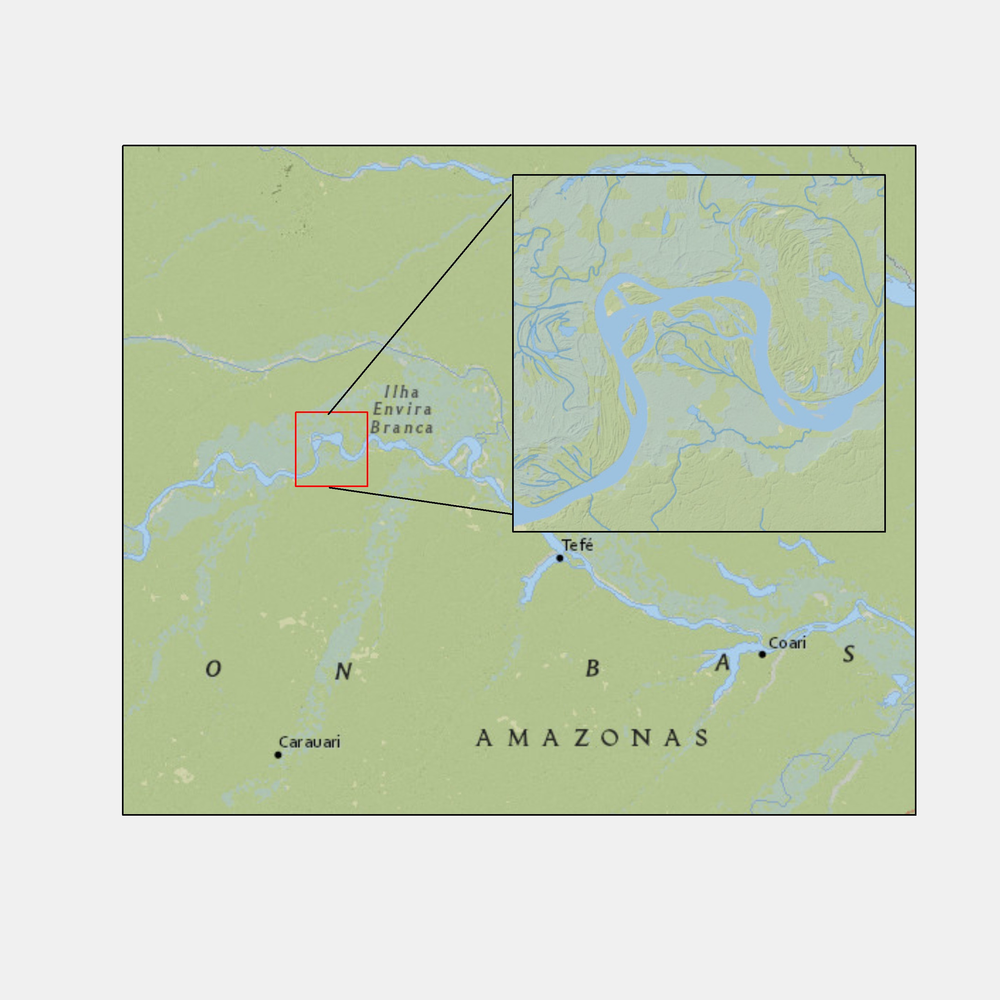

## Before you start

<details class="transcript">
<summary>Transcript</summary>

This deck is the payoff for the last two. You have spatial data; now you make something a reader can look at. The good news is that there is almost nothing new to learn. Maps in ggplot2 are ordinary ggplot2 figures with a different geom, and everything you already know about aesthetics, faceting and themes carries over unchanged. We start with geom_sf for vector data, work through aesthetics for points, lines and polygons, then stack layers, control projections, and add the furniture that makes a map look finished. At the end we do the same for raster data with geom_spatraster.

The learning objective on screen is therefore quite focused: learn to create maps with ggplot2. The table of contents gives you the route through six parts, from single sf maps and their aesthetics to multiple spatial layers, professional map elements, inset maps, and raster maps. You do need the basic ggplot2 grammar before starting. If data, aes, geoms, scales, and themes are unfamiliar, use either of the two linked prerequisites, the ggplot2 book or the earlier course slides, before working through the live cells.

</details>

```{r}
#| include: false
#| cache: false

#--- CHANGED: dropped patchwork, tigris, mapview, lubridate and RStoolbox.   ---#
#--- None of them is called anywhere in this deck, but each had to be         ---#
#--- installed for the deck to render. RStoolbox alone is a heavy dependency. ---#
library(sf)
library(tidyverse)
library(ggspatial)

source(here::here("lectures/_lecture-theme.R"))
```

```{webr-r}
#| context: setup
#--- install and library the data package ---#
#--- Both repos are required. r.spatial.workshop.datasets declares         ---#
#--- Imports: sf, and webr::install() resolves dependencies ONLY in the     ---#
#--- repos named here. With the custom repo alone, sf cannot be found and   ---#
#--- the install never completes, so nothing downstream ever runs.          ---#
webr::install(
  "r.spatial.workshop.datasets",
  repos = c(
    "https://tmieno2.github.io/rwasm-package/repo",
    "https://repo.r-wasm.org"
  )
)

library("r.spatial.workshop.datasets")

#--- load datasets ---#
#--- CHANGED: was data(wells_ne), a plain data.frame this deck never uses.    ---#
#--- Every map here uses wells_ne_sf, so that is what setup names. NOTE: this ---#
#--- is tidying, not a bug fix — the package is LazyData: true, so either     ---#
#--- object resolves by name once the package is attached.                    ---#
data(wells_ne_sf)
data(ne_counties)
data(railroads_ne)
data(corn_acres_ne)

# Mirror of lecture_theme() in lectures/_lecture-theme.R. WebR runs in the
# browser against a virtual filesystem that does not hold the repo, so it
# cannot source that file and has to carry a copy. Edit the shared file first,
# then run `Rscript lectures/check-lecture-theme.R`, which fails if this copy
# has drifted and prints the block to paste.
lecture_theme <- function(base_size = 16) {
  ggplot2::theme_bw(base_size = base_size) +
    ggplot2::theme(
      axis.text = ggplot2::element_text(size = base_size * 0.9),
      axis.title = ggplot2::element_text(size = base_size),
      legend.text = ggplot2::element_text(size = base_size * 0.9),
      legend.title = ggplot2::element_text(size = base_size * 0.9),
      plot.background = ggplot2::element_rect(fill = "transparent", colour = NA),
      panel.background = ggplot2::element_rect(fill = "transparent", colour = NA),
      legend.background = ggplot2::element_rect(fill = "transparent", colour = NA),
      legend.key = ggplot2::element_rect(fill = "transparent", colour = NA),
      # theme_bw's grey92 grid was chosen against a white panel and all but
      # disappears on the warm paper once the panel stops being opaque.
      panel.grid = ggplot2::element_line(colour = "grey87")
    )
}

# WebR draws its canvas at 72 dpi whatever `dpi` says, so on the 216-dpi canvas
# every size ggplot measures in points or millimetres comes out a third of what
# was asked for. Scaling ggplot2's own mm-to-point constants and the theme by
# the same factor puts WebR figures at the same type size as the knitr ones.
# Keep this in step with `dpi` in the header: change one, change the other.
webr_scale <- 216 / 72
assignInNamespace(".pt", ggplot2::.pt * webr_scale, "ggplot2")
assignInNamespace(".stroke", ggplot2::.stroke * webr_scale, "ggplot2")
theme_lecture <- lecture_theme(18 * webr_scale) +
  # base_size also sets the theme's line widths, which are in millimetres and
  # already pass through the scaled .pt; pin them to what 18pt gives, or they
  # come out nine times too thick.
  ggplot2::theme(
    line = ggplot2::element_line(linewidth = 18 / 22),
    rect = ggplot2::element_rect(linewidth = 18 / 22)
  )
ggplot2::theme_set(theme_lecture)
```

<br>

### Learning objectives

Learn how to create maps using the `ggplot2` package.

<br>

### Table of contents

1. [Creating maps from `sf` objects](#sec-vector-maps)
2. [Specifying aesthetics](#sec-aesthetics)
3. [Plotting multiple objects in one figure](#sec-multiple)
4. [Making maps look professional](#sec-professional)
5. [Inset maps](#sec-inset)
6. [Creating maps from raster data](#sec-raster-maps)

<br>

### Pre-requisite

Basic understanding of `ggplot2` is necessary. Here are some resources:

+ [ggplot2: Elegant Graphics for Data Analysis (book)](https://ggplot2-book.org/)
+ [Lecture slides](https://tmieno2.github.io/Data-Science-with-R/Chapter-4-DataVisualization/data_visualization_x.html)


## Tips to make the most of the lecture notes

<details class="transcript">
<summary>Transcript</summary>

The usual arrangement, with one caution for this deck in particular. It loads ten packages into your browser, several of them large, and almost every cell draws a figure. So the first run will be slow and the plots take a moment to appear. Be patient rather than clicking Run repeatedly. Also, many of the cells here are deliberately set up for you to fiddle with, changing a colour or commenting out a line to see what breaks. That is the fastest way to learn map making, so do take the invitations seriously rather than just reading them.

The navigation controls on screen help you return to any example during review. Click the three horizontal lines at the lower left for the table of contents, or press the letter o for an overview of every slide. In each blue code area, Run Code evaluates the whole cell. To run only part of a cell, select that part and press Command plus Enter on a Mac or Control plus Enter on Windows. The two-sheets icon copies the cell so you can paste it into R on your computer. The reload icon beside it restores the original example after you experiment, so you can change code freely without losing the starting point.

</details>

<br>

### Interactive navigation tools

+ Click on the three horizontally stacked lines at the bottom left corner of the slide, then you will see table of contents, and you can jump to the section you want

+ Hit letter "o" on your keyboard and you will have a panel view of all the slides

<br>

### Running and writing codes

+ The box area with a hint of blue as the background color is where you can write code (hereafter referred to as the "code area").
+ Hit the "Run Code" button to execute all the code inside the code area.
+ You can evaluate (run) code selectively by highlighting the parts you want to run and hitting Command + Enter for Mac (Ctrl + Enter for Windows).
+ If you want to run the codes on your computer, you can first click on the icon with two sheets of paper stacked on top of each other (top right corner of the code chunk), which copies the code in the code area. You can then paste it onto your computer.
+ You can click on the reload button (top right corner of the code chunk, left to the copy button) to revert back to the original code.


## Create maps from `sf` using the `ggplot2` package {#sec-vector-maps}

::: {.panel-tabset}

### Introduction

<details class="transcript">
<summary>Transcript</summary>

The point of this slide is reassurance. Making maps is not a separate skill you have to acquire from scratch. The grammar is identical to any other ggplot2 figure: you start with ggplot, you add a geom, you map variables to aesthetics inside aes, you adjust scales and themes. The single substantive difference is which geom you use. For an sf object it is geom_sf, and that one function handles points, lines and polygons without you telling it which you have. If you were comfortable with ggplot2 in Chapter 4, you are already most of the way here.

</details>

+ Creating maps differs from creating non-spatial figures in some ways. However, the underlying principle and syntax under `ggplot2` to create maps and non-spatial figures are very similar. 

+ Indeed, you will find map making very intuitive and rather easy if you already have some knowledge of how `ggplot2` works even if you have not created maps using `ggplot2`. The only major difference between them is the choice of `geom_*()` types.

To create a map from `sf`s, we use `geom_sf()`.

### Create a map

<details class="transcript">
<summary>Transcript</summary>

Three datasets for the whole deck: wells as points, counties as polygons, railroads as lines. One of each geometry type, which is deliberate, because you will want to see how geom_sf handles all three. Notice the first tab uses plain plot rather than ggplot, and that is a habit worth keeping: when you load spatial data, plot it immediately and crudely before you invest any effort in making it pretty. Then the How tab gives you the entire syntax, which is two lines. geom_sf inspects the geometry column and decides what to draw, so you do not choose.

In Data preparation, the three data calls make the named objects available, and wells-ne-s-f dollar geometry selects just the geometry column for that quick base-R check. In How, the name sf is a placeholder: data equals sf tells the layer which spatial object to draw. The Try yourself cell is intentionally incomplete. Choose wells-ne-s-f, ne-counties, or railroads-ne and supply it as the data argument inside geom_sf. Run all three in turn, then compare the point, polygon, and line results before moving to labels.

</details>

::: {.panel-tabset}


#### Data preparation

```{webr-r}
#--- wells in Nebraska ---#
data(wells_ne_sf)

#--- counties in Nebraska ---#
data(ne_counties)

#--- railroads in Nebraska ---#
data(railroads_ne)
```

<br>

Check what one of them looks like using `plot()`:

```{webr-r}
plot(wells_ne_sf$geometry)
```


#### How

**Instruction**

+ We can use `geom_sf()` to create maps from `sf` objects

+ `geom_sf()` <span style = "color: red;"> automatically detects the geometry type </span> of spatial objects stored in an `sf` object and draw maps accordingly 

<br>

**Syntax**

```{r eval = F}
ggplot() +
  geom_sf(data = sf)
```

#### Try yourself

Try to create a map using one of `wells_ne_sf`, `ne_counties`, and `railroads_ne`.

```{webr-r}
ggplot() +
  geom_sf()
```
:::

<!--end of panel-->

### Labels on a map

<details class="transcript">
<summary>Transcript</summary>

Putting text on a map needs a different geom. geom_sf will not do it, and this trips people up because they expect a label argument somewhere. Instead you add a second layer, geom_sf_text, with the label mapped inside aes to whichever column holds the name. It works out where to put each label from the geometry, computing a point on the surface of each polygon unless you supply fun.geometry. Watch the size argument in the example, set to two: at the default size, ninety-three county names cover the map completely. Labels on a busy map are usually a matter of restraint rather than technique.

Read the example layer by layer. Data equals ne-counties is set in ggplot, so both geom_sf and geom_sf_text inherit the same county polygons. Aes label equals name makes the text vary by the name column, while size equals two sits outside aes because it is one fixed text size for every county. Theme_void removes axes, grid lines, and the panel background so the names and boundaries carry the visual load. Warning false keeps warnings out of the displayed result; it changes presentation, not label placement. The Motivation and How tabs show the same map so you can connect the desired output directly to the syntax.

</details>

::: {.panel-tabset}

#### Motivation

+ Sometimes you would like to print text on a map, like below

```{webr-r}
#| context: output
#| warning: false
ggplot(data = ne_counties) +
  #--- draw county border ---#
  geom_sf() +
  #--- print county names ---#
  geom_sf_text(aes(label = name), size = 2) +
  theme_void()
```

#### How

When you want to print labels on a map, you can use `geom_sf_text()`. `geom_sf()` cannot do it.  

<br>

**Syntax**
```{r, eval = FALSE}
geom_sf_text(aes(label = var_name))
```

+ `var_name`: name of the label variable

<br>

**Example**

```{webr-r}
#| warning: false
ggplot(data = ne_counties) +
  #--- draw county border ---#
  geom_sf() +
  #--- print county names ---#
  geom_sf_text(aes(label = name), size = 2) +
  theme_void()
```

:::
<!--end of panel-->

### Faceting

<details class="transcript">
<summary>Transcript</summary>

Faceting works on maps exactly as it does anywhere else in ggplot2, because a map is just a figure. The dataset here is worth understanding before you plot it, which is why the first tab asks you to sort and look. Each county appears four times, once per year, and the geometry is repeated identically in every one of those rows. That is what makes faceting work: facet_wrap splits by year and draws the same counties in each panel with different fill values. Spatial panel data looks wasteful, storing the same polygon over and over, but it is the shape ggplot2 wants.

On Understand the data, arrange by county-code and then year places the four annual rows for each county together, which makes that repeated geometry easy to verify. On faceted map, aes fill equals acre maps harvested corn acres to polygon fill. Facet-wrap with year tilde dot creates one panel for each year, and n-col equals two arranges the four panels in two columns. Scale-fill-viridis supplies a readable continuous colour scale and its legend, while theme_void removes non-map furniture. Keep this pattern in mind as we move to the point, polygon, and line aesthetics that control individual layers.

</details>

+ We can do faceting just like we do with other types of figures you can create with `ggplot2`. 
+ Remember, a map is just a special case of a `ggplot2` figure. 

::: {.panel-tabset}


#### Understand the data

+ We use `corn_acres_ne` for demonstration. This is a county-level corn harvested acres data observed annually from 2020 through 2023.

+ Notice that a single county has multiple rows (one row for one year) with the identical geometry

```{webr-r}
dplyr::arrange(corn_acres_ne, county_code, year)
```

#### faceted map

```{webr-r}
ggplot(corn_acres_ne) +
  geom_sf(aes(fill = acre)) +
  facet_wrap(year ~ ., ncol = 2) +
  scale_fill_viridis() +
  theme_void()
```

:::
<!--end of panel-->

:::

<!--end of panel-->

## Specifying aesthetics {#sec-aesthetics}

<!-- CHANGED: the bullet below used to sit between ::: {.panel-tabset} and the
     first ### tab. Content in that position is silently DROPPED from the
     rendered deck — students never saw this sentence. Moved above the tabset. -->

+ Maps are just special kinds of figures and what you have learned about `ggplot2` directly applies here.

::: {.panel-tabset}

### Points

<details class="transcript">
<summary>Transcript</summary>

Four aesthetics matter for points, and the slide is honest about which are actually useful. Colour is the workhorse. Shape is occasionally handy for distinguishing categories. Size is listed as rarely useful, and fill only applies to certain shapes. That last point catches people: R's point shapes are split between those that take colour only and those numbered twenty-one to twenty-five, which have a separate border and interior, so they respond to both colour and fill. Work through the three examples and watch which arguments sit inside aes and which sit outside, because that distinction is about to matter a great deal.

Example 1 maps colour to groundwater extraction inside aes, so wells with different values receive different colours and the plot builds a scale and legend. Size equals two is outside aes, so every point is enlarged to the same fixed size. Example 2 reverses that logic: groundwater extraction controls point size, while colour equals blue and shape equals twenty-one are fixed settings. Shape twenty-one is a circle with a separately controllable border and interior. Example 3 uses shape twenty-two, the corresponding square, with a blue border, red fill, and size one-point-five. All three settings are outside aes, so they are constants rather than data mappings.

</details>

Here are some of the aesthetic variables for points:

+ `color`: color of the points
+ `fill`: available for some shapes (but likely useless)
+ `shape`: shape of the points
+ `size`: size of the points (rarely useful)

::: {.panel-tabset}

#### Example 1

+ `color`: dependent on `gw_extracted` (the amount of groundwater extraction)
+ `size`: constant across the points (bigger than the default)

```{webr-r}
ggplot() +
  geom_sf(
    data = wells_ne_sf,
    aes(color = gw_extracted),
    size = 2
  )
```

#### Example 2

+ `color`: constant across the points (blue)
+ `size`: dependent on `gw_extracted`
+ `shape`: constant at 21 across the points (a circle with a separate border)

```{webr-r}  
ggplot() +
  geom_sf(
    data = wells_ne_sf,
    aes(size = gw_extracted),
    color = "blue",
    shape = 21
  )
```

#### Example 3

+ `color`: constant across the points (blue)
+ `fill`: constant across the points (red)
+ `size`: constant at 1.5 across the points
+ `shape`: constant at 22 across the points (square)

```{webr-r}  
ggplot() +
  geom_sf(
    data = wells_ne_sf,
    size = 1.5,
    color = "blue",
    fill = "red",
    shape = 22
  )
```

:::

### Polygons

<details class="transcript">
<summary>Transcript</summary>

For polygons the vocabulary shifts. Colour now means the border, not the interior, and fill means the interior. That catches nearly everyone at least once: you set colour to darkgreen expecting green counties and get green outlines around white shapes. Linewidth controls border thickness. Shape and size do not apply at all. Look carefully at the second and third examples, where colour and fill are mapped to a variable rather than set to a constant. Ninety-three counties means ninety-three legend entries, which is a good demonstration of the mechanism and a terrible map.

Example 1 keeps every setting outside aes: red borders, dark-green interiors, and a border linewidth of zero-point-four apply to every county. Example 2 moves colour equals name inside aes, so county name determines the border colour and creates a discrete legend, while dark-green fill remains constant. Example 3 instead maps fill to county-f-p, so that column determines the interiors, and keeps every border red. In each cell, data equals ne-counties belongs to that geom_sf layer. These intentionally extreme maps let you see what each aesthetic controls before you make more restrained choices in real work.

</details>

Here are some of the aesthetic variables for polygons:

+ `color`: color of the <span style = "color: blue;"> borders </span> of the polygons
+ `linewidth`: width of the <span style = "color: blue;"> borders </span> of the polygons
+ `fill`: color of the <span style = "color: blue;"> inside </span> of the polygons
+ `shape`: not available
+ `size`: not available

::: {.panel-tabset}

#### Example 1

+ `color`: constant at "red" across the polygons
+ `fill`: constant at "darkgreen" across the polygons
+ `linewidth`: constant at 0.4 across the polygons

```{webr-r}
ggplot() +
  geom_sf(
    data = ne_counties,
    linewidth = 0.4,
    color = "red",
    fill = "darkgreen"
  )
```

#### Example 2

+ `color`: depends on `name`
+ `fill`: constant at "darkgreen" across the polygons

```{webr-r}
ggplot() +
  geom_sf(
    data = ne_counties,
    aes(color = name),
    fill = "darkgreen"
  )
```

#### Example 3

+ `color`: constant at "red" across the polygons
+ `fill`: depends on "countyfp"

```{webr-r}
ggplot() +
  geom_sf(
    data = ne_counties,
    aes(fill = countyfp),
    color = "red"
  )
```

:::

### Lines

<details class="transcript">
<summary>Transcript</summary>

Lines are the simplest of the three, with only really two aesthetics worth knowing: colour and linewidth. There is no fill, because a line has no interior, and no shape. The railroads example is one short block. The thing to note is that you did not have to tell geom_sf that this dataset contains lines rather than points or polygons. It read that from the geometry column. This is why the same two-line pattern works for all three datasets in this deck, and why you can stack them together without thinking about it, which is next.

In the example, data equals railroads-ne selects the line sf object, colour equals blue gives every railroad the same colour, and linewidth equals zero-point-five gives every railroad the same stroke width. Both appearance settings are outside aes, so they do not depend on a railroad attribute and do not need a data legend. Now that you have seen each geometry separately, the next section layers counties, railroads, and wells in one figure.

</details>

Here are some of the aesthetic variables for lines:

+ `color`: color of the lines
+ `linewidth`: width of the lines

::: {.panel-tabset}

#### Example 1

+ `color`: constant at "blue" across the lines
+ `linewidth`: constant at 0.5 across the lines

```{webr-r}
ggplot() +
  geom_sf(
    data = railroads_ne,
    linewidth = 0.5,
    color = "blue"
  )
```

:::

:::

## Plotting multiple spatial objects in one figure {#sec-multiple}

::: {.panel-tabset}

### Motivation

<details class="transcript">
<summary>Transcript</summary>

A real map almost never shows one thing. You want the county boundaries for context, the railroads because they matter to your story, and the wells because they are what you are actually studying. All three come from separate sf objects with separate geometry types. The question this section answers is how you combine them, and the answer is pleasingly boring: you add them, the same way you add any two ggplot2 layers. There is no special spatial merging step and the objects need not even share a projection, as we will see shortly.

</details>

+ It is often the case that you want to create a map using more than one spatial object. 

+ For example, you want to have county boundary (`ne_counties`), railroads (`railroads_ne`), and wells (`wells_ne_sf`) all in one map.


### How

<details class="transcript">
<summary>Transcript</summary>

This slide is about where you put the data argument, and it is worth slowing down. Data named inside ggplot is global and every later geom inherits it. Data named inside a geom_sf belongs to that layer alone. The two cells look nearly identical and behave differently once you uncomment the extra layer: the first works because the global data is still available, the second fails because there is nothing for the new layer to draw.

Follow the Instruction callout literally. In each cell, add a plus sign after line two and remove the comment marker from line three. On the left, the new geom_sf inherits ne-counties from ggplot and redraws those polygons with red fill. On the right, only the first geom has local data; the added geom has no data of its own and nothing global to inherit, so it cannot draw. Out-width one hundred percent lets each result fill its half of the two-column slide. This distinction is why the multi-layer examples usually put a separate data argument inside every spatial layer.

</details>

+ You can create layers with `geom_sf()` by setting different `sf` objects as the datasets individually, and then simply add them so they appear in a single map.

+ Remember that when you specify data in `ggplot()`, all subsequent `geom_*()` functions will use this data unless otherwise specified.

<br>

::: {.columns}

::: {.column width="50%"}
```{webr-r}
#| out-width: 100%
ggplot(data = ne_counties) +
  geom_sf()
# geom_sf(fill = "red")
```
:::

::: {.column width="50%"}
```{webr-r}
#| out-width: 100%
ggplot() +
  geom_sf(data = ne_counties)
# geom_sf(fill = "red")
```
:::

:::

<br>

:::{.callout-note title="Instruction"}
+ Uncomment line 3, add `+` at the end of line 2, run, and see what happens
+ Confirm the first one works fine because data is set globally to `ne_counties` in line 1.
+ Confirm the second one does not, because the global dataset is not set.
:::


### Example

<details class="transcript">
<summary>Transcript</summary>

Here is the whole idea in one block: three geom_sf calls, one per dataset, added together. Counties first, then railroads in red, then wells at a small size. Notice the comments naming each layer, which is a habit worth copying, because a map with five or six layers becomes unreadable quickly without them. Also notice that the size of 0.2 on the wells is doing real work. There are thousands of wells, and at the default size they merge into a solid blob that hides everything underneath. Point size on a dense map is a substantive choice, not decoration.

</details>

```{webr-r}
ggplot() +
  #--- county ---#
  geom_sf(
    data = ne_counties
  ) +
  #--- railroads ---#
  geom_sf(
    data = railroads_ne,
    color = "red"
  ) +
  #--- wells ---#
  geom_sf(
    data = wells_ne_sf,
    size = 0.2
  )
```

### Order matters

<details class="transcript">
<summary>Transcript</summary>

Layers are drawn in the order you add them, so later layers paint over earlier ones. This is obvious once stated and a common source of confusion when a layer seems to have vanished. In the example the wells are added first, then the filled county polygons on top, and the wells simply disappear underneath. They are in the plot; you cannot see them. The fix is either to reorder the layers or to make the covering layer transparent, by setting fill to NA. Then try the exercise, which asks you to hide the railroads the same way.

</details>

`geom_sf()`s that are added later are <span style = "color: red;"> superimposed </span> on top of the existing layers 

::: {.panel-tabset}

#### Example

Wells are hidden beneath the county layer:

```{webr-r}
ggplot() +
  #--- wells ---#
  geom_sf(
    data = wells_ne_sf,
    size = 0.2
  ) +
  #--- county ---#
  geom_sf(
    data = ne_counties
  ) +
  #--- railroads ---#
  geom_sf(
    data = railroads_ne,
    color = "red"
  )
```

#### Try yourself

:::{.callout-note title="Instruction"}
Hide the railroads beneath the county layer.
:::

<br>

```{webr-r}
ggplot() +
  #--- wells ---#
  geom_sf(
    data = wells_ne_sf,
    size = 0.2
  ) +
  #--- county ---#
  geom_sf(
    data = ne_counties
  ) +
  #--- railroads ---#
  geom_sf(
    data = railroads_ne,
    color = "red"
  )
```

:::

### CRS I

<details class="transcript">
<summary>Transcript</summary>

By default ggplot2 draws using whatever CRS the sf object carries, so your projection choice shows up directly in the shape of the map. The two examples make the comparison. Unprojected, in longitude and latitude, the grid lines are straight. Projected into UTM zone fourteen, which is the right zone for Nebraska, the grid lines curve because geographic meridians and parallels are being transformed into the UTM projection. Notice also what does not change: the axis labels are still longitude and latitude even after projecting, which we deal with on the next slide.

In the first tab, st-c-r-s of ne-counties prints the object's current coordinate reference system before geom_sf draws it. In the projected tab, st-transform takes ne-counties and EPSG code thirty-two-six-fourteen, then stores the result as a new object called ne-counties-projected. Keeping a new name leaves the original unprojected object available for comparison. The final geom_sf uses that new object, so the change in the map comes from its stored CRS rather than from a coordinate instruction added to ggplot.

</details>

`ggplot()` uses the CRS of the `sf` to draw a map by default. 

::: {.panel-tabset}

#### Example (unprojected)

Currently, `ne_counties` is unprojected:

```{webr-r}
st_crs(ne_counties)
```

<br>

```{webr-r}
ggplot() +
  #--- county ---#
  geom_sf(
    data = ne_counties
  )
```

#### Example (projected)

Let's project it to WGS 84, UTM zone 14.

```{webr-r}
ne_counties_projected <- st_transform(ne_counties, 32614)
```

<br>

+ Now, the map is drawn based on the new CRS of 32614

+ Notice that the major grid lines are no longer straight in figure at the bottom unlike the one at the top 

+ X-Y labels are still in longitude and latitude (we will see how we change this)

```{webr-r}
ggplot() +
  #--- county ---#
  geom_sf(
    data = ne_counties_projected
  )
```
:::

### CRS II

<details class="transcript">
<summary>Transcript</summary>

Two things here. coord_sf changes the projection used for drawing without touching the object itself, which is convenient but does the conversion afresh every time you draw. And the datum argument fixes the axis labels, so that a projected map gets projected coordinates on its axes rather than degrees. The last two tabs cover multiple layers, and the behaviour is generous: the first layer's CRS wins and everything else is reconciled to it automatically, so mixing projections across layers does not break your map. coord_sf overrides all of that at once when you want a specific projection.

Read the four tabs in sequence. The first draws unprojected ne-counties but asks coord_sf for c-r-s thirty-two-six-fourteen. Keep c-r-s as a named argument: the first positional argument of coord_sf is x-lim, so coord-s-f of thirty-two-six-fourteen would set an x limit rather than a projection. The second tab adds datum equal to the same EPSG code, making the axis values use that projected coordinate system too. In Multiple layers, st-transform projects the county layer first, and the later railroad layer is reconciled to that first layer's CRS. In the final tab the railroads come first, the projected counties have fill equal to N-A so their boundaries do not cover the lines, and coord_sf applies thirty-two-six-fourteen to the entire plot. Run it with and without that final line to see the override.

</details>

::: {.panel-tabset}

#### `coord_sf()`

You can use `coord_sf()` to alter the CRS on the map on the go, but not the CRS of the `sf` object itself.

```{webr-r}
ggplot() +
  #--- this is unprojected remember? ---#
  geom_sf(data = ne_counties) +
  coord_sf(crs = 32614)
```

<br>

+ pros: you do not have to change the CRS of the sf
+ cons: it takes time to change the CRS behind the scene every time you do this

#### Change X, Y labels on the map

In order to have `X` and `Y` values in the same units as that of the CRS in use on the map, you need to add `datum =` in `coord_sf()`.

```{webr-r}
ggplot() +
  #--- this is unprojected remember? ---#
  geom_sf(data = ne_counties) +
  coord_sf(
    crs = 32614,
    datum = 32614
  )
```

#### Multiple layers   

When there are multiple `geom_sf()` layers, the CRS of the first layer is automatically applied to all the layers, reconciling any difference in CRS for you.

```{webr-r}
ggplot() +
  #--- epsg: 32614 ---#
  geom_sf(
    data = st_transform(
      ne_counties,
      32614
    )
  ) +
  #--- epsg: 4269 ---#
  geom_sf(
    data = railroads_ne
  )
```

#### `coord_sf()` with multiple layers

+ `coord_sf()` applies to all the layers. 
+ try the codes with and without `coord_sf(crs = 32614)` at the end. Note the
`crs =`: the first argument of `coord_sf()` is `xlim`, so `coord_sf(32614)` sets
an x limit rather than a projection.

```{webr-r}
ggplot() +
  #--- epsg: 4269 ---#
  geom_sf(
    data = railroads_ne
  ) +
  #--- epsg: 32614 ---#
  geom_sf(
    data = st_transform(
      ne_counties,
      32614
    ),
    fill = NA
  ) +
  #--- overwrite the CRS ---#
  coord_sf(crs = 32614)
```

:::

:::

## Making maps look professional {#sec-professional}

::: {.panel-tabset}

### Theme

<details class="transcript">
<summary>Transcript</summary>

theme_void is the single highest-value line in map making. A default ggplot2 figure comes with a grey panel, grid lines, axis ticks and axis labels, all of which make sense for a scatterplot and none of which make sense for a map. Nobody wants to read latitude off an axis. Compare the two cells side by side and the difference is stark. Almost every finished map in a paper starts with theme_void or something close to it. If you take one habit from this section, take this one, because it costs eleven characters.

The two columns hold the comparison constant: both layers draw ne-counties with geom_sf, and only the right cell adds theme_void. Autorun true executes each cell when it becomes available, so the comparison appears without your first click. Out-width one hundred percent lets each rendered map use the full width of its own column. Those are display options, while theme_void is the ggplot instruction that changes the plot itself.

</details>

`theme_void()` is a very suitable pre-made theme for maps, which gets rid of many unnecessary components of the default.

<br>

:::: {.columns}

::: {.column}
```{webr-r}
#| autorun: true
#| out-width: 100%
ggplot() +
  geom_sf(data = ne_counties)
```
:::

::: {.column}
```{webr-r}
#| autorun: true
#| out-width: 100%
ggplot() +
  geom_sf(data = ne_counties) +
  theme_void()
```
:::

::::

### North arrow and scale bar

<details class="transcript">
<summary>Transcript</summary>

A north arrow and a scale bar are what make a figure read as a map rather than a coloured shape. Both come from the ggspatial package, as annotation_scale and annotation_north_arrow, and both work the same way. Location is a two-letter code, bottom-left, top-right and so on. Width_hint sizes the scale bar relative to the plot. Then pad_x and pad_y nudge the position away from the edge in real units like inches. Note the preparation tab stores a base map in an object, so the following tabs can add to it rather than repeating the whole plot each time.

On Preparation, library of ggspatial makes the annotation functions available, and the assignment stores a county map with theme_void as g-county. Autorun true prepares that reusable object when the tab loads. On Scale bar, location b-l means bottom-left and width-hint zero-point-two makes the bar about one fifth of the plot width. The callout invites you to change both so you learn the two-letter location rule by seeing it.

Fine-tuning uses unit to express physical distances. Pad-x of one inch moves the bottom-left bar away from the left border, and pad-y of zero-point-three inches moves it away from the bottom border. The North arrow tab keeps that scale bar, then adds an arrow at t-l, or top-left. Its padding is zero-point-two inches horizontally and minus zero-point-one inches vertically, and style equals north-arrow-fancy-orienteering selects the displayed symbol. Because these annotations are added with plus signs, they remain separate ggplot layers that you can adjust or remove independently.

</details>

The `ggspatial` package lets you put a north arrow and scale bar on a map using `annotation_scale()` and `annotation_north_arrow()`

<br>

::: {.panel-tabset}

#### Preparation

```{webr-r}
#| autorun: true
#--- load the package ---#
library(ggspatial)

#--- create a map to work with ---#
g_county <-
  ggplot() +
  geom_sf(data = ne_counties) +
  theme_void()
```


#### Scale bar

```{webr-r}
g_county +
  annotation_scale(
    location = "bl",
    width_hint = 0.2
  )
```

+ `location`: determines where the scale bar is
  * first letter is either `t` (top) or `b` (bottom)
  * second letter is either `l` (left) or `r` (right).  

+ `width_hint`: determines the length of the scale bar relative to the plot

:::{.callout-note title="Try yourself"}
Play with `location` and `width_hint` and see what happens.
:::

#### Fine-tuning the location

Use `pad_x` and `pad_y` options to fine-tune the location of the scale bar.

A positive number means that the scale bar will be placed further away from the closest border of the plot.

+ `pad_x`: since the second letter of `location` is `l`, the scale bar moves an inch from the left border of the map

+ `pad_y`: since the first letter of `location` is `b`, the scale bar moves 0.3 inches from the bottom border of the map


```{webr-r}
g_county +
  annotation_scale(
    location = "bl",
    width_hint = 0.2,
    pad_x = unit(1, "in"),
    pad_y = unit(0.3, "in")
  )
```

:::{.callout-note title="Try yourself"}
Play with `pad_x` and `pad_y` and see what happens.
:::

#### North arrow

+ Use `annotation_north_arrow()` to add north arrow
+ It works just like `annotation_scale()`
+ use `style` option to pick a different type of north arrow symbol

```{webr-r}
g_county +
  annotation_scale(
    location = "bl",
    width_hint = 0.2,
    pad_x = unit(1, "in"),
    pad_y = unit(0.3, "in")
  ) +
  #--- add north arrow ---#
  annotation_north_arrow(
    location = "tl",
    pad_x = unit(0.2, "in"),
    pad_y = unit(-0.1, "in"),
    style = north_arrow_fancy_orienteering
  )
```
:::

:::

## Inset map {#sec-inset}

::: {.panel-tabset}

### Motivation

<details class="transcript">
<summary>Transcript</summary>

An inset map answers a question every reader of a regional map silently has, which is where on earth this is. You show your study area at the scale you need, and a small panel places it in a wider context, or magnifies a corner that is too small to see. The image is a general example of an inset map; the next slide shows the result built in this section. It is genuinely useful in papers: reviewers ask about geographic context surprisingly often, and an inset costs you a few lines rather than a second figure.

</details>

Inset map (like one below) provides a better sense of the geographic extent and the location of the area of interest relative to the larger geographic extent that the readers are more familiar with. 

```{r, echo = FALSE, out.width = "80%"}

```

### Objective

<details class="transcript">
<summary>Transcript</summary>

Here is the target, drawn in full, so you can see where the next five slides are going. Three counties in southwest Nebraska picked out in red, with a circular inset magnifying them and a frame connecting the inset back to its true location. Do not try to absorb the code yet. Skim it and notice the shape of it: a base map, then a configuration object describing the inset, then a few extra layers that draw the inset itself. We build those three pieces one at a time, and the ggmapinset website has more if you want to go further.

</details>

Create a map like this using `ne_counties` with the `ggmapinset` package. 

```{webr-r}
#| context: output

three_counties <- dplyr::filter(ne_counties, name %in% c("Perkins", "Chase", "Dundy"))

inset_config <-
  configure_inset(
    shape = shape_circle(st_centroid(st_union(three_counties)), 80),
    translation = c(300, -250),
    scale = 2,
    units = "km"
  )

(
  g_inset_example <-
    ggplot() +
    #--- base map ---#
    geom_sf(data = ne_counties, fill = "blue", alpha = 0.4) +
    #--- additional layers ---#
    geom_sf(data = three_counties, fill = "red", alpha = 0.4) +
    # geom_sf_text(data = three_counties, aes(label = name)) +
    #--- inset ---#
    geom_sf_inset(data = three_counties, map_base = "none") +
    geom_sf_text_inset(data = three_counties, aes(label = name)) +
    geom_inset_frame() +
    coord_sf_inset(inset = inset_config) +
    theme_void()
)
```

:::{.callout-note}
Visit the [`ggmapinset` website](https://cidm-ph.github.io/ggmapinset/index.html) for more examples and other functionalities beyond what is presented here, including multiple insets. 
:::

### Create the base layer

<details class="transcript">
<summary>Transcript</summary>

Step one is an ordinary map with nothing special about it. Filter the three counties of interest into their own sf object, then draw all the counties in blue and those three in red on top. Note the alpha argument, which is what lets the second layer sit over the first without hiding it entirely. Store the result in an object called g_base rather than printing it directly. That matters for what follows, because every remaining step adds layers to this same base, and rebuilding the whole plot each time would make the code unreadable.

Dplyr double-colon filter makes the package source explicit. Name percent-in-percent c of Perkins, Chase, and Dundy keeps rows whose county name is any of those three values while preserving their geometries. In the plot, each alpha equals zero-point-four makes its blue or red fill partly transparent, and theme_void removes the axes and grid. The outer parentheses around the assignment print g-base immediately as well as storing it. Code-track zero-point-four gives the code forty percent of the side-by-side area and leaves the larger share for the map output.

</details>

The first step of making an inset map is to create the base map layer, a part of which is going to be expanded as an inset.

We want to create a map of all the counties in Nebraska with only the three counties (Perkins, Chase, and Dundy) colored red.

Let's first create an `sf` consisting of the three counties first:

```{webr-r}
three_counties <- dplyr::filter(ne_counties, name %in% c("Perkins", "Chase", "Dundy"))
``` 

<br>

We now create the base map. You use `geom_sf()` to create base map layers.

```{webr-r}
#| code-track: 0.4
(
  g_base <-
    ggplot() +
    geom_sf(
      data = ne_counties,
      fill = "blue",
      alpha = 0.4
    ) +
    geom_sf(
      data = three_counties,
      fill = "red",
      alpha = 0.4
    ) +
    theme_void()
)
```

### Configure the inset

<details class="transcript">
<summary>Transcript</summary>

The configuration is a separate object, which is a slightly unusual design but a sensible one, because several layers all need to agree about where the inset goes. Four things to specify. The shape: a circle by centre and radius, or a rectangle by centre, half-width, and optional half-height. Translation, how far to shift the magnified copy away from its true position, in the units you name. Scale, how much to enlarge it. And units. Notice the centre is computed rather than typed: the centroid of the union of the three counties, which is a nice small use of what you learned last deck.

In this configuration, st-union dissolves the three county polygons into one combined geometry and st-centroid finds its centre. Shape-circle uses that centre and a radius of eighty kilometres. The commented shape-rectangle line is an alternative you can swap in with the same centre and a half-width of eighty. Translation c of three hundred comma minus two hundred fifty moves the inset three hundred kilometres east and two hundred fifty kilometres south, scale equals two doubles it, and units equals kilometres tells every distance how to be interpreted. The outer parentheses both store inset-config and print it for inspection.

</details>

We now configure (specify) the inset using `configure_inset()`. Here is the list of parameters you want to provide:

+ `shape`: the shape and size of the inset
  + `shape_circle`: `centre` and `radius`
  + `shape_rectangle`: `centre` and `hwidth`
+ `translation`: how much you shift in x and y from the center to display the enlarged circle
+ `scale`: how much to enlarge
+ `units`: length unit 

```{webr-r}
(
  inset_config <-
    configure_inset(
      #--- centroid of the three counties as the center, and the radius ---#
      shape = shape_circle(st_centroid(st_union(three_counties)), 80),
      # shape = shape_rectangle(st_centroid(st_union(three_counties)), 80),
      #--- move 300 east and 250 south ---#
      translation = c(300, -250),
      #--- scale up by 2 ---#
      scale = 2,
      units = "km"
    )
)
```

### Add an inset

<details class="transcript">
<summary>Transcript</summary>

Three new layers on top of the base. geom_sf_inset draws the magnified copy, geom_sf_text_inset labels it, and geom_inset_frame draws the circle in place, the enlarged circle, and the lines joining them. Then coord_sf_inset ties the whole thing to the configuration you just built. If you forget that last line, nothing works, because the layers have no idea where the inset is meant to be. Do take up the invitation in the callout: comment out one line at a time and see what disappears. That is the quickest way to learn which piece does what.

The inset geometry uses three-counties as its data and map-base equals none, so this layer adds those polygons only inside the inset instead of duplicating them on the main map. The text layer uses the same data and maps label to name, which labels Perkins, Chase, and Dundy inside the enlarged copy. Inset equal to inset-config passes your circle, translation, scale, and units to the coordinate system. After testing one removed line at a time, go back one tab and vary those configuration values. The next tab isolates map-base, since that one argument is easy to misunderstand.

</details>

+ Use `geom_sf_inset()` and/or `geom_sf_text_inset()` to create layers to present as an inset.
+ Use `geom_inset_frame()` to add the inset frame (small circle, big circle, and the lines connecting them)
+ Use `coord_sf_inset(inset = inset_config)` to reflect the configuration you set up earlier.  

<br> 

```{webr-r}
g_base +
  geom_sf_inset(data = three_counties, map_base = "none") +
  geom_sf_text_inset(data = three_counties, aes(label = name)) +
  geom_inset_frame() +
  coord_sf_inset(inset = inset_config)
```

<br>

:::{.callout-note title="Try yourself"}
+ Comment out one line of the code above, run it, and see what each line does.
+ Go back to the previous slide and change the value of the parameters to see what happens.
:::

### `map_base`

<details class="transcript">
<summary>Transcript</summary>

One argument worth understanding, because its default surprises people. By default geom_sf_inset draws your layer twice, once on the base map and once inside the inset. Usually that is what you want. But when the layer is already on the base map, as the three red counties are here, you get it drawn twice and the second copy sits on top looking wrong. Setting map_base to none restricts the layer to the inset only. Run the code as given, then swap the commented lines, and the difference will be obvious immediately.

</details>

+ By default, `geom_sf_inset()` creates two copies of the map layer: one for the base map and the other for the inset map. 

+ `map_base` option in `geom_sf_inset()` determines whether you create the copy for the base map or not.

In the code below, `map_base` is not specified, meaning that `geom_sf_inset(data = three_counties, fill = "black")` will be applied for both the base and inset maps.

```{webr-r}
g_base +
  geom_sf_inset(data = three_counties, fill = "black") +
  # geom_sf_inset(data = three_counties, fill = "black", map_base = "none") +
  geom_sf_text_inset(data = three_counties, aes(label = name)) +
  geom_inset_frame() +
  coord_sf_inset(inset = inset_config)
```

<br>

:::{.callout-note title="Try yourself"}
Comment out line 2 and comment in line 3 to see what happens.
:::


:::

## Create maps using raster data {#sec-raster-maps}

```{webr-r}
#| context: setup
library(stars)
data(NIR)
NIR <- terra::rast(NIR)
data(RED)
RED <- terra::rast(RED)
```

::: {.panel-tabset}

### Introduction

<details class="transcript">
<summary>Transcript</summary>

Raster maps use tidyterra, which supplies geom_spatraster for SpatRaster objects from terra. The design mirrors what you already know, so this section is short. Note the aside about tmap: it is a well-regarded alternative that takes a different approach to map making, and it is deliberately out of scope here, since learning one grammar properly beats half-learning two. If you find yourself doing a lot of cartography later, it is worth a look. For everything in this course, ggplot2 with geom_sf and geom_spatraster covers it.

</details>

+ We will use the `ggplot2` and `tidyterra` packages to create maps using raster data.

+ The `tidyterra` package provides `geom_spatraster()` that works specifically for `SpatRaster` object from the `terra` package.

+ There are other package options like the `tmap` package. But, we do not talk about it in this course.

### How

<details class="transcript">
<summary>Transcript</summary>

As promised, it is the same pattern with one substitution: geom_spatraster in place of geom_sf, and a SpatRaster in place of an sf object. Everything else, including theme_void, behaves identically. The callout points out something convenient. You did not write anything mapping the cell values to colour, and yet the cells are coloured by value. geom_spatraster does that automatically, because a raster has exactly one thing worth colouring by. That is different from geom_sf, where you must say explicitly which column you want mapped to fill.

</details>

It works very much like map creation with `sf`. We just use `SpatRaster` object and use `geom_spatraster()` in place of `geom_sf`.

```{webr-r}
ggplot() +
  geom_spatraster(data = NIR) +
  theme_void()
```

<br>

:::{.callout-note}
Notice that `geom_spatraster()` automatically bases the fill color of the cells on the attribute values without you specifying so.
:::

### NA values

<details class="transcript">
<summary>Transcript</summary>

Rasters are rectangles, but the things they describe rarely are, so most real raster data has missing cells around the edges, and by default those come out grey. Grey is fine on its own but wrong when the raster sits on top of something else, because it hides what is underneath. The fix is the na.value argument inside the fill scale, set to transparent. Transparent NA cells are useful when a raster would otherwise obscure an underlying layer, but the final example does not apply this setting.

</details>

By default, the cells with NA values are colored grey. You can set the color for such cells using the `na.value` option inside `scale_*()` function. For example, the following code makes the cells with NA values transparent (invisible).

```{webr-r}
ggplot() +
  geom_spatraster(data = NIR) +
  scale_fill_continuous(na.value = "transparent") +
  theme_void()
```

### Multi-layer raster

<details class="transcript">
<summary>Transcript</summary>

Give geom_spatraster a raster with more than one layer and it does something unhelpful but honest: it draws all of them, stacked on top of each other, and warns you that it has done so. The warning is worth reading rather than dismissing, because it tells you the two ways out. Either name a single layer with aes fill, which is shown here, or facet by layer, which is next. This is a case where the package is trying quite hard to stop you from misreading your own figure. Take the hint.

The first line combines N-I-R and R-E-D with c and stores the two-layer SpatRaster as nir-red. The first geom_spatraster receives that entire object with no layer selection, producing the warning and the overlaid display. In the second cell, aes fill equals N-I-R selects that named raster layer, so only N-I-R supplies the cells and colour values. Code-track zero-point-five gives code and output equal shares in both live cells. If you want both layers to remain visible rather than choosing one, continue to the Faceting slide.

</details>

How does `geom_spatraster()` behave with a multi-layer `SpatRaster`?

```{webr-r}
#| code-track: 0.5
nir_red <- c(NIR, RED)

ggplot() +
  geom_spatraster(data = nir_red)
```

<br>

As the warning message suggests, both layers are plotted by default. You can specify which layer to use with `aes(fill = layer_name)` like below.

<br>

```{webr-r}
#| code-track: 0.5
ggplot() +
  geom_spatraster(data = nir_red, aes(fill = NIR))
```

### Faceting

<details class="transcript">
<summary>Transcript</summary>

The other resolution: leave fill unmapped and add facet_wrap by lyr, and you get one panel per layer, side by side. Note that this only works if you do not also pin fill to a single layer, since naming one layer and then faceting by layer leaves you with exactly one panel. Read the callout, because it is about interpretation rather than syntax. Facets share one legend and therefore one colour scale, which is right for the same variable at different times and misleading for different variables measured in different units.

</details>

When you want to create maps for individual attributes at the same time, you can add `facet_wrap(~lyr)`. 

```{webr-r}
ggplot() +
  geom_spatraster(data = nir_red) +
  facet_wrap(~lyr)
```

:::{.callout-note}
+ But remember that faceting is often not appropriate when you are plotting multiple variables on different scales (e.g., temperature and precipitation), as they share the same legend.
+ A good use case of faceting is displaying the same variable observed at different times (e.g., temperature on different days).
:::

:::

## Create a map with both `sf` and `SpatRaster`

<details class="transcript">
<summary>Transcript</summary>

Everything in this deck comes together here, and the point is how unremarkable it is. Add geom_spatraster for the raster and geom_sf for the vector, in that order so the boundaries sit on top, then facet by layer, set a viridis scale with a proper legend title, and finish with theme_void and the legend moved to the bottom. Five daily rainfall surfaces with county lines over them. Notice the boundaries use fill equals NA and a thin orange line, so they mark the counties without hiding the data underneath, which is the point of the whole exercise.

The setup cell loads prism-twenty-twelve-aug and terra double-colon rast converts it to the SpatRaster that geom_spatraster expects. Context setup prepares that object for the interactive map without presenting the setup as the main result. Facet-wrap by lyr makes one panel per raster layer, and n-col equals two arranges the five panels in two columns. Scale-fill-viridis names the shared legend Precipitation in millimetres, preserving the verified units shown in the code. Theme_void removes the map furniture, and the final theme call places that shared legend beneath the panels where it uses the available width cleanly.

</details>

It is very easy to achieve this. You just use `geom_sf()` for `sf` and `geom_spatraster()` for `SpatRaster`. You just add them as layers just like any figures you create with `ggplot2`.

<br>

```{webr-r}
#| context: setup

data(prism_2012_aug)
prism_2012_aug <- terra::rast(prism_2012_aug)
```

```{webr-r}
ggplot() +
  #--- raster data ---#
  geom_spatraster(data = prism_2012_aug) +
  #--- vector data ---#
  geom_sf(data = ne_counties, color = "orange", fill = NA, linewidth = 0.1) +
  #--- facet by layer of the raster data ---#
  facet_wrap(~lyr, ncol = 2) +
  #--- CHANGED: was "Precipitation (inches)". PRISM ppt is millimetres, and  ---#
  #--- these five daily layers run 0 to 73.8 — impossible as inches.         ---#
  scale_fill_viridis(name = "Precipitation (mm)") +
  theme_void() +
  theme(legend.position = "bottom")
```
